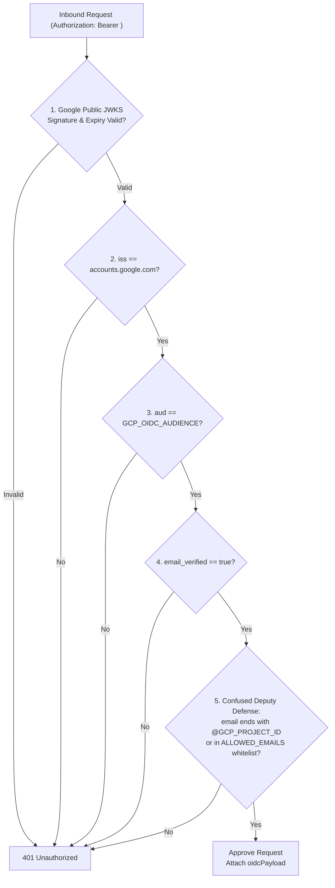
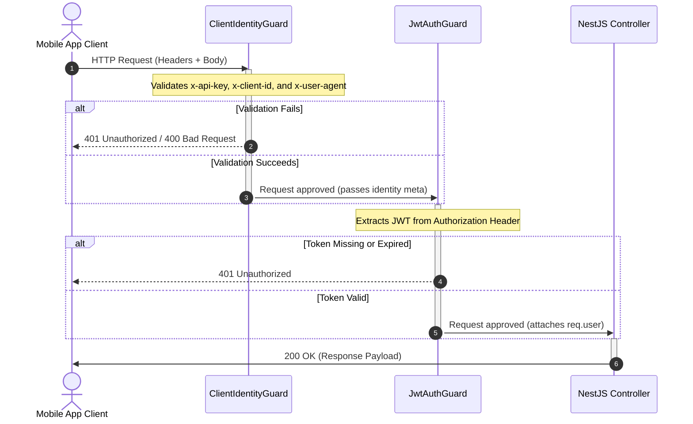

# API Authentication & Guards

BreathAway APIs are secured using three distinct authentication layers depending on the caller type:

1. **Client Identity Verification**: Ensures requests originate from a supported, authentic version of the mobile app.
2. **User Session Authentication**: Authenticates and identifies the logged-in user via JWT tokens.
3. **Internal GCP Service Authentication (OIDC)**: Authenticates automated service-to-service calls from GCP infrastructure (Cloud Scheduler and Pub/Sub) using Google-signed OpenID Connect ID tokens.

---

## 📱 1. Client Identity Verification

Enforced globally by `ClientIdentityGuard` on all endpoints. It can be bypassed on specific routes (such as system webhooks or internal endpoints) by applying the `@SkipClientIdentity()` decorator.

### Required Request Headers

Every standard client request must supply the following headers:

| Header Name    | Type   | Description                                          | Example                                 |
| :------------- | :----- | :--------------------------------------------------- | :-------------------------------------- |
| `x-api-key`    | String | Valid API key matching `API_KEYS`                    | `ba_live_abcdefg1234`                   |
| `x-client-id`  | String | Valid Client Identifier matching `CLIENT_IDS`        | `ba_ios_app`                            |
| `x-device-id`  | String | Unique device identifier (for push / session audits) | `A12B34CD-56EF-...`                     |
| `x-user-agent` | String | Must follow: `AppName/Version (Platform OS; Device)` | `BreathAway/1.0.0 (iOS 17.4; iPhone15)` |

> [!CAUTION]
> If the `x-user-agent` format or version is invalid (e.g. below the `MIN_APP_VERSION` configuration variable), the guard will reject the request with `401 Unauthorized` or `400 Bad Request`.

---

## 🔑 2. User Session Authentication (JWT)

Endpoints that require a logged-in user session are decorated with `JwtAuthGuard` (e.g. `@UseGuards(JwtAuthGuard)`).

### Bearer Token Header

To access protected routes, request the access token from the login flow and include it in the `Authorization` header:

```http
Authorization: Bearer <your_jwt_access_token>
```

---

## ☁️ 3. Internal GCP Service Authentication (OIDC)

Internal endpoints that are triggered exclusively by Google Cloud services—specifically **Cloud Scheduler cron jobs** (`/api/v1/internal/jobs/*`) and **Cloud Pub/Sub push subscriptions** (`/api/v1/pubsub/ingest`)—are secured by [`GcpOidcAuthGuard`](file:///Users/mohitmalpani/Business/BreathAway/Backend/breathaway/src/common/guards/gcp-oidc-auth.guard.ts).

These routes apply `@SkipClientIdentity()` (since requests originate from Google infrastructure rather than mobile devices) and `@UseGuards(GcpOidcAuthGuard)`.

### How GCP OIDC Works
1. Google Cloud infrastructure (Pub/Sub or Scheduler) acts on behalf of an IAM Service Account (`pubsub-invoker` or `scheduler-invoker`).
2. Google generates a short-lived (~1 hour), cryptographically signed OpenID Connect ID token (JWT) where `aud` equals the Cloud Run service URL.
3. The token is delivered in the `Authorization: Bearer <JWT>` header.

### 🛡️ Defense Against "Confused Deputy" Attacks

In Google Cloud, any GCP user can request an OIDC ID token targeting any public URL as the audience claim (`aud`). To prevent an external attacker in another GCP project from invoking our endpoints with a token signed for our URL, `GcpOidcAuthGuard` performs strict 5-point validation:



1. **Cryptographic Signature**: Verified dynamically against Google's public JWKS certificates (`https://www.googleapis.com/oauth2/v3/certs`).
2. **Issuer Claim (`iss`)**: Must strictly match `https://accounts.google.com` or `accounts.google.com`.
3. **Audience Claim (`aud`)**: Must strictly match `GCP_OIDC_AUDIENCE` to prevent cross-service token reuse.
4. **Verified Email**: Ensures `email_verified: true` and `email` is present.
5. **Caller Origin & Whitelist**: Ensures `email` ends with `@${GCP_PROJECT_ID}.iam.gserviceaccount.com` (or matches explicit whitelist `GCP_OIDC_ALLOWED_EMAILS`), immediately blocking tokens created in foreign GCP projects.

---

## 🔄 Authentication Sequence Flow (Client & User)


