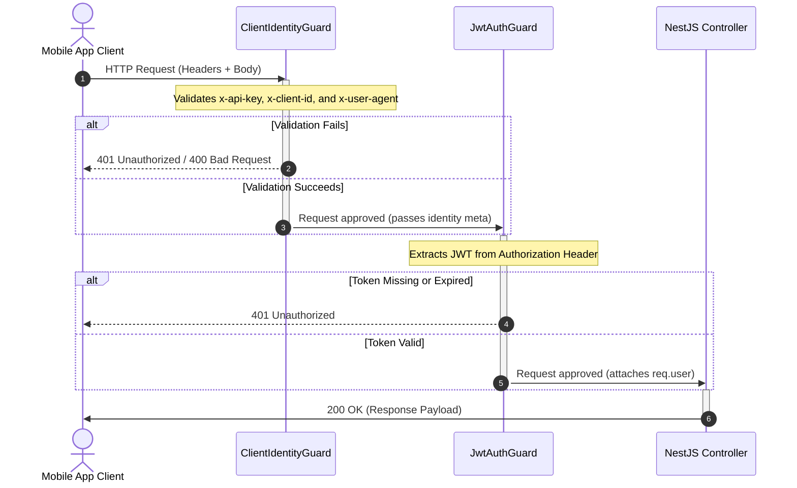

# API Authentication & Guards

BreathAway APIs are secured using a two-tier guard validation flow:

1. **Client Identity Verification**: Ensures requests originate from a supported, authentic version of the mobile app.
2. **User Session Authentication**: Authenticates and identifies the logged-in user via JWT tokens.

---

## 📱 1. Client Identity Verification

Enforced globally by `ClientIdentityGuard` on all endpoints. It can be bypassed on specific routes (such as system webhooks or health checks) by applying the `@SkipClientIdentity()` decorator.

### Required Request Headers

Every standard client request must supply the following headers:

| Header Name    | Type   | Description                                          | Example                                 |
| :------------- | :----- | :--------------------------------------------------- | :-------------------------------------- |
| `x-api-key`    | String | Valid API key matching `API_KEYS`                    | `ba_live_abcdefg1234`                   |
| `x-client-id`  | String | Valid Client Identifier matching `CLIENT_IDS`        | `ba_ios_app`                            |
| `x-device-id`  | String | Unique device identifier (for push / session audits) | `A12B34CD-56EF-...`                     |
| `x-user-agent` | String | Must follow: `AppName/Version (Platform OS; Device)` | `BreathAway/1.0.0 (iOS 17.4; iPhone15)` |

> [!CAUTION]
> If the `x-user-agent` format or version is invalid (e.g. below the `MIN_APP_VERSION` configuration variable), the guard will reject the request with `401 Unauthorized` or `400 Bad Request`.

---

## 🔑 2. User Session Authentication (JWT)

Endpoints that require a logged-in user session are decorated with the `JwtAuthGuard` (e.g. `@UseGuards(JwtAuthGuard)`).

### Bearer Token Header

To access protected routes, request the access token from the login flow and include it in the `Authorization` header:

```
Authorization: Bearer <your_jwt_access_token>
```

---

## 🔄 Authentication Sequence Flow


