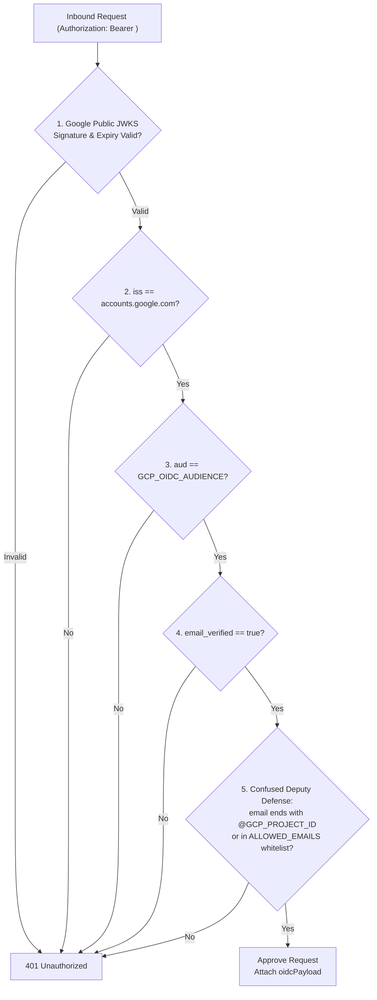
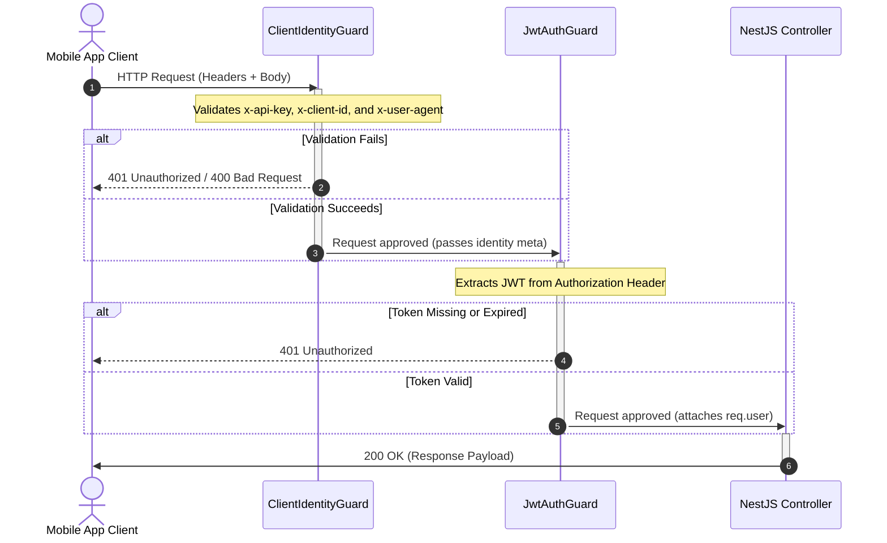

# API Authentication & Guards

BreathAway APIs are secured using three distinct authentication layers depending on the caller type:

1. **Client Identity Verification**: Ensures requests originate from a supported, authentic version of the mobile app.
2. **User Session Authentication**: Authenticates and identifies the logged-in user via JWT tokens.
3. **Internal GCP Service Authentication (OIDC)**: Authenticates automated service-to-service calls from GCP infrastructure (Cloud Scheduler and Pub/Sub) using Google-signed OpenID Connect ID tokens.

---

## 📱 1. Client Identity Verification

Enforced globally by `ClientIdentityGuard` on all endpoints. It can be bypassed on specific routes (such as system webhooks or internal endpoints) by applying the `@SkipClientIdentity()` decorator.

### Required Request Headers

Every standard client request must supply the following headers:

| Header Name    | Type   | Description                                                                                                                                                    | Example                                 |
| :------------- | :----- | :------------------------------------------------------------------------------------------------------------------------------------------------------------- | :-------------------------------------- |
| `x-api-key`    | String | Valid API key matching `API_KEYS`                                                                                                                              | `ba_live_abcdefg1234`                   |
| `x-client-id`  | String | Valid Client Identifier matching `CLIENT_IDS`                                                                                                                  | `ba_ios_app`                            |
| `x-device-id`  | String | Unique device identifier (for push / session audits)                                                                                                           | `A12B34CD-56EF-...`                     |
| `x-user-agent` | String | Must follow: `AppName/Version (Platform OS; Device)`. For web browsers, the standard `user-agent` header is automatically parsed if `x-user-agent` is omitted. | `BreathAway/1.0.0 (iOS 17.4; iPhone15)` |

> [!NOTE]
> **Web Browser Support**: When calling from web applications where setting custom headers may be restricted or omitted, `ClientIdentityGuard` automatically falls back to parsing the standard browser `user-agent` header (`Mozilla/5.0...`). It extracts the browser engine, operating system, and automatically sets `platform: web` with mobile version thresholds bypassed.

> [!CAUTION]
> For mobile apps, if the `x-user-agent` format or version is invalid (e.g. below the `MIN_APP_VERSION` configuration variable), the guard will reject the request with `401 Unauthorized` or `400 Bad Request`.

---

## 🔑 2. User Session Authentication (JWT)

Endpoints that require an authenticated user session are decorated with `JwtAuthGuard` (e.g. `@UseGuards(JwtAuthGuard)`).

### Bearer Token Header

To access protected routes, client applications must provide the access token in the standard HTTP `Authorization` header:

```http
Authorization: Bearer <your_jwt_access_token>
```

---

### 🛡️ Dual-Token Architecture & Security Rationale

To balance low latency (stateless authentication) with high security (instant revocability), BreathAway enforces an RFC 6749 and RFC 6819 compliant dual-token architecture:

1. **Access Token (Short-Lived)**:
   - **Lifespan**: Configured via `JWT_EXPIRES_IN` (Default: `15m`).
   - **Storage**: In-memory (RAM / secure mobile keystore).
   - **Verification**: Fully stateless verification via `JwtStrategy` using public/symmetric cryptographic signature verification. No database queries are performed per authenticated request, keeping endpoint latency under 10ms.
   - **Audience**: Verified against `JWT_AUDIENCE` (e.g. `breathaway-api`).

2. **Refresh Token (Long-Lived, Single-Use)**:
   - **Lifespan**: Configured via `JWT_REFRESH_EXPIRES_IN` (Default: `14d`).
   - **Storage**: Hardware-backed secure storage (iOS Keychain, Android EncryptedSharedPreferences).
   - **Endpoint**: Exclusively accepted at `POST /api/v1/auth/refresh`.
   - **Audience**: Strictly locked to `${JWT_AUDIENCE}:refresh` (e.g. `breathaway-api:refresh`).

> [!IMPORTANT]
> **Audience Separation Defense**: Access tokens and refresh tokens use mutually exclusive `aud` claims. If a client attempts to present a refresh token to an API route protected by `JwtAuthGuard`, or an access token to `/api/v1/auth/refresh`, the token is rejected at the cryptographic verification step before any database queries execute.

---

### 🧩 Token Claims & Cryptographic Lineage

Refresh tokens contain structured claims that link the token to an explicit session lineage:

```json
{
  "sub": "01KY9DY8M1GARMFEHXFJBZ08RM",
  "aud": "breathaway-api:refresh",
  "iss": "breathaway-auth",
  "jti": "UEdjtynJEB9APUfBlM5IguFsuM5ZWjgp",
  "familyId": "pulOGDHQMRxSKELeDqDp0zzK",
  "token_type": "refresh",
  "iat": 1728034255,
  "exp": 1729243855
}
```

- **`sub` (Subject)**: The authenticating user's ULID.
- **`jti` (JWT ID)**: A cryptographically random 32-character string (`nanoid(32)`). Indexed uniquely in PostgreSQL (`UserSession.jti`) to enable $O(1)$ session lookups.
- **`familyId`**: A 24-character lineage identifier (`nanoid(24)`). Generated upon initial authentication and preserved across subsequent rotations on that device.
- **`token_type`**: Must be explicitly set to `'refresh'`. Any token lacking this claim is immediately rejected.

---

### 🔒 Cryptographic Token Hashing (`tokenHash`)

To prevent offline database compromise from resulting in session takeover, **plaintext refresh tokens are never persisted in the database**:

1. When a refresh token is issued, `AuthTokenService` generates the signed JWT string.
2. The server calculates an unsalted SHA-256 digest of the complete token string:
   ```typescript
   const tokenHash = createHash('sha256').update(refreshToken).digest('hex');
   ```
3. Only this 64-character hexadecimal digest is stored in `UserSession.tokenHash`.

**Threat Model Impact**: If an adversary gains unauthorized read access to database backups or read replicas via SQL injection, they cannot use the stored `tokenHash` values to authenticate or rotate tokens. Only the legitimate client holding the raw, signed JWT can present the credential.

---

### ⚔️ RFC 6819 §5.2.2.3: Refresh Token Rotation & Breach Containment

Refresh Token Rotation (RTR) guarantees that **every refresh token is strictly single-use**. Whenever a refresh token is exchanged, it is immediately invalidated and replaced with a newly issued token.

#### Threat Scenario & Automatic Breach Containment

If an attacker intercepts a user's refresh token (Token 1):

```mermaid
sequenceDiagram
    autonumber
    actor Victim as Legitimate Client
    actor Attacker as Malicious Actor
    participant Auth as AuthTokenService / PostgreSQL

    Note over Victim, Auth: 1. Normal Rotation
    Victim ->> Auth: POST /refresh with Token 1 (familyId: F1)
    Auth ->> Auth: Invalidate Token 1 (revokedAt = now())
    Auth -->> Victim: Issue Token 2 (familyId: F1)

    Note over Attacker, Auth: 2. Stolen Token Replay Attempt
    Attacker ->> Auth: POST /refresh with Token 1 (familyId: F1)
    Auth ->> Auth: Query UserSession by jti (Token 1)
    Note over Auth: 🚨 Replay Detected! Token 1 is already revoked!

    rect rgb(255, 235, 235)
        Note over Auth: Breach Containment Protocol Triggered
        Auth ->> Auth: UPDATE UserSession SET revokedAt = now() WHERE familyId = F1
    end

    Auth -->> Attacker: 401 Unauthorized (Breach detected; family terminated)
    
    Note over Victim, Auth: 3. Legitimate Client Locked Out for Safety
    Victim ->> Auth: POST /refresh with Token 2 (familyId: F1)
    Auth -->> Victim: 401 Unauthorized (Family was revoked due to breach)
    Note over Victim: App securely clears local keystore and prompts for fresh login
```

By invalidating the entire `familyId` lineage, the backend neutralizes the attacker's persistence and alerts the user to re-authenticate with their primary credentials.

---

### ⚡ Race Condition Defense: Atomic Compare-and-Swap (CAS)

In mobile environments, when a short-lived access token expires after 15 minutes, multiple asynchronous HTTP requests (e.g. fetching user profile, unread notification count, and new messages) may fail with `401 Unauthorized` at the exact same millisecond.

If the mobile client fires multiple parallel `/refresh` requests carrying the same refresh token, a naive check-then-act implementation (`findUnique` followed by `update`) creates a critical race condition:

1. Request A reads Token 1 (`revokedAt: null`).
2. Request B reads Token 1 (`revokedAt: null`).
3. Request A updates Token 1 (`revokedAt: now()`) and succeeds.
4. Request B attempts to rotate Token 1, detects `revokedAt !== null`, and incorrectly flags Request A as an attacker replay, terminating the user's active session!

#### The Prisma Atomic CAS Implementation

`AuthTokenService` executes the token revocation using an atomic **Compare-and-Swap (CAS)** pattern wrapped in a Prisma `$transaction`:

```typescript
return this.prisma.$transaction(async (tx) => {
  // Atomic CAS: Only update if revokedAt is STILL null at the instant of execution
  const updateResult = await tx.userSession.updateMany({
    where: { id: session.id, revokedAt: null },
    data: { revokedAt: DateUtil.now() },
  });

  if (updateResult.count === 0) {
    // Another concurrent request already revoked this token!
    // Trigger breach containment on the lineage.
    await tx.userSession.updateMany({
      where: { familyId: session.familyId, revokedAt: null },
      data: { revokedAt: DateUtil.now() },
    });
    throw new UnauthorizedException(
      'Revoked refresh token reuse detected. All sessions in this lineage have been terminated.',
    );
  }

  // Issue rotated token pair with the same familyId within the same transaction
  return this.generateAuthResponse(
    user,
    { ...metadata, familyId: session.familyId, isRefresh: true },
    tx,
  );
});
```

#### Mobile Client Concurrency Standard

While the backend is completely concurrency-safe via CAS, client applications (iOS and Android) must implement a **refresh mutex/queue lock** in their HTTP network interceptor:

1. When a 401 response is intercepted, acquire a local refresh lock.
2. Queue any subsequent 401 requests while the refresh call is in flight.
3. Perform a single `POST /api/v1/auth/refresh` call.
4. Update local storage with the new access and refresh token pair.
5. Replay all queued requests with the updated `Authorization: Bearer <new_token>` header, then release the lock.

---

## ☁️ 3. Internal GCP Service Authentication (OIDC)

Internal endpoints that are triggered exclusively by Google Cloud services—specifically **Cloud Scheduler cron jobs** (`/api/v1/internal/jobs/*`) and **Cloud Pub/Sub push subscriptions** (`/api/v1/pubsub/ingest`)—are secured by [`GcpOidcAuthGuard`](file:///Users/mohitmalpani/Business/BreathAway/Backend/breathaway/src/common/guards/gcp-oidc-auth.guard.ts).

These routes apply `@SkipClientIdentity()` (since requests originate from Google infrastructure rather than mobile devices) and `@UseGuards(GcpOidcAuthGuard)`.

### How GCP OIDC Works

1. Google Cloud infrastructure (Pub/Sub or Scheduler) acts on behalf of an IAM Service Account (`pubsub-invoker` or `scheduler-invoker`).
2. Google generates a short-lived (~1 hour), cryptographically signed OpenID Connect ID token (JWT) where `aud` equals the Cloud Run service URL.
3. The token is delivered in the `Authorization: Bearer <JWT>` header.

### 🛡️ Defense Against "Confused Deputy" Attacks

In Google Cloud, any GCP user can request an OIDC ID token targeting any public URL as the audience claim (`aud`). To prevent an external attacker in another GCP project from invoking our endpoints with a token signed for our URL, `GcpOidcAuthGuard` performs strict 5-point validation:


```mermaid
flowchart TD
    Req["Inbound Request (Authorization: Bearer <JWT>)"] --> Step1{"1. Google Public JWKS<br/>Signature & Expiry Valid?"}
    Step1 -- "Invalid" --> Reject["401 Unauthorized"]
    Step1 -- "Valid" --> Step2{"2. iss == accounts.google.com?"}
    Step2 -- "No" --> Reject
    Step2 -- "Yes" --> Step3{"3. aud == GCP_OIDC_AUDIENCE?"}
    Step3 -- "No" --> Reject
    Step3 -- "Yes" --> Step4{"4. email_verified == true?"}
    Step4 -- "No" --> Reject
    Step4 -- "Yes" --> Step5{"5. Confused Deputy Defense:<br/>email ends with @GCP_PROJECT_ID<br/>or in ALLOWED_EMAILS whitelist?"}
    Step5 -- "No" --> Reject
    Step5 -- "Yes" --> Allow["Approve Request<br/>Attach oidcPayload"]
```

1. **Cryptographic Signature**: Verified dynamically against Google's public JWKS certificates (`https://www.googleapis.com/oauth2/v3/certs`).
2. **Issuer Claim (`iss`)**: Must strictly match `https://accounts.google.com` or `accounts.google.com`.
3. **Audience Claim (`aud`)**: Must strictly match `GCP_OIDC_AUDIENCE` to prevent cross-service token reuse.
4. **Verified Email**: Ensures `email_verified: true` and `email` is present.
5. **Caller Origin & Whitelist**: Ensures `email` ends with `@${GCP_PROJECT_ID}.iam.gserviceaccount.com` (or matches explicit whitelist `GCP_OIDC_ALLOWED_EMAILS`), immediately blocking tokens created in foreign GCP projects.

---

## 🔄 Authentication Sequence Flow (Client & User)


```mermaid
sequenceDiagram
    autonumber
    actor MobileClient as Mobile App Client
    participant CGuard as ClientIdentityGuard
    participant JWTGuard as JwtAuthGuard
    participant Controller as NestJS Controller

    MobileClient ->> CGuard: HTTP Request (Headers + Body)
    activate CGuard
    Note over CGuard: Validates x-api-key, x-client-id, and x-user-agent
    alt Validation Fails
        CGuard -->> MobileClient: 401 Unauthorized / 400 Bad Request
    else Validation Succeeds
        CGuard ->> JWTGuard: Request approved (passes identity meta)
    end
    deactivate CGuard

    activate JWTGuard
    Note over JWTGuard: Extracts JWT from Authorization Header
    alt Token Missing or Expired
        JWTGuard -->> MobileClient: 401 Unauthorized
    else Token Valid
        JWTGuard ->> Controller: Request approved (attaches req.user)
    end
    deactivate JWTGuard

    activate Controller
    Controller ->> MobileClient: 200 OK (Response Payload)
    deactivate Controller
```
