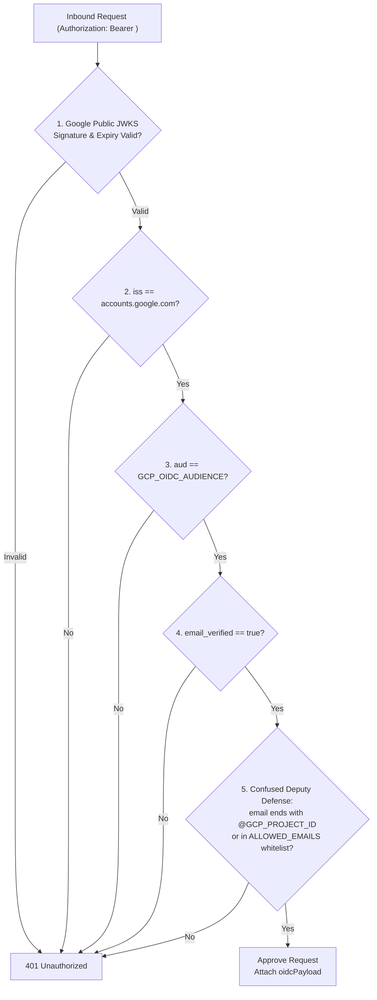
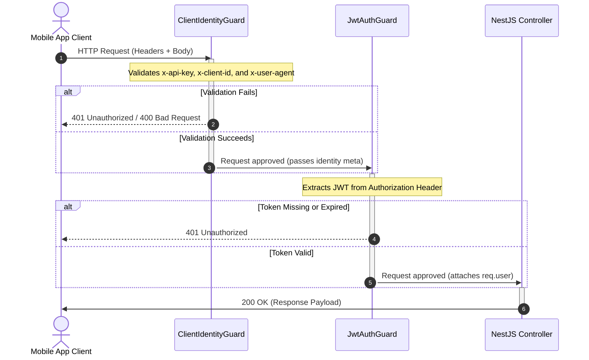
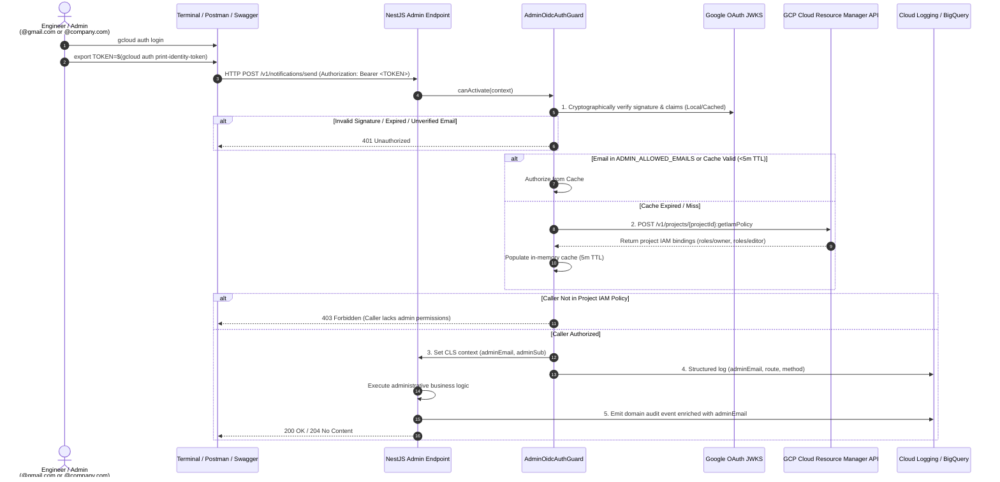

# API Authentication & Guards

BreathAway APIs are secured using four distinct authentication layers depending on the caller type:

1. **Client Identity Verification**: Ensures requests originate from a supported, authentic version of the mobile app.
2. **User Session Authentication**: Authenticates and identifies the logged-in user via JWT tokens.
3. **Internal GCP Service Authentication (OIDC)**: Authenticates automated service-to-service calls from GCP infrastructure (Cloud Scheduler and Pub/Sub) using Google-signed OpenID Connect ID tokens.
4. **Administrative & Developer Authentication (Google OIDC + GCP IAM)**: Authenticates engineers and administrators invoking privileged routes using personal Google accounts verified against live GCP project IAM policies.

---

## 📱 1. Client Identity Verification

Enforced globally by `ClientIdentityGuard` on all endpoints. It can be bypassed on specific routes (such as system webhooks or internal endpoints) by applying the `@SkipClientIdentity()` decorator.

### Required Request Headers

Every standard client request must supply the following headers:

| Header Name    | Type   | Description                                                                                                                                                    | Example                                 |
| :------------- | :----- | :------------------------------------------------------------------------------------------------------------------------------------------------------------- | :-------------------------------------- |
| `x-api-key`    | String | Valid API key matching `API_KEYS`                                                                                                                              | `ba_live_abcdefg1234`                   |
| `x-client-id`  | String | Valid Client Identifier matching `CLIENT_IDS`                                                                                                                  | `ba_ios_app`                            |
| `x-device-id`  | String | Unique device identifier (for push / session audits)                                                                                                           | `A12B34CD-56EF-...`                     |
| `x-user-agent` | String | Must follow: `AppName/Version (Platform OS; Device)`. For web browsers, the standard `user-agent` header is automatically parsed if `x-user-agent` is omitted. | `BreathAway/1.0.0 (iOS 17.4; iPhone15)` |

> [!NOTE]
> **Web Browser Support**: When calling from web applications where setting custom headers may be restricted or omitted, `ClientIdentityGuard` automatically falls back to parsing the standard browser `user-agent` header (`Mozilla/5.0...`). It extracts the browser engine, operating system, and automatically sets `platform: web` with mobile version thresholds bypassed.

> [!CAUTION]
> For mobile apps, if the `x-user-agent` format or version is invalid (e.g. below the `MIN_APP_VERSION` configuration variable), the guard will reject the request with `401 Unauthorized` or `400 Bad Request`.

---

## 🔑 2. User Session Authentication (JWT)

Endpoints that require an authenticated user session are decorated with `JwtAuthGuard` (e.g. `@UseGuards(JwtAuthGuard)`).

### Bearer Token Header

To access protected routes, client applications must provide the access token in the standard HTTP `Authorization` header:

```http
Authorization: Bearer <your_jwt_access_token>
```

---

### 🛡️ Dual-Token Architecture & Security Rationale

To balance low latency (stateless authentication) with high security (instant revocability), BreathAway enforces an RFC 6749 and RFC 6819 compliant dual-token architecture:

1. **Access Token (Short-Lived)**:
   - **Lifespan**: Configured via `JWT_EXPIRES_IN` (Default: `15m`).
   - **Storage**: In-memory (RAM / secure mobile keystore).
   - **Verification**: Fully stateless verification via `JwtStrategy` using public/symmetric cryptographic signature verification. No database queries are performed per authenticated request, keeping endpoint latency under 10ms.
   - **Audience**: Verified against `JWT_AUDIENCE` (e.g. `breathaway-api`).

2. **Refresh Token (Long-Lived, Single-Use)**:
   - **Lifespan**: Configured via `JWT_REFRESH_EXPIRES_IN` (Default: `14d`).
   - **Storage**: Hardware-backed secure storage (iOS Keychain, Android EncryptedSharedPreferences).
   - **Endpoint**: Exclusively accepted at `POST /api/v1/auth/refresh`.
   - **Audience**: Strictly locked to `${JWT_AUDIENCE}:refresh` (e.g. `breathaway-api:refresh`).

> [!IMPORTANT]
> **Audience Separation Defense**: Access tokens and refresh tokens use mutually exclusive `aud` claims. If a client attempts to present a refresh token to an API route protected by `JwtAuthGuard`, or an access token to `/api/v1/auth/refresh`, the token is rejected at the cryptographic verification step before any database queries execute.

---

### 🧩 Token Claims & Cryptographic Lineage

Refresh tokens contain structured claims that link the token to an explicit session lineage:

```json
{
  "sub": "01KY9DY8M1GARMFEHXFJBZ08RM",
  "aud": "breathaway-api:refresh",
  "iss": "breathaway-auth",
  "jti": "UEdjtynJEB9APUfBlM5IguFsuM5ZWjgp",
  "familyId": "pulOGDHQMRxSKELeDqDp0zzK",
  "token_type": "refresh",
  "iat": 1728034255,
  "exp": 1729243855
}
```

- **`sub` (Subject)**: The authenticating user's ULID.
- **`jti` (JWT ID)**: A cryptographically random 32-character string (`nanoid(32)`). Indexed uniquely in PostgreSQL (`UserSession.jti`) to enable $O(1)$ session lookups.
- **`familyId`**: A 24-character lineage identifier (`nanoid(24)`). Generated upon initial authentication and preserved across subsequent rotations on that device.
- **`token_type`**: Must be explicitly set to `'refresh'`. Any token lacking this claim is immediately rejected.

---

### 🔒 Cryptographic Token Hashing (`tokenHash`)

To prevent offline database compromise from resulting in session takeover, **plaintext refresh tokens are never persisted in the database**:

1. When a refresh token is issued, `AuthTokenService` generates the signed JWT string.
2. The server calculates an unsalted SHA-256 digest of the complete token string:
   ```typescript
   const tokenHash = createHash('sha256').update(refreshToken).digest('hex');
   ```
3. Only this 64-character hexadecimal digest is stored in `UserSession.tokenHash`.

**Threat Model Impact**: If an adversary gains unauthorized read access to database backups or read replicas via SQL injection, they cannot use the stored `tokenHash` values to authenticate or rotate tokens. Only the legitimate client holding the raw, signed JWT can present the credential.

---

### ⚔️ RFC 6819 §5.2.2.3: Refresh Token Rotation & Breach Containment

Refresh Token Rotation (RTR) guarantees that **every refresh token is strictly single-use**. Whenever a refresh token is exchanged, it is immediately invalidated and replaced with a newly issued token.

#### Threat Scenario & Automatic Breach Containment

If an attacker intercepts a user's refresh token (Token 1):

```mermaid
sequenceDiagram
    autonumber
    actor Victim as Legitimate Client
    actor Attacker as Malicious Actor
    participant Auth as AuthTokenService / PostgreSQL

    Note over Victim, Auth: 1. Normal Rotation
    Victim ->> Auth: POST /refresh with Token 1 (familyId: F1)
    Auth ->> Auth: Invalidate Token 1 (revokedAt = now())
    Auth -->> Victim: Issue Token 2 (familyId: F1)

    Note over Attacker, Auth: 2. Stolen Token Replay Attempt
    Attacker ->> Auth: POST /refresh with Token 1 (familyId: F1)
    Auth ->> Auth: Query UserSession by jti (Token 1)
    Note over Auth: 🚨 Replay Detected! Token 1 is already revoked!

    rect rgb(255, 235, 235)
        Note over Auth: Breach Containment Protocol Triggered
        Auth ->> Auth: UPDATE UserSession SET revokedAt = now() WHERE familyId = F1
    end

    Auth -->> Attacker: 401 Unauthorized (Breach detected; family terminated)

    Note over Victim, Auth: 3. Legitimate Client Locked Out for Safety
    Victim ->> Auth: POST /refresh with Token 2 (familyId: F1)
    Auth -->> Victim: 401 Unauthorized (Family was revoked due to breach)
    Note over Victim: App securely clears local keystore and prompts for fresh login
```

By invalidating the entire `familyId` lineage, the backend neutralizes the attacker's persistence and alerts the user to re-authenticate with their primary credentials.

---

### ⚡ Race Condition Defense: 10-Second Grace Window & Atomic CAS

In distributed client environments — such as serverless SSR proxy instances, multiple browser tabs, mobile cold starts, `bfcache` restores, and network retries — when a short-lived access token expires after 15 minutes, multiple asynchronous HTTP requests (e.g. fetching user profile, unread notification counts, and discovery cards) may fail with `401 Unauthorized` at the exact same millisecond.

If multiple parallel `/refresh` requests land on separate serverless instances carrying the same refresh token, strict zero-tolerance one-time-use RTR would falsely flag the second request as a replay attack and terminate the user's entire session lineage.

#### The 10-Second Grace Window & Upstash Redis Cache

To eliminate false-positive session terminations without sacrificing breach containment:

1. **Idempotent 10-Second Leeway (`ROTATION_GRACE_PERIOD_MS = 10_000`)**: When a refresh token rotates, the resulting `UserAuthResponseDto` is cached under `auth:refresh:grace:<consumed_jti>` in Upstash Redis (15-second TTL) and process-local memory.
2. **Grace Hit**: If any subsequent request presents that consumed token within 10 seconds, `AuthTokenService` returns the exact same cached token pair immediately. No new database writes are performed, and no token tree branches are created.
3. **Atomic CAS with Concurrency Resolution**: When two requests race at the exact same millisecond:

   ```typescript
   // Atomic CAS: Only update if revokedAt is STILL null at the instant of execution
   const updateResult = await tx.userSession.updateMany({
     where: { id: session.id, revokedAt: null },
     data: { revokedAt: DateUtil.now() },
   });

   if (updateResult.count === 0) {
     // A parallel request consumed this token milliseconds ago!
     // Poll Upstash Redis / memory for the winning request's cached response.
   }
   ```

   Instead of immediately killing the session family, the second request polls the cache (50ms interval, up to 5 attempts) to receive the winning request's response.

4. **Breach Containment (> 10s)**: Any reuse attempt occurring after the 10-second window is recognized as genuine token theft and triggers immediate RFC 6819 §5.2.2.3 family revocation across all devices.

While the backend is completely concurrency-safe via CAS, client applications (iOS and Android) must implement a **refresh mutex/queue lock** in their HTTP network interceptor:

1. When a 401 response is intercepted, acquire a local refresh lock.
2. Queue any subsequent 401 requests while the refresh call is in flight.
3. Perform a single `POST /api/v1/auth/refresh` call.
4. Update local storage with the new access and refresh token pair.
5. Replay all queued requests with the updated `Authorization: Bearer <new_token>` header, then release the lock.

---

### ⏱️ Brute-Force Defense: Multi-Tiered Rate Limiting (@nestjs/throttler)

While cryptographic verification and RFC 6819 Token Family tracking safeguard against replayed credentials, public authentication APIs are prime targets for automated attacks:

- **Refresh Token Endpoints (`/refresh`)**: Vulnerable to signature brute-forcing or denial-of-service (DoS) attempts aimed at exhausting database transaction pools with rapid token rotation requests.
- **Sign-In & Onboarding Endpoints (`/signin`, `/signup`, `/signin-or-signup`, `/add-phone`, `/add-email`)**: Vulnerable to credential stuffing, SMS/OTP pumping fraud, and high-frequency bot account creation.

BreathAway guards these critical attack surfaces using `@nestjs/throttler` with a tiered defense strategy.

#### Reverse Proxy & Google Cloud Run IP Resolution

In serverless Google Cloud Run deployments fronted by Google Cloud Load Balancing (GCLB), the default Express client IP resolution (`req.ip`) evaluates to an internal Google infrastructure IP. Under default settings, **every mobile client worldwide would share the exact same rate-limiting counter**, causing false-positive 429 lockouts.

To enforce per-client rate isolation:

1. **Express Trust Proxy**: Configured via `app.set('trust proxy', true)` in [`main.ts`](file:///Users/mohitmalpani/Business/BreathAway/Backend/breathaway/src/main.ts).
2. **Deterministic IP Resolution (`extractClientIp`)**: Provided in [`request.utils.ts`](file:///Users/mohitmalpani/Business/BreathAway/Backend/breathaway/src/common/utils/request.utils.ts) and wired into `ThrottlerModule.forRootAsync` via `getTracker`:
   ```typescript
   export function extractClientIp(req: Request): string | undefined {
     const forwarded = req.headers['x-forwarded-for'];
     if (typeof forwarded === 'string' && forwarded.length > 0) {
       return forwarded.split(',')[0].trim();
     }
     if (Array.isArray(forwarded) && forwarded.length > 0) {
       return forwarded[0].split(',')[0].trim();
     }
     return (
       (req.headers['x-real-ip'] as string) ||
       req.ip ||
       req.socket?.remoteAddress
     );
   }
   ```
   This guarantees that the client's genuine public IP address (the leftmost entry in `x-forwarded-for`) governs their individual rate limit bucket.

#### Multi-Tier Throttling Profiles

Rather than a single coarse window, BreathAway configures three concurrent time horizons (`short`, `medium`, `long`) to simultaneously defeat high-frequency bursts and sustained distributed brute-force campaigns:

| Policy Constant               | Target Endpoints                                                                                                                                                       | Short Tier (1s) | Medium Tier (10s) | Long Tier (60s) | Rationale & Protection                                                                                                                    |
| :---------------------------- | :--------------------------------------------------------------------------------------------------------------------------------------------------------------------- | :-------------: | :---------------: | :-------------: | :---------------------------------------------------------------------------------------------------------------------------------------- |
| **`AUTH_REFRESH_THROTTLE`**   | `POST /api/v1/auth/refresh`                                                                                                                                            |      2 req      |       5 req       |     10 req      | Permits an immediate burst of 2 requests in 1 second (handling parallel 401 retries from mobile apps), but strictly clamps at 10 req/min. |
| **`AUTH_STRICT_THROTTLE`**    | `POST /api/v1/auth/signup`<br/>`POST /api/v1/auth/signin`<br/>`POST /api/v1/auth/signin-or-signup`<br/>`POST /api/v1/auth/add-phone`<br/>`POST /api/v1/auth/add-email` |      1 req      |       3 req       |      5 req      | Stringent throttle preventing credential stuffing, OTP toll fraud, and automated account farming.                                         |
| **`AUTH_DEV_LOGIN_THROTTLE`** | `POST /api/v1/admin/dev-login`                                                                                                                                         |      2 req      |       5 req       |     10 req      | Protects local/staging developer bypass route from automation scripts.                                                                    |

#### Error Response Contract (`429 Too Many Requests`)

When a client breaches any of the configured throttler thresholds, the NestJS `ThrottlerGuard` immediately halts processing before controller or database execution, returning standard HTTP 429:

```json
{
  "statusCode": 429,
  "message": "ThrottlerException: Too Many Requests"
}
```

---

### 🧹 Session Retention & Storage Lifecycle

Because access tokens expire in 15 minutes, an active user generates approximately 4 `UserSession` records per active hour (~96 records/day). Over months across thousands of users, the table accumulates millions of rows, degrading B-tree index performance on `jti` and `userId`.

BreathAway executes an automated, chunked retention cleanup job:

- **Schedule**: Weekly (`0 3 * * 0 UTC`) via Cloud Scheduler invoking `POST /api/v1/internal/jobs/purge-expired-sessions`.
- **Grace Period**: Purges sessions where `expiresAt < NOW() - INTERVAL '7 days'`, retaining a 7-day audit horizon for forensics.
- **Batching**: Iteratively deletes in chunks of 5,000 rows to avoid PostgreSQL lock escalation and WAL buffer exhaustion.
- **Documentation**: See [Maintenance Module](/modules/maintenance#5-scheduled-user-session-retention-cleanup) for execution details.

---

## ☁️ 3. Internal GCP Service Authentication (OIDC)

Internal endpoints that are triggered exclusively by Google Cloud services—specifically **Cloud Scheduler cron jobs** (`/api/v1/internal/jobs/*`) and **Cloud Pub/Sub push subscriptions** (`/api/v1/pubsub/ingest`)—are secured by [`GcpOidcAuthGuard`](file:///Users/mohitmalpani/Business/BreathAway/Backend/breathaway/src/common/guards/gcp-oidc-auth.guard.ts).

These routes apply `@SkipClientIdentity()` (since requests originate from Google infrastructure rather than mobile devices) and `@UseGuards(GcpOidcAuthGuard)`.

### How GCP OIDC Works

1. Google Cloud infrastructure (Pub/Sub or Scheduler) acts on behalf of an IAM Service Account (`pubsub-invoker` or `scheduler-invoker`).
2. Google generates a short-lived (~1 hour), cryptographically signed OpenID Connect ID token (JWT) where `aud` equals the Cloud Run service URL.
3. The token is delivered in the `Authorization: Bearer <JWT>` header.

### 🛡️ Defense Against "Confused Deputy" Attacks

In Google Cloud, any GCP user can request an OIDC ID token targeting any public URL as the audience claim (`aud`). To prevent an external attacker in another GCP project from invoking our endpoints with a token signed for our URL, `GcpOidcAuthGuard` performs strict 5-point validation:


```mermaid
flowchart TD
    Req["Inbound Request (Authorization: Bearer <JWT>)"] --> Step1{"1. Google Public JWKS<br/>Signature & Expiry Valid?"}
    Step1 -- "Invalid" --> Reject["401 Unauthorized"]
    Step1 -- "Valid" --> Step2{"2. iss == accounts.google.com?"}
    Step2 -- "No" --> Reject
    Step2 -- "Yes" --> Step3{"3. aud == GCP_OIDC_AUDIENCE?"}
    Step3 -- "No" --> Reject
    Step3 -- "Yes" --> Step4{"4. email_verified == true?"}
    Step4 -- "No" --> Reject
    Step4 -- "Yes" --> Step5{"5. Confused Deputy Defense:<br/>email ends with @GCP_PROJECT_ID<br/>or in ALLOWED_EMAILS whitelist?"}
    Step5 -- "No" --> Reject
    Step5 -- "Yes" --> Allow["Approve Request<br/>Attach oidcPayload"]
```

1. **Cryptographic Signature**: Verified dynamically against Google's public JWKS certificates (`https://www.googleapis.com/oauth2/v3/certs`).
2. **Issuer Claim (`iss`)**: Must strictly match `https://accounts.google.com` or `accounts.google.com`.
3. **Audience Claim (`aud`)**: Must strictly match `GCP_OIDC_AUDIENCE` to prevent cross-service token reuse.
4. **Verified Email**: Ensures `email_verified: true` and `email` is present.
5. **Caller Origin & Whitelist**: Ensures `email` ends with `@${GCP_PROJECT_ID}.iam.gserviceaccount.com` (or matches explicit whitelist `GCP_OIDC_ALLOWED_EMAILS`), immediately blocking tokens created in foreign GCP projects.

---

## 🔄 Authentication Sequence Flow (Client & User)


```mermaid
sequenceDiagram
    autonumber
    actor MobileClient as Mobile App Client
    participant CGuard as ClientIdentityGuard
    participant JWTGuard as JwtAuthGuard
    participant Controller as NestJS Controller

    MobileClient ->> CGuard: HTTP Request (Headers + Body)
    activate CGuard
    Note over CGuard: Validates x-api-key, x-client-id, and x-user-agent
    alt Validation Fails
        CGuard -->> MobileClient: 401 Unauthorized / 400 Bad Request
    else Validation Succeeds
        CGuard ->> JWTGuard: Request approved (passes identity meta)
    end
    deactivate CGuard

    activate JWTGuard
    Note over JWTGuard: Extracts JWT from Authorization Header
    alt Token Missing or Expired
        JWTGuard -->> MobileClient: 401 Unauthorized
    else Token Valid
        JWTGuard ->> Controller: Request approved (attaches req.user)
    end
    deactivate JWTGuard

    activate Controller
    Controller ->> MobileClient: 200 OK (Response Payload)
    deactivate Controller
```

---

## 🛠️ 4. Administrative & Developer Authentication (Google OIDC + GCP IAM)

Administrative APIs (`/api/v1/admin/*` including developer bypass `/api/v1/admin/dev-login`, `/api/v1/notifications/*`, `/api/v1/reports/*`, `/api/v1/payments/routes/*`, `/api/v1/social-identities/*`, `/api/v1/transactions/*`, `/api/v1/instagram/*`) are secured by [`AdminOidcAuthGuard`](file:///Users/mohitmalpani/Business/BreathAway/Backend/breathaway/src/modules/admin/guards/admin-oidc-auth.guard.ts).

This replaces legacy HTTP Basic Auth and shared static passwords with **Zero-Trust Google OpenID Connect (OIDC)**, delegating identity verification to Google and authorization to Google Cloud IAM.

---

### ⚖️ Regular Customer Flow vs. Admin OIDC Flow

| Architectural Aspect          | Regular Customer Flow (App Users)                         | Administrative OIDC Flow (Engineers / Admins)                        |
| :---------------------------- | :-------------------------------------------------------- | :------------------------------------------------------------------- |
| **Primary Identity Provider** | Firebase Auth (Phone OTP, Apple, Google Sign-In)          | Google Accounts (`@gmail.com` or `@mycompany.com`)                   |
| **Token Type & Issuer**       | BreathAway Custom JWTs (HMAC/RSA issued by Backend)       | Google OIDC ID Token issued by `accounts.google.com`                 |
| **Token Lifetime**            | 15 minutes (Access) / 14 days (Refresh Token Family)      | 1 hour (Google standard OIDC lifetime, no refresh flow)              |
| **Client Headers Required**   | `x-api-key`, `x-client-id`, `x-user-agent`, `x-device-id` | `@SkipClientIdentity()` applied (No client app headers required)     |
| **Authorization Source**      | PostgreSQL database tables (`User`, `UserRole`, status)   | Live GCP Project IAM Policy (`roles/owner`, `roles/editor`)          |
| **Revocation Mechanism**      | Database session deletion / token blacklist               | Removing developer from GCP Project IAM in Google Cloud Console      |
| **Audit Logging Actor**       | Internal User ULID (`sub: "01KY9DY8M1GARM..."`)           | Verified Google email (`adminEmail: "engineer@company.com"`)         |
| **Audit Sink Destination**    | Application database & standard access logs               | GCP Cloud Logging & BigQuery Sink (`jsonPayload.adminEmail`)         |
| **Interactive Tooling**       | Mobile App / Public Web Client                            | Terminal (`curl`), Postman, and Admin Swagger UI (`/api/docs/admin`) |

---

### 🛡️ How Admin OIDC Verification Works

When a request reaches a route protected by `AdminOidcAuthGuard`:

1. **Header Validation**: Extracts the Bearer token from `Authorization: Bearer <token>`. Rejects missing or malformed headers with `401 Unauthorized`.
2. **Cryptographic Google JWKS Verification**:
   - The token signature is verified against Google's public JWKS certificates (`https://www.googleapis.com/oauth2/v3/certs`) via `google-auth-library`.
   - Google certificates are automatically cached in-memory, requiring 0ms network latency on subsequent requests.
   - Verifies `iss` is `accounts.google.com` or `https://accounts.google.com`.
   - Verifies `aud` matches either configured audiences (`GCP_ADMIN_OIDC_AUDIENCE` / `GCP_OIDC_AUDIENCE`) or Google Cloud SDK's canonical client ID (`32555940559.apps.googleusercontent.com`).
   - Verifies `email_verified: true` and extracts `payload.email`.
3. **Dynamic GCP IAM Authorization**:
   - **Step 3A (Config Whitelist)**: Checks `ADMIN_ALLOWED_EMAILS` (comma-separated list). If matched, authorizes immediately (ideal for local dev without cloud access).
   - **Step 3B (Cached IAM Policy)**: Checks in-memory cache of authorized project emails. If cached and TTL (5 minutes) has not expired, authorizes immediately.
   - **Step 3C (GCP Cloud Resource Manager Query)**: Calls the GCP Resource Manager API (`POST https://cloudresourcemanager.googleapis.com/v1/projects/{projectId}:getIamPolicy`) using Application Default Credentials (ADC) or the Cloud Run service account.
   - Extracts all members bound to `roles/owner`, `roles/editor`, `roles/resourcemanager.organizationAdmin`, or roles specified in `GCP_ADMIN_IAM_ROLES`.
   - If `user:<email>` is found in the IAM policy bindings, updates the in-memory cache and grants access.
   - If not found, logs a warning and throws `403 Forbidden: Caller does not have administrative permissions in GCP`.
4. **Context Propagation & Structured Audit Logging**:
   - Injects `adminEmail`, `adminSub`, and `adminEmailHash` (SHA-256) into Continuation-Local Storage (CLS) via `ClsService`.
   - Attaches `request.adminUser = { email, sub, emailHash }`.
   - Emits structured JSON log with `step: 'authenticate'`, `adminEmail`, and request details.
   - Any downstream call to `BaseService.emitAuditLog` automatically enriches audit events (`PubSubEvent.SYSTEM_AUDIT_LOG`) with the admin email for BigQuery ingestion.

---

### 🔄 Admin Authentication Sequence Flow


```mermaid
sequenceDiagram
    autonumber
    actor Admin as Engineer / Admin<br/>(@gmail.com or @company.com)
    participant CLI as Terminal / Postman / Swagger
    participant Backend as NestJS Admin Endpoint
    participant Guard as AdminOidcAuthGuard
    participant GoogleJWKS as Google OAuth JWKS
    participant GCPIAM as GCP Cloud Resource Manager API
    participant Logger as Cloud Logging / BigQuery

    Admin->>CLI: gcloud auth login
    Admin->>CLI: export TOKEN=$(gcloud auth print-identity-token)
    CLI->>Backend: HTTP POST /v1/notifications/send (Authorization: Bearer <TOKEN>)
    Backend->>Guard: canActivate(context)

    Guard->>GoogleJWKS: 1. Cryptographically verify signature & claims (Local/Cached)
    alt Invalid Signature / Expired / Unverified Email
        Guard-->>CLI: 401 Unauthorized
    end

    alt Email in ADMIN_ALLOWED_EMAILS or Cache Valid (<5m TTL)
        Guard->>Guard: Authorize from Cache
    else Cache Expired / Miss
        Guard->>GCPIAM: 2. POST /v1/projects/{projectId}:getIamPolicy
        GCPIAM-->>Guard: Return project IAM bindings (roles/owner, roles/editor)
        Guard->>Guard: Populate in-memory cache (5m TTL)
    end

    alt Caller Not in Project IAM Policy
        Guard-->>CLI: 403 Forbidden (Caller lacks admin permissions)
    else Caller Authorized
        Guard->>Backend: 3. Set CLS context (adminEmail, adminSub)
        Guard->>Logger: 4. Structured log (adminEmail, route, method)
        Backend->>Backend: Execute administrative business logic
        Backend->>Logger: 5. Emit domain audit event enriched with adminEmail
        Backend-->>CLI: 200 OK / 204 No Content
    end
```

---

### 💻 Developer Guide: How to Generate and Use Admin Tokens

#### 1. Prerequisites

- The engineer's Google account (`user@gmail.com` or `user@mycompany.com`) must be added to the GCP project (`breathaway-dev` / `breathaway-prod`) with the **Editor** or **Owner** role.
- Google Cloud CLI (`gcloud`) installed locally.

#### 2. Generating the Token

Run the following in your terminal:

```bash
# 1. Log in with your authorized Google account
gcloud auth login

# 2. Mint the short-lived 1-hour Google OIDC identity token
export TOKEN=$(gcloud auth print-identity-token)
```

> [!NOTE]
> **Why no `--audiences` flag?**: The `--audiences` flag in `gcloud auth print-identity-token` is only permitted for Service Accounts. For human developer accounts, omitting `--audiences` produces a token targeted at the Google Cloud SDK client ID (`32555940559.apps.googleusercontent.com`), which `AdminOidcAuthGuard` natively accepts.

#### 3. Using in Swagger UI

1. Open the Admin Swagger documentation: `http://localhost:3000/api/docs/admin` (or production URL).
2. Click the green **Authorize** button at the top right.
3. Paste the token into the **`gcp-oidc (http, Bearer)`** input field and click **Authorize**.
4. All admin endpoints can now be executed interactively.

#### 4. Using in Postman / Curl

```bash
curl -X POST "http://localhost:3000/api/v1/notifications/send" \
  -H "Authorization: Bearer $TOKEN" \
  -H "Content-Type: application/json" \
  -d '{
    "channel": "EMAIL",
    "category": "TRANSACTIONAL",
    "type": "USER_WELCOME",
    "recipientUserId": "01KY9DY8M1GARMFEHXFJBZ08RM"
  }'
```

---

### ☁️ Required Google Cloud Platform Services & Permissions

To enable dynamic IAM evaluation, the GCP project and runtime environment require the following configuration:

#### 1. Enable Cloud Resource Manager API

The GCP Cloud Resource Manager API must be enabled on the project to allow the backend to query project IAM policies:

```bash
gcloud services enable cloudresourcemanager.googleapis.com --project=breathaway-dev
```

#### 2. Service Account Permissions (Cloud Run)

The Cloud Run runtime service account (`backend-service@<project-id>.iam.gserviceaccount.com`) must be granted read access to the project IAM policy:

```bash
gcloud projects add-iam-policy-binding <project-id> \
  --member="serviceAccount:backend-service@<project-id>.iam.gserviceaccount.com" \
  --role="roles/browser"
```

_(Alternatively, grant `roles/viewer`)._

#### 3. Local Development (Localhost)

When running the NestJS backend locally on localhost:

- Run `gcloud auth application-default login` so your local Node.js process inherits credentials to query Cloud Resource Manager.
- Or configure `ADMIN_ALLOWED_EMAILS="your-email@gmail.com"` in your environment variables to bypass cloud IAM API queries locally.
