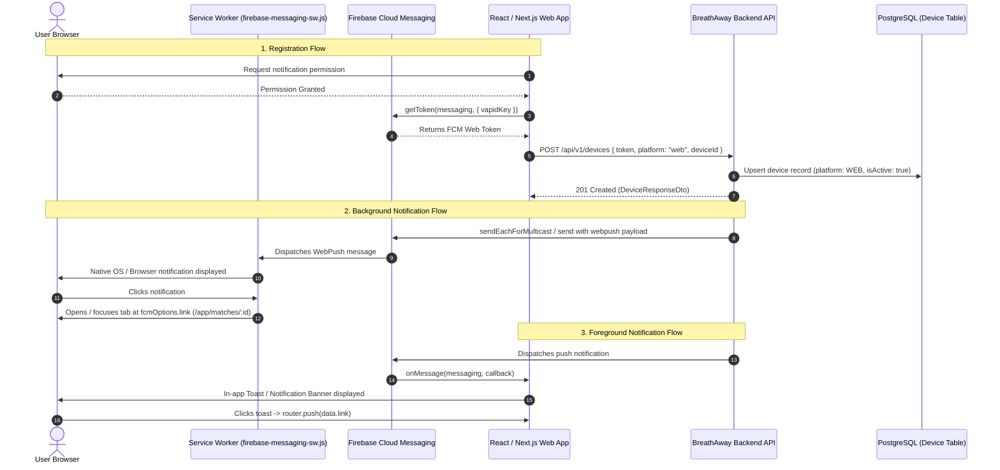

# Web Push Notifications Integration Guide

This guide provides end-to-end integration instructions for frontend engineers implementing Web Push notifications on the BreathAway web application (`/app`).

---

## 🎯 Architecture Overview

BreathAway uses **Firebase Cloud Messaging (FCM)** as the push notification provider across mobile (iOS, Android) and web (browser service workers).



---

## 🔑 1. Prerequisites & Firebase Setup

### Firebase Project Alignment
The web app must initialize Firebase using the same project as the backend:
* **Development**: `breathaway-dev-37fd5`
* **Production**: `breathaway-prod` (configured via environment)

> [!WARNING]
> Web push tokens are bound to the specific Firebase Project ID that created them. If the web client uses a mismatched project, the backend will receive `messaging/mismatched-credential` or `messaging/invalid-registration-token` errors when dispatching.

### VAPID Key (Web Push Certificate)
Obtain the public VAPID key (Key Pair) from the Firebase Console:
1. Go to **Firebase Console** → Project Settings.
2. Select the **Cloud Messaging** tab.
3. Scroll down to **Web configuration** → **Web Push certificates**.
4. Generate or copy your public Key Pair (VAPID key). Store this in your web app environment variables as `NEXT_PUBLIC_FIREBASE_VAPID_KEY` (or equivalent).

---

## 🛠 2. Service Worker Setup (`firebase-messaging-sw.js`)

Create a `firebase-messaging-sw.js` file and place it in the public root directory (`/public` in Next.js/Vite) so that its scope covers the entire origin (`/`):

```javascript
// public/firebase-messaging-sw.js
importScripts('https://www.gstatic.com/firebasejs/10.12.0/firebase-app-compat.js');
importScripts('https://www.gstatic.com/firebasejs/10.12.0/firebase-messaging-compat.js');

firebase.initializeApp({
  apiKey: "YOUR_FIREBASE_API_KEY",
  authDomain: "breathaway-dev-37fd5.firebaseapp.com",
  projectId: "breathaway-dev-37fd5",
  storageBucket: "breathaway-dev-37fd5.appspot.com",
  messagingSenderId: "YOUR_MESSAGING_SENDER_ID",
  appId: "YOUR_APP_ID"
});

const messaging = firebase.messaging();

// Optional background message handler
// Note: When the browser tab is closed or in the background, the browser automatically
// displays the system notification using the backend's webpush configuration (title, body, icon, badge).
// When the notification is clicked, the browser automatically navigates to `fcmOptions.link`.
messaging.onBackgroundMessage((payload) => {
  console.log('[firebase-messaging-sw.js] Received background push message:', payload);
});
```

---

## 📲 3. Requesting Permission & Getting the Token

Implement a client-side utility to prompt the user and obtain the push token:

```typescript
// src/services/notifications.service.ts
import { getMessaging, getToken, onMessage, MessagePayload } from 'firebase/messaging';
import { firebaseApp } from '@/lib/firebase';

const messaging = typeof window !== 'undefined' ? getMessaging(firebaseApp) : null;

/**
 * Prompts user for notification permission and registers the device token with the backend.
 */
export async function registerWebPushNotifications(): Promise<string | null> {
  if (!('Notification' in window) || !('serviceWorker' in navigator) || !messaging) {
    console.warn('Push notifications are not supported in this browser.');
    return null;
  }

  // 1. Request user permission
  const permission = await Notification.requestPermission();
  if (permission !== 'granted') {
    console.log('Push notification permission denied by user.');
    return null;
  }

  try {
    // 2. Register service worker
    const serviceWorkerRegistration = await navigator.serviceWorker.register(
      '/firebase-messaging-sw.js'
    );

    // 3. Obtain FCM Web Registration Token
    const currentToken = await getToken(messaging, {
      vapidKey: process.env.NEXT_PUBLIC_FIREBASE_VAPID_KEY,
      serviceWorkerRegistration,
    });

    if (!currentToken) {
      console.warn('No registration token available.');
      return null;
    }

    // 4. Send token to BreathAway Backend
    await syncDeviceTokenWithBackend(currentToken);
    return currentToken;
  } catch (error) {
    console.error('Error enabling web push notifications:', error);
    return null;
  }
}
```

---

## 🌐 4. Register Device with Backend API

The backend endpoint `POST /api/v1/devices` natively supports `platform: "web"`, tracks active tokens, and automatically dedupes records.

### Request Specification
- **Method**: `POST`
- **Path**: `/api/v1/devices`
- **Auth**: `Bearer <USER_JWT_TOKEN>`
- **Headers**:
  ```http
  Authorization: Bearer <USER_JWT_TOKEN>
  Content-Type: application/json
  x-api-key: <CLIENT_API_KEY>
  x-client-id: <CLIENT_ID>
  x-device-id: <PERSISTENT_BROWSER_UUID>
  ```
- **Payload (`CreateDeviceRequestDto`)**:
  ```json
  {
    "token": "eX_v01...FCM_TOKEN_HERE...",
    "platform": "web",
    "deviceId": "550e8400-e29b-41d4-a716-446655440000",
    "appVersion": "1.0.0"
  }
  ```

### Client Implementation Example
```typescript
/**
 * Synchronizes the FCM Web token with the BreathAway device management API.
 */
async function syncDeviceTokenWithBackend(token: string): Promise<void> {
  // Retrieve or generate a persistent UUID for this browser instance
  let deviceId = localStorage.getItem('breathaway_device_id');
  if (!deviceId) {
    deviceId = crypto.randomUUID();
    localStorage.setItem('breathaway_device_id', deviceId);
  }

  const response = await fetch('/api/v1/devices', {
    method: 'POST',
    headers: {
      'Content-Type': 'application/json',
      Authorization: `Bearer ${getAuthToken()}`,
      'x-api-key': process.env.NEXT_PUBLIC_API_KEY!,
      'x-client-id': process.env.NEXT_PUBLIC_CLIENT_ID!,
      'x-device-id': deviceId,
    },
    body: JSON.stringify({
      token,
      platform: 'web',
      deviceId,
      appVersion: '1.0.0',
    }),
  });

  if (!response.ok) {
    throw new Error(`Failed to register device: ${response.statusText}`);
  }
}
```

---

## 🔔 5. Foreground Notification Handling (`onMessage`)

When a user is actively viewing the website in a focused tab, the browser automatically **suppresses** native system push popups. You must listen to `onMessage` to render an in-app toast or banner:

```typescript
// src/components/NotificationListener.tsx
import { useEffect } from 'react';
import { useRouter } from 'next/router';
import { getMessaging, onMessage } from 'firebase/messaging';
import { toast } from 'sonner'; // or your UI toast library
import { firebaseApp } from '@/lib/firebase';

export function NotificationListener() {
  const router = useRouter();

  useEffect(() => {
    if (typeof window === 'undefined') return;

    const messaging = getMessaging(firebaseApp);
    const unsubscribe = onMessage(messaging, (payload) => {
      console.log('Foreground push notification received:', payload);

      const title = payload.notification?.title || 'BreathAway';
      const body = payload.notification?.body || '';
      const link = payload.data?.link || payload.data?.route;

      // Show interactive in-app toast
      toast(title, {
        description: body,
        action: link
          ? {
              label: 'View',
              onClick: () => {
                const target = link.startsWith('/app') ? link : `/app${link}`;
                router.push(target);
              },
            }
          : undefined,
      });
    });

    return () => unsubscribe();
  }, [router]);

  return null;
}
```

---

## 🗺 6. Payload Contract & Deep Link Routing

The backend automatically enriches every push notification with navigation links in two places:
1. `webpush.fcmOptions.link`: Full absolute HTTPS URL (e.g. `https://www.breathaway.app/app/matches/:matchId`). When a background notification is clicked, the browser opens or focuses this URL directly.
2. `payload.data.link` & `payload.data.route`: Normalized relative route (e.g. `/matches/:matchId`, `/credits`). For foreground notifications, pass this to your router.

### Notification Route Catalog

| Notification Type | Deep Link Route (`data.link`) | Background Tap URL | Included Data Fields |
| :--- | :--- | :--- | :--- |
| **`NEW_MESSAGE`** | `/matches/:matchId` | `https://www.breathaway.app/app/matches/:matchId` | `roomId`, `matchId`, `senderName`, `messagePreview` |
| **`NEW_MATCH`** | `/matches/:matchId` | `https://www.breathaway.app/app/matches/:matchId` | `matchId`, `matchName` |
| **`CREDIT_UPDATE`** | `/credits` | `https://www.breathaway.app/app/credits` | `balance` |
| **`CREDITS_PURCHASED`** | `/credits` | `https://www.breathaway.app/app/credits` | `creditsAdded`, `creditBalance` |
| **`CREDITS_USED`** | `/credits` | `https://www.breathaway.app/app/credits` | `creditsUsed`, `creditBalance` |
| **`BUNDLE_EXPIRY_WARNING`**| `/credits` | `https://www.breathaway.app/app/credits` | `count`, `expiryDate`, `daysRemaining` |
| **`LIKE_SENT`** | `/likes` | `https://www.breathaway.app/app/likes` | `targetMaskedValue`, `targetLabel` |
| **`LIKE_WITHDRAWN`** | `/likes` | `https://www.breathaway.app/app/likes` | `targetMaskedValue` |
| **`LIKES_EXPIRED`** | `/likes` | `https://www.breathaway.app/app/likes` | `count`, `expiryDate` |
| **`WELCOME`** | `/explore` | `https://www.breathaway.app/app/explore` | `name` |
| **`DEVICE_ADDED`** | `/settings/devices` | `https://www.breathaway.app/app/settings/devices` | `platform`, `deviceId` |
| **`IDENTITY_ADDED` / `REMOVED`** | `/settings/identities` | `https://www.breathaway.app/app/settings/identities` | `identityType`, `maskedValue` |

---

## 🚪 7. Logout & Token De-registration

When a user logs out of the web application, invoke the delete endpoint to prevent future notifications from being dispatched to that browser:

```typescript
export async function handleLogout(deviceId: string) {
  try {
    await fetch(`/api/v1/devices/${deviceId}`, {
      method: 'DELETE',
      headers: {
        Authorization: `Bearer ${getAuthToken()}`,
      },
    });
  } catch (err) {
    console.warn('Failed to unregister push device on logout:', err);
  } finally {
    clearAuthTokens();
    window.location.href = '/login';
  }
}
```
