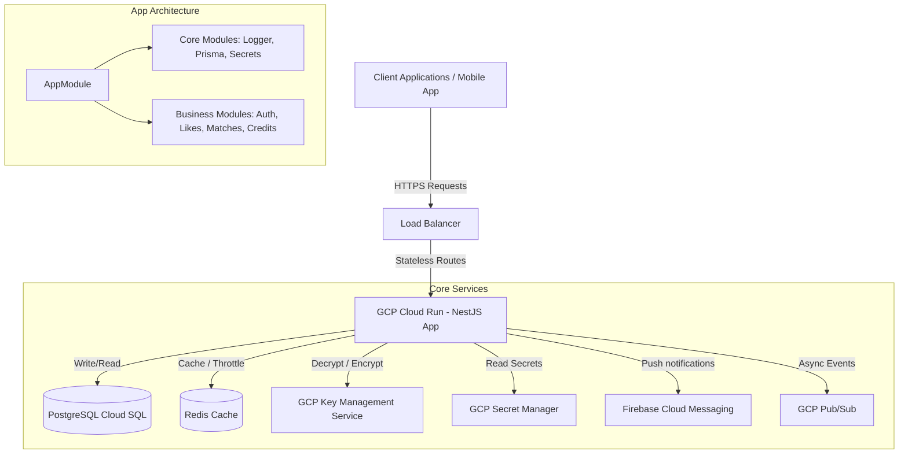
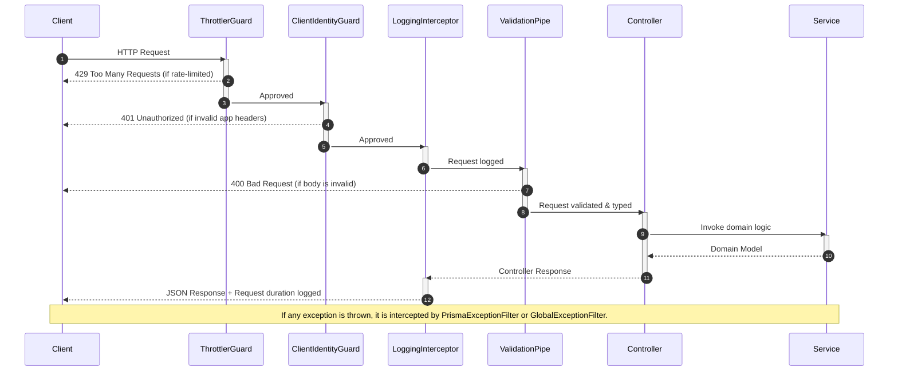

# Architecture Guide

This guide provides a comprehensive overview of the **BreathAway** backend system architecture, design patterns, and engineering standards.

---

## 🏗 High-Level Architecture

The BreathAway backend is built as a modular monolith using the NestJS framework. It is designed to run in stateless, containerized environments (such as Google Cloud Run) and offloads persistent states to managed services (PostgreSQL via Cloud SQL, Redis via Cloud Memorystore).

---

## 📦 Core Architecture Patterns

We enforce strict SOLID principles and NestJS architectural paradigms:

### 1. Modularity & Separation of Concerns

Each feature is encapsulated in its own NestJS module folder under `src/modules/`. Communication between modules is handled via explicit dependency injection (DI) or NestJS's `EventEmitter` for asynchronous decoupling.

- **Controllers**: Responsible _only_ for handling incoming HTTP requests, routing, status codes, and returning response payloads.
- **Services**: Contain the core domain business logic. They do not interact with raw request objects.
- **Repositories**: Database queries are encapsulated within dedicated modules or services (e.g., `PrismaService`), ensuring that controllers never execute Prisma commands directly.

### 2. Strict DTO Architecture

Every endpoint must have validation schema classes using `class-validator` and `class-transformer`.

- **Request DTOs**: Named `[action]-[entity].request.dto.ts`. Used to filter, sanitize, and validate incoming query parameters or request bodies.
- **Response DTOs**: Named `[entity].response.dto.ts`. Used with interceptors to ensure no internal schema columns or fields leak to the client.

### 3. Hashed & Encrypted PII (Privacy)

To comply with global privacy standards, personal identifiable information (PII) is encrypted at rest.

- Hashing: Fields like email addresses and phone numbers are hashed using SHA-256 for lookup/indexing purposes (`valueHash`).
- Encryption: The original values are encrypted using AES-256-GCM (`publicValueCiphertext`, `publicValueIv`, `publicValueTag`). The encryption key is protected using Google Cloud KMS.

---

## 🔄 Request Lifecycle & Global Enhancers

NestJS executes multiple layers of interceptors, guards, and filters on every incoming request.

---

## Coding Standards and Guidelines

When developing in the BreathAway backend, you must strictly follow these engineering conventions:

### Import Management

To keep import statements clean and readable:

- Use **absolute path aliases** (e.g. `@modules/auth/...`, `@common/guards/...`) for any imports traversing more than two directory levels up (i.e. avoiding `../../../`).
- Keep imports ordered:
  1. Built-in Node.js modules (e.g. `crypto`, `fs`).
  2. External packages (e.g. `@nestjs/common`, `rxjs`).
  3. Absolute path internal modules (e.g. `@core/...`, `@infrastructure/...`).
  4. Local relative path files.

### Naming Conventions

- **Files**: Use `kebab-case` and appropriate type suffixes (e.g. `create-user.request.dto.ts`, `profiles.controller.ts`).
- **Classes**: Use `PascalCase` (e.g. `ProfilesController`, `CreditsService`).
- **Methods & Variables**: Use `camelCase` (e.g. `findUserById`, `activeSubscription`).
- **Constants**: Use `UPPER_SNAKE_CASE` (e.g. `MAX_RETRY_COUNT`).
