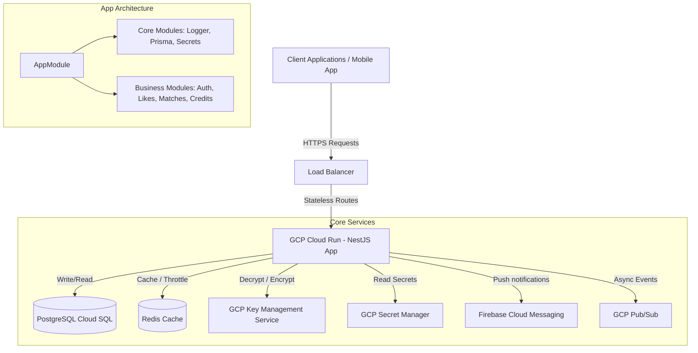
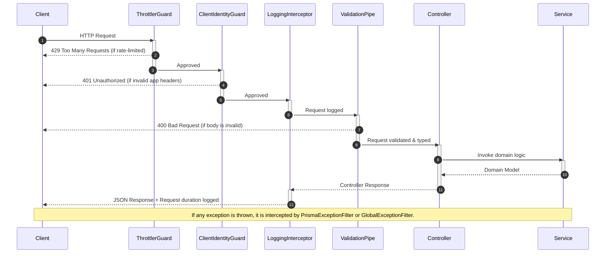

# Architecture Guide

This guide provides a comprehensive overview of the **BreathAway** backend system architecture, design patterns, and engineering standards.

---

## 🏗 High-Level Architecture

The BreathAway backend is built as a modular monolith using the NestJS framework. It is designed to run in stateless, containerized environments (such as Google Cloud Run) and offloads persistent states to managed services (PostgreSQL via Cloud SQL, Redis via Cloud Memorystore).

```mermaid
graph TD
    Client[Client Applications / Mobile App] -->|HTTPS Requests| LB[Load Balancer]
    LB -->|Stateless Routes| CloudRun[GCP Cloud Run - NestJS App]

    subgraph Core Services
        CloudRun -->|Write/Read| DB[(PostgreSQL Cloud SQL)]
        CloudRun -->|Cache / Throttle| Cache[(Redis Cache)]
        CloudRun -->|Decrypt / Encrypt| KMS[GCP Key Management Service]
        CloudRun -->|Read Secrets| SecretManager[GCP Secret Manager]
        CloudRun -->|Push notifications| FCM[Firebase Cloud Messaging]
        CloudRun -->|Async Events| PubSub[GCP Pub/Sub]
    end

    subgraph App Architecture
        AppModule[AppModule]
        AppModule --> CoreModules[Core Modules: Logger, Prisma, Secrets]
        AppModule --> BusinessModules[Business Modules: Auth, Likes, Matches, Credits]
    end
```

---

## 📦 Core Architecture Patterns

We enforce strict SOLID principles and NestJS architectural paradigms:

### 1. Modularity & Separation of Concerns

Each feature is encapsulated in its own NestJS module folder under `src/modules/`. Communication between modules is handled via explicit dependency injection (DI) or NestJS's `EventEmitter` for asynchronous decoupling.

- **Controllers**: Responsible _only_ for handling incoming HTTP requests, routing, status codes, and returning response payloads.
- **Services**: Contain the core domain business logic. They do not interact with raw request objects.
- **Repositories**: Database queries are encapsulated within dedicated modules or services (e.g., `PrismaService`), ensuring that controllers never execute Prisma commands directly.

### 2. Strict DTO Architecture

Every endpoint must have validation schema classes using `class-validator` and `class-transformer`.

- **Request DTOs**: Named `[action]-[entity].request.dto.ts`. Used to filter, sanitize, and validate incoming query parameters or request bodies.
- **Response DTOs**: Named `[entity].response.dto.ts`. Used with interceptors to ensure no internal schema columns or fields leak to the client.

### 3. Hashed & Encrypted PII (Zero-Plaintext Privacy)

To comply with global privacy standards (GDPR Articles 5, 25, 32, 34), personal identifiable information (PII) is encrypted at rest using application-layer envelope encryption backed by Google Cloud KMS:

- **Hashed Identifiers**: Lookup identifiers like email addresses and phone numbers are hashed using SHA-256 (`publicValueHash`) for indexability.
- **Dedicated Envelope Columns**: Raw contact handles in `Identity` (`publicValueCiphertext`, `publicValueWrappedKey`, `publicValueIv`, `publicValueTag`) are stored across dedicated envelope columns.
- **Compact Envelope Columns**: Direct customer names (`UserProfile.firstName`, `UserProfile.lastName`) and romantic annotations (`Like.label`) are serialized as self-describing compact envelopes (`enc:v1:...`) in PostgreSQL `TEXT` columns.
- **Zero-Plaintext Invariant**: Plaintext is never persisted in Supabase/PostgreSQL, protecting database dumps, replicas, and logs from PII exposure.
- **Deep Dive**: See the dedicated [Database & Prisma ORM Architecture](./architecture/database.md#-field-level-envelope-encryption-fle-for-pii) guide.

### 4. Decoupled Domain Events

To prevent cross-cutting leakage and tight coupling, domain feature services **never** call notification delivery mechanics directly.

- **Domain Events**: Domain services (`Auth`, `Likes`, `MatchResolver`, `Credits`, etc.) emit strongly typed domain events via NestJS `EventEmitter2` (e.g. `LIKE_SENT_EVENT`, `MATCH_CREATED_EVENT`).
- **Centralized Listener**: The `NotificationEventsListener` in `NotificationsModule` subscribes to domain events via `@OnEvent(EVENT, { async: true })`, resolves recipient profile data, and orchestrates channel dispatch (`PUSH`, `EMAIL`, `WHATSAPP`).
- **Zero Coupling**: Feature modules never import `NotificationsModule` or inject `NotificationsService`.
- **Deep Dive**: See the dedicated [Decoupled Domain Events Architecture](./architecture/domain-events.md) guide.

### 5. Web Payments & Gateway Orchestration

The platform provides a provider-agnostic, secure payment orchestration engine for web clients:

- **Dumb Frontend Model**: The client app never calculates prices or selects payment gateways. It provides purchase intent (`planId`), and the backend dynamically routes to the appropriate gateway (e.g. Razorpay) based on regional database routing rules (`PaymentGatewayRoute`).
- **Cryptographic Security**: Client callbacks and webhooks require HMAC-SHA256 signature verification compared using `crypto.timingSafeEqual`.
- **Atomic Double-Grant Prevention**: Credit fulfillment and ledger insertion execute inside a single atomic Prisma transaction with conditional updates and unique constraint guards (`P2002`/`P2025`).
- **Autonomous Reconciliation**: An autonomous background sweeper (`PaymentsReconciliationService`) polls stale `PENDING` orders every 2 minutes to settle dropped webhooks and terminate expired checkouts.
- **Deep Dive**: See the dedicated [Web Payments Architecture & Gateway Orchestration](./architecture/payments.md) guide.

---

## 🔄 Request Lifecycle & Global Enhancers

NestJS executes multiple layers of interceptors, guards, and filters on every incoming request.

```mermaid
sequenceDiagram
    autonumber
    Client ->> ThrottlerGuard: HTTP Request
    activate ThrottlerGuard
    ThrottlerGuard -->> Client: 429 Too Many Requests (if rate-limited)
    ThrottlerGuard ->> ClientIdentityGuard: Approved
    deactivate ThrottlerGuard

    activate ClientIdentityGuard
    ClientIdentityGuard -->> Client: 401 Unauthorized (if invalid app headers)
    ClientIdentityGuard ->> LoggingInterceptor: Approved
    deactivate ClientIdentityGuard

    activate LoggingInterceptor
    LoggingInterceptor ->> ValidationPipe: Request logged
    deactivate LoggingInterceptor

    activate ValidationPipe
    ValidationPipe -->> Client: 400 Bad Request (if body is invalid)
    ValidationPipe ->> Controller: Request validated & typed
    deactivate ValidationPipe

    activate Controller
    Controller ->> Service: Invoke domain logic
    activate Service
    Service -->> Controller: Domain Model
    deactivate Service
    Controller -->> LoggingInterceptor: Controller Response
    deactivate Controller

    activate LoggingInterceptor
    LoggingInterceptor -->> Client: JSON Response + Request duration logged
    deactivate LoggingInterceptor

    Note over Client, Service: If any exception is thrown, it is intercepted by PrismaExceptionFilter or GlobalExceptionFilter.
```

---

## Coding Standards and Guidelines

When developing in the BreathAway backend, you must strictly follow these engineering conventions:

### Import Management

To keep import statements clean and readable:

- Use **absolute path aliases** (e.g. `@modules/auth/...`, `@common/guards/...`) for any imports traversing more than two directory levels up (i.e. avoiding `../../../`).
- Keep imports ordered:
  1. Built-in Node.js modules (e.g. `crypto`, `fs`).
  2. External packages (e.g. `@nestjs/common`, `rxjs`).
  3. Absolute path internal modules (e.g. `@core/...`, `@infrastructure/...`).
  4. Local relative path files.

### Naming Conventions

- **Files**: Use `kebab-case` and appropriate type suffixes (e.g. `create-user.request.dto.ts`, `profiles.controller.ts`).
- **Classes**: Use `PascalCase` (e.g. `ProfilesController`, `CreditsService`).
- **Methods & Variables**: Use `camelCase` (e.g. `findUserById`, `activeSubscription`).
- **Constants**: Use `UPPER_SNAKE_CASE` (e.g. `MAX_RETRY_COUNT`).
