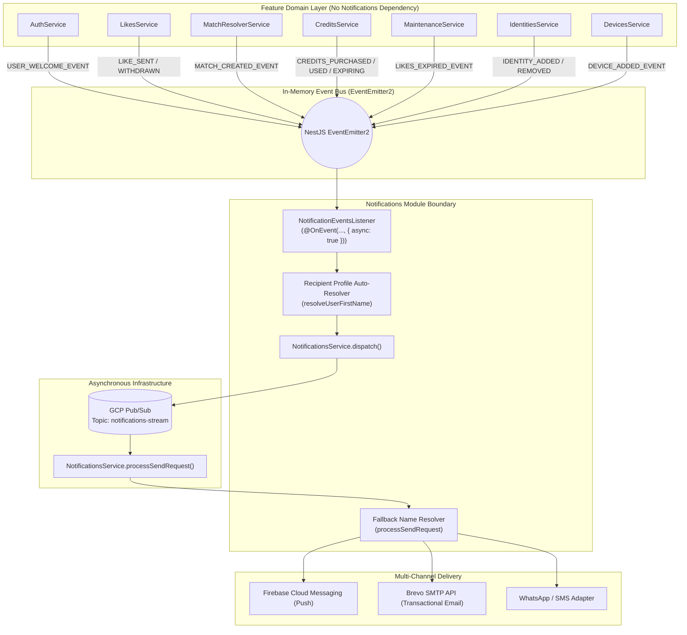

# 📡 Decoupled Domain Events Architecture

The BreathAway backend utilizes an **event-driven, decoupled domain architecture** powered by `@nestjs/event-emitter`. Under this design, feature domain services (`Auth`, `Likes`, `MatchResolver`, `Credits`, `Devices`, `Identities`, `Maintenance`) emit strongly typed domain events rather than directly invoking downstream side-effect processors such as `NotificationsService`.

---

## 🎯 Architectural Rationale

In early iterations, domain services directly orchestrated notifications:

```typescript
// ❌ Legacy Anti-Pattern (Tight Coupling)
// AuthService / LikesService / CreditsService directly injected NotificationsService
// and queried UserProfile solely to format notification payloads:
const profile = await this.prisma.userProfile.findUnique({ where: { userId } });
await this.notificationsService.dispatch({
  type: NotificationType.LIKE_SENT,
  userIds: [userId],
  payload: { name: profile.firstName, ... },
});
```

### Problems with Direct Service Coupling:

1. **Module Entanglement**: Feature modules were forced to import `NotificationsModule` and inject `NotificationsService`, creating cross-cutting dependency graphs.
2. **Leaky Profile Resolution**: Domain services queried `prisma.userProfile` just to obtain recipient first names, polluting business transactions with auxiliary notification concerns.
3. **Boilerplate & Risk**: Services repeatedly duplicated private fire-and-forget methods with try/catch and logger fallbacks.
4. **Fragile Testing**: Unit tests for domain services required mocking `NotificationsService` and testing notification channels instead of pure business outcomes.

### The Decoupled Pattern (Current Architecture):

```typescript
// ✅ Modern Decoupled Architecture
// Domain services emit domain events; NotificationsModule listens asynchronously
this.eventEmitter.emit(
  LIKE_SENT_EVENT,
  new LikeSentEvent(userId, targetMaskedValue, targetLabel, intent),
);
```

---

## 🏗 System Architecture Flow

The following diagram illustrates how domain services produce events, how the centralized `NotificationEventsListener` consumes them, and how messages flow into the GCP Pub/Sub pipeline:



---

## 📋 Domain Event Catalog

All domain events are strongly typed classes accompanied by exported string constants:

| Module                    | Event Constant                                               | Event Class                 | Emitted When                                               |
| :------------------------ | :----------------------------------------------------------- | :-------------------------- | :--------------------------------------------------------- |
| **Auth**                  | `USER_WELCOME_EVENT` (`'user.welcome'`)                      | `UserWelcomeEvent`          | A new user signs up or links their first verified email    |
| **Auth** / **Identities** | `IDENTITY_ADDED_EVENT` (`'identity.added'`)                  | `IdentityAddedEvent`        | A new contact method (email, phone) is added to an account |
| **Identities**            | `IDENTITY_REMOVED_EVENT` (`'identity.removed'`)              | `IdentityRemovedEvent`      | An identity method is deleted/unlinked                     |
| **Devices**               | `DEVICE_ADDED_EVENT` (`'device.added'`)                      | `DeviceAddedEvent`          | A new device token is registered for an account            |
| **Likes**                 | `LIKE_SENT_EVENT` (`'like.sent'`)                            | `LikeSentEvent`             | A user sends a like to a contact                           |
| **Likes**                 | `LIKE_WITHDRAWN_EVENT` (`'like.withdrawn'`)                  | `LikeWithdrawnEvent`        | A user cancels or deletes a pending like                   |
| **Match Resolver**        | `MATCH_CREATED_EVENT` (`'match.created'`)                    | `MatchCreatedEvent`         | A mutual like is resolved into an active `Match`           |
| **Credits**               | `CREDITS_PURCHASED_EVENT` (`'credits.purchased'`)            | `CreditsPurchasedEvent`     | A user purchases or receives a credit bundle               |
| **Credits**               | `CREDITS_USED_EVENT` (`'credits.used'`)                      | `CreditsUsedEvent`          | Credits are debited from the user's ledger                 |
| **Credits**               | `CREDIT_BUNDLE_EXPIRING_EVENT` (`'credits.bundle-expiring'`) | `CreditBundleExpiringEvent` | Cron identifies credit bundles nearing expiry (7d / 2d)    |
| **Maintenance**           | `LIKES_EXPIRED_EVENT` (`'likes.expired'`)                    | `LikesExpiredEvent`         | Nightly cron voids pending likes older than 90 days        |

---

## 🛠 Implementation Blueprint

When implementing a new feature that requires notifying users, follow this standardized 4-step blueprint:

### 1. Define the Domain Event

Create `src/modules/<feature>/events/<entity>-<action>.event.ts` and barrel-export it in `events/index.ts`:

```typescript
// src/modules/subscriptions/events/subscription-renewed.event.ts
export const SUBSCRIPTION_RENEWED_EVENT = 'subscription.renewed';

export class SubscriptionRenewedEvent {
  constructor(
    public readonly userId: string,
    public readonly planId: string,
    public readonly renewalDate: Date,
  ) {}
}
```

### 2. Emit the Event in the Domain Service

Services extending `BaseService` inherit `this.eventEmitter: EventEmitter2`:

```typescript
// src/modules/subscriptions/subscriptions.service.ts
import { Injectable } from '@nestjs/common';
import { BaseService } from '@shared/domain/base.service';
import { SUBSCRIPTION_RENEWED_EVENT, SubscriptionRenewedEvent } from './events';

@Injectable()
export class SubscriptionsService extends BaseService {
  async renew(userId: string, planId: string) {
    // 1. Core business logic
    const sub = await this.prisma.subscription.update(...);

    // 2. Synchronous, non-blocking event emission
    this.eventEmitter.emit(
      SUBSCRIPTION_RENEWED_EVENT,
      new SubscriptionRenewedEvent(userId, planId, sub.renewalDate),
    );

    return this.toResponse(sub);
  }
}
```

> [!IMPORTANT]
> The domain service **never** queries `userProfile` for names or templates. Only domain-specific IDs, counts, and dates are passed in the event.

### 3. Handle the Event in `NotificationEventsListener`

In `src/modules/notifications/listeners/notification-events.listener.ts`:

```typescript
@OnEvent(SUBSCRIPTION_RENEWED_EVENT, { async: true })
async handleSubscriptionRenewed(event: SubscriptionRenewedEvent): Promise<void> {
  try {
    const firstName = await this.resolveUserFirstName(event.userId);

    await this.notificationsService.dispatch({
      type: NotificationType.SUBSCRIPTION_RENEWED,
      category: NotificationCategory.TRANSACTIONAL,
      priority: NotificationPriority.HIGH,
      channels: [NotificationChannel.EMAIL, NotificationChannel.PUSH],
      userIds: [event.userId],
      payload: {
        name: firstName ?? 'there',
        planId: event.planId,
        renewalDate: event.renewalDate.toISOString(),
      },
    });
  } catch (error) {
    this.logger.error('Failed to dispatch subscription renewed notification', {
      userId: event.userId,
      err: serializeError(error),
    });
  }
}
```

### 4. Recipient Name Auto-Resolution Fallback

If an event listener dispatches a single-recipient notification without providing `payload.name`, `NotificationsService.processSendRequest` automatically looks up `userProfile.firstName` before dispatching to downstream providers:

```typescript
// Inside NotificationsService.processSendRequest
if (!dto.payload.name && dto.userIds.length === 1) {
  const profile = await this.prisma.userProfile.findUnique({
    where: { userId: dto.userIds[0] },
    select: { firstName: true },
  });
  if (profile?.firstName) {
    dto.payload.name = profile.firstName;
  }
}
```

---

## 🧪 Testing Patterns

### Domain Service Unit Tests

Domain tests only assert event emissions, completely eliminating mocks for `NotificationsService`:

```typescript
// src/modules/subscriptions/tests/subscriptions.service.spec.ts
it('should emit SUBSCRIPTION_RENEWED_EVENT when subscription renews', async () => {
  const eventEmitter = module.get(EventEmitter2);
  await service.renew(userId, planId);

  expect(eventEmitter.emit).toHaveBeenCalledWith(
    SUBSCRIPTION_RENEWED_EVENT,
    expect.objectContaining({ userId, planId }),
  );
});
```

### Listener Unit Tests

The listener is independently tested in `src/modules/notifications/tests/notification-events.listener.spec.ts`:

```typescript
it('should handle SUBSCRIPTION_RENEWED_EVENT and dispatch notification', async () => {
  await listener.handleSubscriptionRenewed(mockEvent);

  expect(notificationsService.dispatch).toHaveBeenCalledWith(
    expect.objectContaining({
      type: NotificationType.SUBSCRIPTION_RENEWED,
      userIds: [mockEvent.userId],
    }),
  );
});
```
