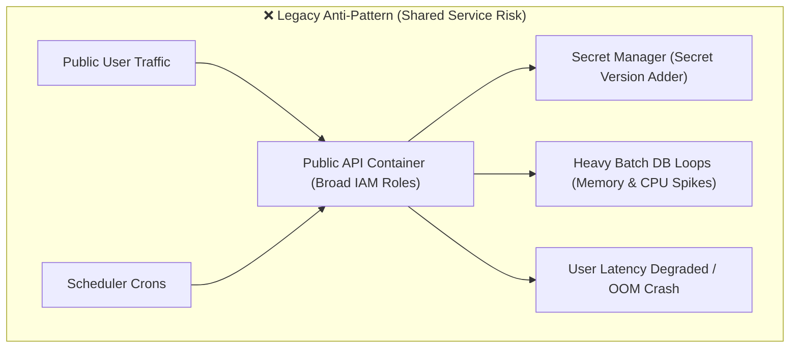
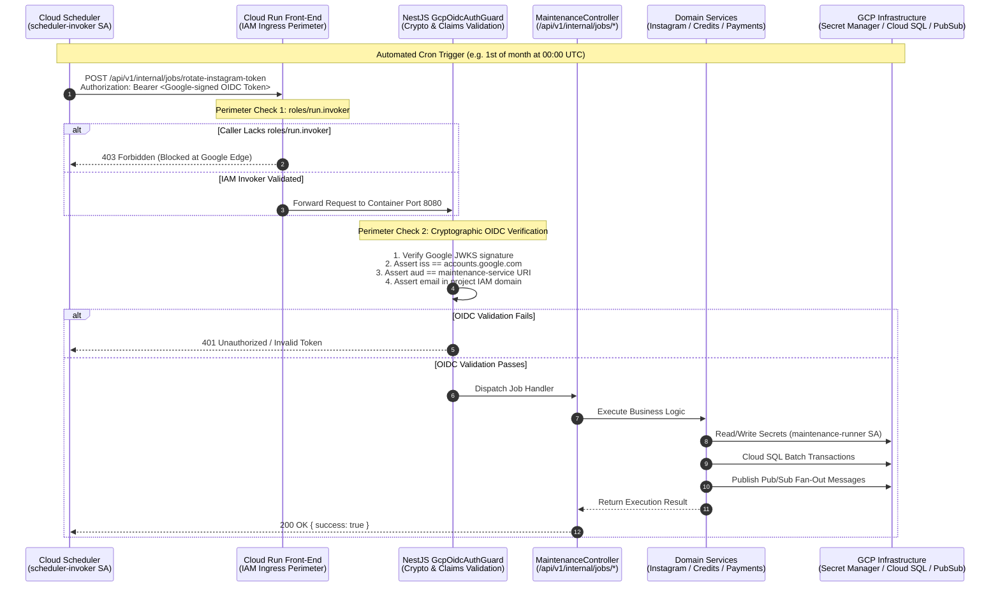

# 🛠️ Maintenance & Internal Worker Architecture

The BreathAway backend utilizes a **Single-Artifact, Dual-Service Deployment Architecture** on Google Cloud Run. This pattern runs two logically isolated services—the public-facing API (`backend-service`) and an internal maintenance worker (`maintenance-service`)—from a **single NestJS codebase and a single Docker image**.

---

## 🎯 Why the Maintenance Service Exists

Modern backend applications handle two fundamentally distinct categories of traffic:

1. **Interactive User Traffic**: Low-latency, stateless HTTP requests initiated by mobile apps and web clients (auth, swiping, messaging, profile updates).
2. **Privileged Scheduled Workloads**: Long-running, batch-oriented data hygiene routines, credential lifecycle rotations, and third-party gateway reconciliations.

Running privileged batch tasks inside the public-facing API introduces critical security and reliability liabilities:



### 1. Principle of Least Privilege (Security Isolation)

The public-facing container must never possess write permissions to critical infrastructure secrets. For example, rotating third-party OAuth credentials (such as Instagram Long-Lived Access Tokens) requires `roles/secretmanager.secretVersionAdder`.

If `backend-service` were granted `secretVersionAdder`, any remote code execution (RCE) or server-side request forgery (SSRF) flaw in public endpoints could allow an attacker to overwrite production secrets. By isolating secret rotation into `maintenance-service` under a dedicated service account (`maintenance-runner`), `backend-service` retains strictly read-only access (`roles/secretmanager.secretAccessor`).

### 2. Performance & Blast-Radius Isolation

Batch processes (like fanning out thousands of expired credit bundles or polling payment gateways) consume bursty CPU, memory, and database connections. Running them inside the user-facing container causes:

- Event-loop starvation and latency spikes for real-time mobile app users.
- Database connection pool exhaustion.
- Potential Out-Of-Memory (OOM) container restarts that terminate active user requests.

Isolating batch jobs to `maintenance-service` ensures public traffic remains 100% unaffected by background maintenance cycles.

### 3. Strict Perimeter Access Control

While `backend-service` allows unauthenticated public access (`--allow-unauthenticated`), `maintenance-service` has unauthenticated access strictly disabled (`--no-allow-unauthenticated`). Requests are filtered by Google Cloud Run's front-end proxy, rejecting any caller lacking IAM `roles/run.invoker` before traffic ever hits the container.

---

## 🏗 System Topology & Architecture Flow

The following diagram illustrates how Cloud Scheduler, Cloud Run IAM, OIDC cryptographic verification, and the NestJS application interact:



---

## 📦 Single-Artifact, Dual-Service Deployment Pattern

A core design goal is **zero code duplication and zero multi-repo overhead**. We do not build separate Docker images or maintain separate codebases.

### How It Works

1. **One Build Artifact**: `scripts/deploy.sh` executes Google Cloud Build to produce a single, production-hardened Docker image tagged with the Git commit hash:
   ```bash
   asia-south1-docker.pkg.dev/breathaway-dev/breathaway-backend/backend-service:8f98b36
   ```
2. **Two Cloud Run Deployments**: The deployment script deploys this exact same image twice with distinct runtime environments, service accounts, scaling parameters, and security policies.

### Service Comparison Matrix

| Property                   | `backend-service` (Public API)                              | `maintenance-service` (Internal Worker)                                                                     |
| :------------------------- | :---------------------------------------------------------- | :---------------------------------------------------------------------------------------------------------- |
| **Primary Responsibility** | Interactive user HTTP requests, mobile auth, realtime feeds | Scheduled maintenance, token rotations, reconciliation                                                      |
| **Service Account**        | `backend-service@<project>.iam.gserviceaccount.com`         | `maintenance-runner@<project>.iam.gserviceaccount.com`                                                      |
| **Secret Manager Access**  | `roles/secretmanager.secretAccessor` (Read-only)            | `roles/secretmanager.secretAccessor`<br/>`roles/secretmanager.secretVersionAdder` (Scoped to token secrets) |
| **Cloud SQL Access**       | `roles/cloudsql.client` (Pool Max: 4)                       | `roles/cloudsql.client` (Pool Max: 4)                                                                       |
| **Pub/Sub Access**         | `roles/pubsub.publisher`                                    | `roles/pubsub.publisher`                                                                                    |
| **Cloud KMS Access**       | `roles/cloudkms.cryptoKeyEncrypterDecrypter`                | N/A                                                                                                         |
| **Ingress Setting**        | `--ingress=all`                                             | `--ingress=all`                                                                                             |
| **Authentication**         | `--allow-unauthenticated`                                   | `--no-allow-unauthenticated` (IAM perimeter locked)                                                         |
| **Direct Invoker**         | Public Internet (via Mobile App / Web / Load Balancer)      | Cloud Scheduler (via `scheduler-invoker` SA)                                                                |
| **CPU Allocation**         | `2` vCPU                                                    | `2` vCPU (Can be scaled independently)                                                                      |
| **Memory Allocation**      | `2Gi` RAM                                                   | `2Gi` RAM (Can be scaled to 4Gi/8Gi for batch workloads)                                                    |
| **Concurrency Limit**      | `160` concurrent requests per instance                      | `80` concurrent requests (Dedicated resources for batch runs)                                               |
| **Max Instances**          | `10` (Dev) / `20` (Prod)                                    | `5` (Prevents runaway cost during batch runs)                                                               |
| **Swagger UI**             | `SWAGGER_ENABLED=true` (Dev) / `false` (Prod)               | `SWAGGER_ENABLED=false` (Always disabled)                                                                   |
| **Client Headers**         | Enforces `x-client-id`, `x-api-key`, `x-timezone`           | Bypassed via `@SkipClientIdentity()`                                                                        |

---

## 🔐 Cryptographic OIDC Authentication (`GcpOidcAuthGuard`)

Because `maintenance-service` endpoints must only be invoked by Google Cloud Scheduler, routes are secured using two layers of defence:

### 1. Header Bypassing (`@SkipClientIdentity`)

The public API enforces strict mobile client identity headers (`x-client-id`, `x-api-key`, `x-timezone`). Cloud Scheduler does not pass mobile headers. The `@SkipClientIdentity()` decorator instructs `ClientIdentityGuard` and `RequireTimezoneGuard` to bypass these checks for maintenance endpoints.

### 2. Google OIDC Token Verification

The endpoint is protected by `GcpOidcAuthGuard`:

```typescript
@Controller('internal/jobs')
export class MaintenanceController {
  @Post('rotate-instagram-token')
  @SkipClientIdentity()
  @UseGuards(GcpOidcAuthGuard)
  async rotateInstagramToken(): Promise<Record<string, unknown>> {
    return this.instagramService.refreshSystemAccessToken();
  }
}
```

### Defence-in-Depth Checks in `GcpOidcAuthGuard`:

1. **Google Public JWKS**: Verifies the JWT cryptographic signature against Google's public key certificate set.
2. **Issuer Check (`iss`)**: Strictly verifies `payload.iss === 'https://accounts.google.com'`.
3. **Audience Check (`aud`)**: Verifies `payload.aud` matches the target Cloud Run URL (`https://maintenance-service-...a.run.app`). Supports multi-audience configuration via comma-separated `GCP_OIDC_AUDIENCE`.
4. **Confused Deputy Prevention**: Ensures the caller's email matches the project IAM domain (`@breathaway-dev.iam.gserviceaccount.com`) or an explicit whitelist (`GCP_OIDC_ALLOWED_EMAILS`), preventing tokens issued to other GCP tenants from executing internal jobs.

---

## ⏰ Active Cloud Scheduler Jobs

All cron jobs are managed declaratively in [`terraform/scheduler.tf`](file:///terraform/scheduler.tf) and invoke `maintenance-service` over HTTPS:

| Job Name                               |    Schedule    | Timezone | Endpoint                                       | Purpose                                                                                                                                              |
| :------------------------------------- | :------------: | :------: | :--------------------------------------------- | :--------------------------------------------------------------------------------------------------------------------------------------------------- |
| **`rotate-instagram-token-job`**       |  `0 0 1 * *`   |   UTC    | `/api/v1/internal/jobs/rotate-instagram-token` | Rotates Instagram Long-Lived User Access Token monthly (valid 60 days) and uploads the new version to GCP Secret Manager (`access-token-instagram`). |
| **`expire-credit-bundles-job`**        |  `0 0 * * *`   |   UTC    | `/api/v1/internal/jobs/expire-bundles`         | Scans expired credit bundles daily, identifies affected users, and fans out batch events to Pub/Sub (`CREDIT_EXPIRY_BATCH`).                         |
| **`warn-expiring-credit-bundles-job`** |  `0 10 * * *`  |   UTC    | `/api/v1/internal/jobs/warn-expiring-bundles`  | Scans credit bundles expiring in exactly 6 to 7 days daily at 10 AM, dispatching advance warning domain events to users.                             |
| **`reconcile-payments-job`**           | `*/30 * * * *` |   UTC    | `/api/v1/internal/jobs/reconcile-payments`     | Polls payment gateways (e.g. Razorpay) every 30 minutes for stale `PENDING` orders, reconciling missed webhook deliveries.                           |

---

## 🎯 What Use Cases Belong in the Maintenance Service?

To maintain clean modular boundaries and protect system stability, adopt these criteria when adding new functionality:

### ✅ Belong in `maintenance-service`

1. **Third-Party Credential & Token Rotation**: Any scheduled operation that exchanges expiring tokens (Instagram Graph API, Apple developer keys, OAuth refresh tokens) and updates Secret Manager.
2. **Time-Windowed Data Expiration**: Daily/hourly sweeps that mark records as expired or voided (credit bundles, unverified signups, expired OTP records).
3. **Proactive Scheduled Notifications**: Jobs scanning rolling future horizons (e.g., "expiring in 7 days", "membership renewal in 3 days") to fan out warnings without storing stateful flags.
4. **Asynchronous Gateway Reconciliation**: Periodic reconciliation jobs polling external providers (Razorpay, Stripe, RevenueCat, SendGrid) to heal dropped webhooks.
5. **Data Hygiene & Archival**: Voiding dormant records (e.g., pending likes older than 90 days), pruning expired session caches, and archiving cold logs.
6. **Heavy Analytical Rollups**: Precomputing daily system KPIs, generating engagement summaries, or calculating leaderboard standings during off-peak hours.

### ❌ Do NOT Belong in `maintenance-service`

- Real-time user API endpoints (authentication, swiping, profile viewing).
- Public inbound webhooks (Meta, Razorpay, RevenueCat)—these belong in `WebhooksModule` on `backend-service`.
- High-frequency Pub/Sub push subscribers handling low-latency event streams—these run on `backend-service` or dedicated event worker instances.

---

## 🏗 Codebase Structuring Guidelines

How to structure maintenance functionality within the single NestJS codebase:

```
src/
├── modules/
│   ├── instagram/                  <-- Domain Feature Module
│   │   ├── instagram.service.ts    <-- Business logic (refresh token, call Graph API)
│   │   └── instagram.module.ts     <-- Exports InstagramService
│   │
│   ├── credits/                    <-- Domain Feature Module
│   │   ├── credits.service.ts      <-- Business logic (expire bundles, calculate warnings)
│   │   └── credits.module.ts       <-- Exports CreditsService
│   │
│   └── maintenance/                <-- Orchestration Facade Module
│       ├── maintenance.controller.ts <-- Exposes /api/v1/internal/jobs/*
│       ├── maintenance.service.ts    <-- Orchestrates batch queries & pub/sub fan-outs
│       └── maintenance.module.ts     <-- Imports domain modules & wires OIDC guards
```

### Core Implementation Rules

1. **Domain Services House Logic**: Business logic remains inside the relevant feature service (`InstagramService`, `CreditsService`, `PaymentsService`).
2. **Maintenance Module as Facade**: `MaintenanceController` and `MaintenanceService` act strictly as orchestration handlers for scheduled crons. They inject feature services and call domain methods.
3. **Decoupled Side Effects**: When a maintenance job requires user notification, it emits a domain event (`this.eventEmitter.emit(...)`). It never imports `NotificationsModule` directly.
4. **Idempotency**: All maintenance jobs must be strictly idempotent. If Cloud Scheduler retries a failed execution, the operation must produce identical results without duplicating side effects.
5. **Pagination & Fan-Out**: Never load unbounded query results into container memory. Use cursor pagination and push IDs to Pub/Sub to let worker instances scale horizontally.

---

## 🚢 Deployment Script Operations

Release operations are managed via [`scripts/deploy.sh`](file:///scripts/deploy.sh):

```bash
# Full deployment (Builds image once, deploys backend-service AND maintenance-service)
./scripts/deploy.sh --env=dev

# Deploy only the public backend service:
./scripts/deploy.sh --env=dev --only-public

# Deploy only the internal maintenance service:
./scripts/deploy.sh --env=dev --only-maintenance

# Skip maintenance service during backend updates:
./scripts/deploy.sh --env=dev --no-maintenance

# Force image rebuild even if git commit tag exists in Artifact Registry:
./scripts/deploy.sh --env=dev --force
```
