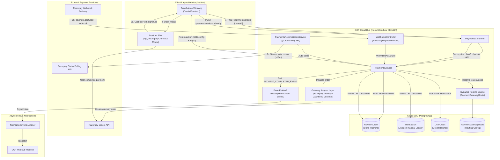
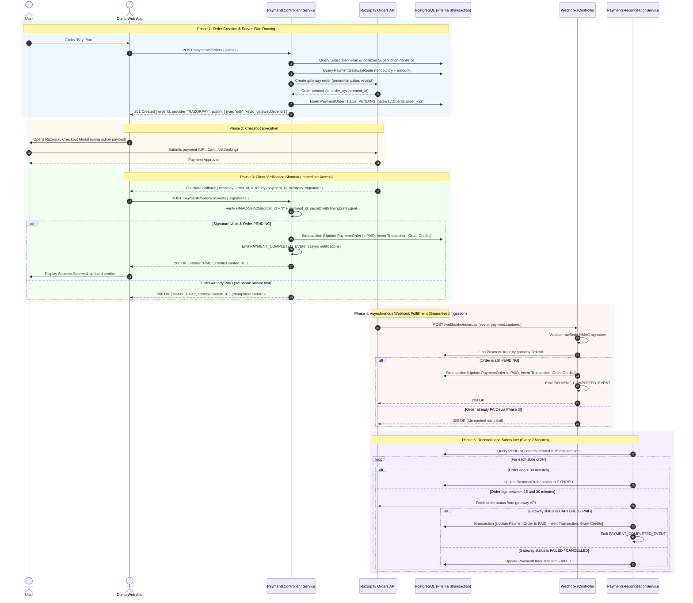
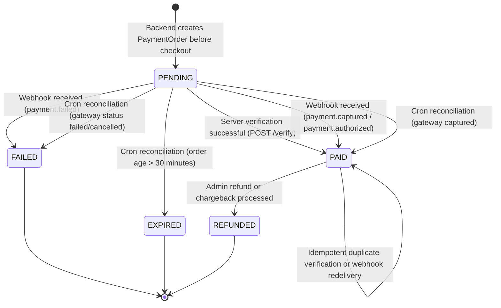
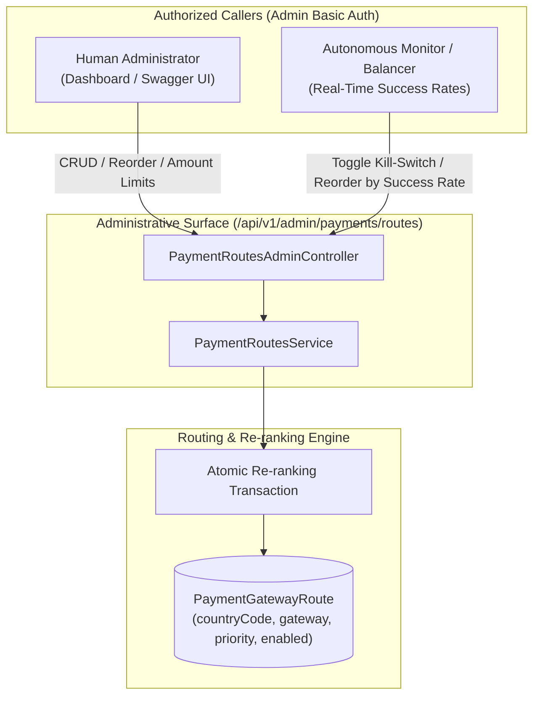

# 💳 Web Payments Architecture & Gateway Orchestration

This document details the system-wide architecture, security model, and execution workflows for the **BreathAway Web Payments System**.

---

## 🎯 Architectural Rationale & Core Principles

The payments engine is architected around four core pillars:

1. **The "Dumb Web App" Model**: The web frontend never decides which gateway to use, never calculates prices, and never sends payable monetary amounts to the backend. It only sends purchase intent (`planId`). The backend acts as the single source of truth for routing, currency selection, regional pricing, and checkout mechanics.
2. **Provider-Agnostic Gateway Routing**: The checkout layer is decoupled from concrete payment providers (Razorpay, Cashfree, Decentro, RevenueCat) through the **Adapter Pattern** and database-backed dynamic routing (`PaymentGatewayRoute`). Gateways can be enabled, disabled, or reprioritized per country without deploying code.
3. **Defense-in-Depth & Zero-Trust Security**: Browser callbacks are treated strictly as UI hints, never as proof of payment. Fulfillment occurs only after server-side cryptographic signature validation (HMAC-SHA256 with constant-time equality checks) or verified webhook ingestion with raw-body validation.
4. **Resilient At-Least-Once Idempotency**: Distributed payment systems inherently deliver duplicate events across webhooks, client callbacks, and background sweepers. The database guarantees atomicity through conditional state transitions and unique financial ledger constraints.

---

## 🏗 System Topology

The following diagram illustrates how the web client, the stateless NestJS application running on GCP Cloud Run, the Cloud SQL database, and external payment providers interact:



---

## 🔄 End-to-End Payment Lifecycle

The system operates across five distinct phases: Order Creation, Checkout Execution, Client Verification Shortcut, Asynchronous Webhook Fulfillment, and Cron Reconciliation.



---

## 🚦 Payment Order Finite State Machine

The lifecycle of every payment order is governed by a strict finite state machine tracked in `PaymentOrder.status`:



### State Transition Rules

| Initial State | Target State   | Triggering Actor                  | Invariant Enforced                                                                       |
| :------------ | :------------- | :-------------------------------- | :--------------------------------------------------------------------------------------- |
| **`[*]`**     | **`PENDING`**  | `PaymentsService.createOrder`     | Amount derived server-side from `SubscriptionPlanPrice`. Gateway order ID recorded.      |
| **`PENDING`** | **`PAID`**     | Client Verify, Webhook, or Cron   | Atomic transition inside Prisma transaction with conditional update (`status: PENDING`). |
| **`PENDING`** | **`FAILED`**   | Webhook or Cron                   | Terminal failure recorded without granting credits.                                      |
| **`PENDING`** | **`EXPIRED`**  | `PaymentsReconciliationService`   | Orders unfulfilled after 30 minutes are terminated to prevent late capture races.        |
| **`PAID`**    | **`PAID`**     | Duplicate Webhook or Client Retry | Safe idempotent no-op: returns existing `creditsGranted` without balance mutation.       |
| **`PAID`**    | **`REFUNDED`** | Admin / Webhook                   | Credits deducted or flagged in ledger.                                                   |

---

## 🔒 Data Invariants & Double-Grant Prevention

To guarantee financial integrity under high concurrency and duplicate network deliveries, the architecture relies on two separate database entities:

```
┌─────────────────────────────────┐       1:1       ┌─────────────────────────────────┐
│          PaymentOrder           │ ─────────────── │           Transaction           │
├─────────────────────────────────┤                 ├─────────────────────────────────┤
│ id: String (ULID)               │                 │ id: String (ULID)               │
│ status: PaymentOrderStatus      │                 │ gateway: PaymentGateway         │
│ gateway: PaymentGateway         │                 │ gatewayTransactionId: String    │
│ gatewayOrderId: String          │                 │ amount: Decimal                 │
│ transactionId: String? (Unique) │                 │ occurredAt: DateTime            │
└─────────────────────────────────┘                 └─────────────────────────────────┘
     @@unique([gateway, gatewayOrderId])                 @@unique([gateway, gatewayTransactionId])
```

### Why Separate `PaymentOrder` and `Transaction`?

1. **Lifecycle vs Ledger**: `PaymentOrder` represents a transient user checkout journey that can be abandoned, expired, or failed. `Transaction` represents an immutable, finalized financial accounting record.
2. **Gateway ID Disconnect**: At checkout initialization, only `gatewayOrderId` (e.g. `order_PZzFN...`) exists. The payment ID (`pay_PZzFN...`) is only generated after the user pays. Decoupling the tables enables tracking pending intent while keeping the ledger strictly populated with confirmed payment IDs.

### Atomic Fulfillment Transaction

Fulfillment is executed inside an atomic `prisma.$transaction`:

```typescript
await this.prisma.$transaction(async (tx) => {
  // 1. Conditional update: only updates if still PENDING (guards against race conditions)
  await tx.paymentOrder.update({
    where: { id: order.id, status: PaymentOrderStatus.PENDING },
    data: { status: PaymentOrderStatus.PAID },
  });

  // 2. Ledger insert: @@unique([gateway, gatewayTransactionId]) prevents double-recording
  const transaction = await this.transactionsService.record(
    {
      userId: order.userId,
      gateway: order.gateway,
      gatewayTransactionId: gatewayPaymentId,
      gatewayEventId: gatewayOrderId,
      status: TransactionStatus.COMPLETED,
      environment,
      channel: TransactionChannel.WEB,
      productId: order.planId,
      creditsGranted: order.plan.creditsGranted,
      amount: order.amount / 100,
      currency: order.currency,
      countryCode: order.countryCode,
      occurredAt: DateUtil.now().toISOString(),
    },
    tx,
  );

  // 3. Link transaction back to order
  await tx.paymentOrder.update({
    where: { id: order.id },
    data: { transactionId: transaction.id },
  });

  // 4. Grant credits to user balance
  await this.creditsService.grantCredits(
    {
      userId: order.userId,
      amount: order.plan.creditsGranted,
      source: CreditSource.PURCHASE,
      referenceId: transaction.id,
      expiresAt: expiresAt.toISOString(),
    },
    tx,
  );
});
```

### Concurrency Race Condition Defenses

- **Prisma Error `P2002` (Unique Constraint Violation)**: Occurs if the webhook and client callback execute concurrently on `Transaction(gateway, gatewayTransactionId)`. Caught, logged as concurrent redelivery, and returns existing credits without re-granting.
- **Prisma Error `P2025` (Record to update not found)**: Occurs on the conditional `where: { status: PENDING }` update if one thread already changed the status to `PAID`. Treated as an idempotent skip.

---

## 🔀 Dynamic Routing & Priority Step Architecture

The `PaymentGatewayRoute` table decouples the payment orchestration layer from static gateway providers. Routes are mapped by `(countryCode, gateway)` with amount guards (`minAmount`, `maxAmount`), an availability kill-switch (`enabled`), and a **contiguous ordinal priority step number** (`1, 2, 3, ... N`).



### Contiguous Step Numbers vs Arbitrary Rankings

In traditional routing systems, operators often assign arbitrary priority numbers (e.g. `900` or `1000`) to express low priority, leaving random gaps and unpredictable fallback behaviors.

BreathAway enforces **strict, contiguous ordinal step numbers** within each country:

1. **Contiguity Invariant**: Priorities for a country with `N` configured gateways are always strictly `1, 2, ... N`.
2. **Deterministic Fallback**: `PaymentsService.selectGateway()` evaluates routes using `WHERE countryCode = :c AND enabled = true ORDER BY priority ASC`. Step 1 is always evaluated first; if disabled or outside amount limits, Step 2 is selected next.
3. **Atomic Re-ranking**: When moving a route from Step `P_old` to Step `P_new`:
   - If promoting (`P_new < P_old`), intermediate routes in `[P_new, P_old - 1]` automatically increment by `+1`.
   - If demoting (`P_new > P_old`), intermediate routes in `[P_old + 1, P_new]` automatically decrement by `-1`.
4. **Validation Guard**: Requesting a priority step outside `[1, N]` (or `[1, N + 1]` during route creation) is rejected with `400 Bad Request` (`InvalidPriorityStepException`).

### Dynamic Success-Rate Balancing & Automated Circuit Breaking

The administrative API is designed for dual consumption:

- **Human Administrators**: Provision new country routes, update minimum/maximum amount thresholds, and audit gateway allocations.
- **Autonomous Systems**: An internal monitoring agent tracks moving-window payment conversion rates per provider. If a gateway experiences a surge in bank errors:
  - **Circuit Breaker**: The monitor calls `PATCH /api/v1/admin/payments/routes/:id/toggle` to disable the route (`enabled = false`), instantly shifting live traffic to the Step 2 gateway.
  - **Dynamic Traffic Reordering**: When recovery is detected, the monitor computes new ranks and calls `PUT /api/v1/admin/payments/routes/reorder`, passing an array of route IDs in preferred order.

---

## 🛡 Security Architecture & Threat Model

| Threat / Attack Vector          | Mitigation Strategy                               | Implementation Detail                                                                                                                                                 |
| :------------------------------ | :------------------------------------------------ | :-------------------------------------------------------------------------------------------------------------------------------------------------------------------- |
| **Price Tampering in Browser**  | Price omitted from client request entirely        | Client submits only `planId`. Amount is fetched directly from database `SubscriptionPlanPrice` by country code.                                                       |
| **Forged Payment Verification** | Server-side HMAC-SHA256 signature check           | Client callback is validated by computing `HMAC-SHA256(order_id + "\|" + payment_id, secret)` and matching using `crypto.timingSafeEqual`.                            |
| **Timing Side-Channel Attacks** | Constant-time buffer comparison                   | `crypto.timingSafeEqual` prevents attackers from inferring signatures through byte-comparison response latencies.                                                     |
| **Forged Webhook Delivery**     | Cryptographic payload verification                | `RazorpayWebhookGuard` validates `X-Razorpay-Signature` against the raw byte payload buffer before body parsing.                                                      |
| **Leaked API Keys**             | Strict separation of public vs secret credentials | Publishable key (`keyId`) is sent to frontend; secret key (`keySecret`) and webhook secret are injected into Cloud Run from **GCP Secret Manager** and never exposed. |
| **Replay Attacks**              | Unique database constraints & timestamp guards    | Deduplication on `(gateway, gatewayTransactionId)` rejects replayed webhooks.                                                                                         |

---

## ⏱ Background Reconciliation Engine

Even with robust webhooks, edge cases exist in production: Cloud Run cold start timeouts, network hiccups, or dropped webhook events.

The **`PaymentsReconciliationService`** runs every 2 minutes via `@Cron('*/2 * * * *')` as an autonomous safety net:

1. **Stale Threshold (15 minutes)**: Queries up to 50 `PENDING` orders created >15 minutes ago.
2. **Expired Threshold (30 minutes)**: Orders older than 30 minutes are transitioned directly to `EXPIRED` without external API polling.
3. **Gateway Polling (15–30 minutes)**: Invokes the gateway adapter's `fetchOrderStatus(gatewayOrderId)`:
   - If `CAPTURED` or `AUTHORIZED`: fetches payment details and triggers `fulfil()`, granting user credits.
   - If `FAILED` or `CANCELLED`: updates order to `FAILED`.
   - If still `PENDING`: leaves order for next tick.
