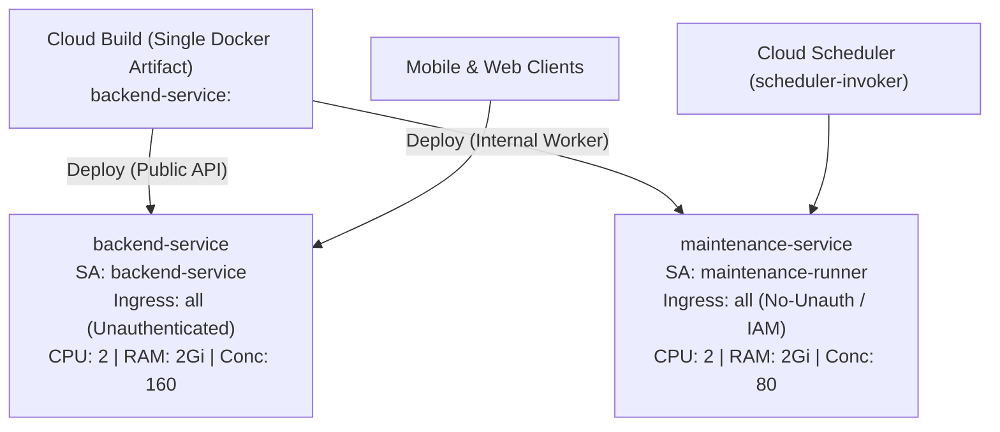

# Deployment Guide

This guide details the deployment pipeline, containerization strategy, and infrastructure setup for the BreathAway NestJS backend.

---

## 🐳 Containerization (Docker)

The application is containerized using a multi-stage Docker build process located in the root `Dockerfile`.

### Docker Architecture

1. **Base Stage (`node:22-slim`)**:
   - Standardizes the Node runtime environment.
   - Installs `openssl` (required by Prisma's query engine).
   - Installs `pnpm` globally.
2. **Builder Stage**:
   - Copies dependency manifest files (`package.json`, `pnpm-lock.yaml`) and database schemas.
   - Runs `pnpm install --frozen-lockfile` to install all dependencies.
   - Generates Prisma client types.
   - Compiles TypeScript into JavaScript (`pnpm build`).
   - Runs `pnpm prune --prod` to strip away unnecessary developer packages, leaving only production engines.
3. **Runner Stage**:
   - Inherits the clean Node base image.
   - Switches execution context to a secure, non-root user (`node`).
   - Copies _only_ the compiled code and pruned `node_modules`.
   - Exposes port `8080` (standard for GCP Cloud Run).
   - Executes the compiled javascript bundle: `node dist/main.js`.

---

## 🏗 Single-Artifact, Dual-Service Deployment

To achieve **complete segregation of concerns and least-privilege security**, a single deployment builds **one container image artifact** and deploys it to **two distinct Cloud Run services**:



### Why Deploy Across Two Services?

1. **IAM Privilege Segregation**:
   - **`backend-service`**: Driven by `backend-service@<project>.iam.gserviceaccount.com`. Retains strictly read-only access to Secret Manager (`roles/secretmanager.secretAccessor`). Even if the public API suffers an exploit, the attacker cannot add or mutate secrets.
   - **`maintenance-service`**: Driven by `maintenance-runner@<project>.iam.gserviceaccount.com`. Possesses elevated permissions to rotate secrets (`roles/secretmanager.secretVersionAdder` scoped to specific secrets like `access-token-instagram`).
2. **Resource & Scaling Segregation**:
   - **`backend-service`**: Scaled for high concurrency web traffic (`CONCURRENCY=160`, `MAX_INSTANCES=20`).
   - **`maintenance-service`**: Configured with dedicated memory and lower concurrency (`CONCURRENCY=80`, `MAX_INSTANCES=5`), ensuring that intensive batch sweeps and memory-heavy cron loops never degrade user-facing API performance or trigger out-of-memory container crashes on public traffic.
3. **Perimeter Authentication**:
   - `backend-service` allows unauthenticated traffic (`--allow-unauthenticated`) for public mobile clients.
   - `maintenance-service` disallows unauthenticated traffic (`--no-allow-unauthenticated`). Only caller identities with `roles/run.invoker` (Cloud Scheduler's `scheduler-invoker` service account) can reach the container.

---

## 🚢 Deployment Orchestration

Releases to Google Cloud are managed by the unified deployment script [`scripts/deploy.sh`](file:///scripts/deploy.sh), triggered via root `pnpm` commands:

```bash
# Full deployment to Staging / Dev environment (both services)
pnpm run deploy:dev

# Full deployment to Production environment (both services)
pnpm run deploy:prod
```

### Advanced CLI Deployment Flags

[`scripts/deploy.sh`](file:///scripts/deploy.sh) supports targeted deployments to minimize revision rollouts:

```bash
# Deploy only the public backend service:
./scripts/deploy.sh --env=dev --only-public

# Deploy only the internal maintenance worker:
./scripts/deploy.sh --env=dev --only-maintenance

# Skip deploying maintenance service when updating backend:
./scripts/deploy.sh --env=dev --no-maintenance

# Force image rebuild even if the Git commit tag already exists in Artifact Registry:
./scripts/deploy.sh --env=dev --force
```

### Configuration & Sizing Parameterization

Environment variables and resource sizing are declared in [`scripts/common.dev.sh`](file:///scripts/common.dev.sh) and [`scripts/common.prod.sh`](file:///scripts/common.prod.sh):

```bash
# Public API Resource Sizing
export CPU='2'
export MEMORY='2Gi'
export MAX_INSTANCES='20'
export CONCURRENCY='160'

# Maintenance Worker Resource Sizing (Can be adjusted independently)
export MAINTENANCE_CPU='2'
export MAINTENANCE_MEMORY='2Gi'
export MAINTENANCE_MAX_INSTANCES='5'
export MAINTENANCE_CONCURRENCY='80'

# Service Accounts
export BACKEND_SERVICE_ACCOUNT="backend-service@${PROJECT_ID}.iam.gserviceaccount.com"
export MAINTENANCE_SERVICE_ACCOUNT="maintenance-runner@${PROJECT_ID}.iam.gserviceaccount.com"
```

---

## 🏗 GCP Infrastructure & Terraform

Infrastructure resources are managed declaratively using **Terraform** inside the `/terraform` directory:

- **[`terraform/backend-iam.tf`](file:///terraform/backend-iam.tf)**: Defines `backend-service` service account and its read-only secret accessor, Cloud SQL, KMS, and Pub/Sub roles.
- **[`terraform/scheduler.tf`](file:///terraform/scheduler.tf)**:
  - Declares `scheduler-invoker` service account and binds `roles/run.invoker` to `maintenance-service`.
  - Declares `maintenance-runner` service account and binds `roles/secretmanager.secretVersionAdder` for `access-token-instagram`.
  - Defines all automated Cloud Scheduler jobs targeting `maintenance-service` with Google OIDC authentication.
- **[`terraform/pubsub.tf`](file:///terraform/pubsub.tf)**: Configures event push subscriptions back to Cloud Run.
- **[`terraform/audit-logs.tf`](file:///terraform/audit-logs.tf)**: Integrates Cloud Logging sinks to stream structured security and audit logs to BigQuery.
