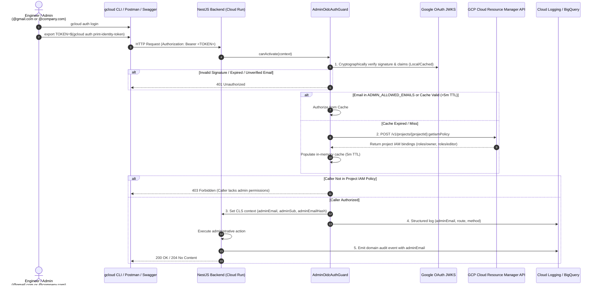

# Admin Module

The `AdminModule` handles privileged administrative operations across the platform, including user moderation, manual credit ledger adjustments, subscription plan catalog management, payment gateway routing switches, and multi-channel notifications.

All administrative routes are protected by **Google OpenID Connect (OIDC)** and **dynamic Google Cloud IAM authorization**, completely eliminating shared static passwords.

---

## 📋 Purpose & Responsibilities

- **Zero-Trust Administrative Security**: Authenticates individual engineers using Google accounts and verifies authorization against the live GCP project IAM policy.
- **Auditable User Moderation**: Cascading soft-deletion of user accounts, auth credentials, and active device push tokens with full audit attribution.
- **Manual Credit Adjustments**: Grants or debits user credit balances with cryptographically signed and auditable ledger entries.
- **Subscription & Payment Governance**: Controls localized plan pricing and gateway routing kill-switches.
- **Immutable Audit Logging**: Enriches all administrative events with the administrator's Google email (`adminEmail`) for streaming into Google Cloud Logging and BigQuery.

---

## 🔐 Security Architecture: Google OIDC + GCP IAM

Administrative routes are secured by [`AdminOidcAuthGuard`](file:///Users/mohitmalpani/Business/BreathAway/Backend/breathaway/src/modules/admin/guards/admin-oidc-auth.guard.ts).



### 1. Two-Tier Verification

1. **Tier 1 (Authentication via Google JWKS)**:
   - Validates the token's cryptographic signature against Google's public JWKS certificates (`https://www.googleapis.com/oauth2/v3/certs`).
   - Ensures `iss` is `accounts.google.com` and `email_verified` is `true`.
   - Accepts tokens targeted to either configured audiences (`GCP_ADMIN_OIDC_AUDIENCE` / `GCP_OIDC_AUDIENCE`) or Google Cloud SDK's canonical client ID (`32555940559.apps.googleusercontent.com`).
2. **Tier 2 (Authorization via GCP IAM)**:
   - Checks `ADMIN_ALLOWED_EMAILS` config whitelist (immediate match for local dev).
   - Checks in-memory cache (5-minute TTL) to avoid hitting external Google APIs on every request.
   - On cache miss, queries the GCP Cloud Resource Manager API (`POST https://cloudresourcemanager.googleapis.com/v1/projects/{projectId}:getIamPolicy`).
   - Verifies the user email has `roles/owner`, `roles/editor`, or roles defined in `GCP_ADMIN_IAM_ROLES`.

---

## ⚖️ Customer Flow vs. Admin OIDC Flow

| Aspect | Customer / Mobile User Flow | Administrative OIDC Flow |
| :--- | :--- | :--- |
| **Authentication Source** | Firebase Auth (Phone OTP, Apple, Google) | Google Accounts (`@gmail.com` or `@mycompany.com`) |
| **Token Issued By** | BreathAway Backend (Custom JWT Access/Refresh) | Google Accounts (`accounts.google.com` OIDC token) |
| **Token Lifetime** | 15 minutes (Access) / 14 days (Refresh Token) | 1 hour (Google standard OIDC token) |
| **Client Ingress Headers** | `x-api-key`, `x-client-id`, `x-user-agent`, `x-device-id` | `@SkipClientIdentity()` applied (No client headers required) |
| **Authorization Source** | PostgreSQL database (`User`, `UserRole`) | GCP Project IAM Policy (`roles/owner`, `roles/editor`) |
| **Revocation** | Deleting session from DB / token rotation | Removing user from GCP Project IAM in GCP Console |
| **Audit Actor** | Internal User ULID (`sub`) | Verified Google email (`adminEmail: "engineer@company.com"`) |
| **Audit Log Target** | Application database & standard access logs | GCP Cloud Logging & BigQuery Log Sink |

---

## 🔍 Audit Logging & BigQuery Integration

### Why Plaintext Email in Audit Logs?
For internal administrative operations, logging the plaintext email (`adminEmail`) is standard practice across cloud providers (including Google's own Cloud Audit Logs):
- **Compliance & Non-Repudiation (SOC 2, ISO 27001, PCI-DSS)**: Audit trails must unambiguously answer *who* performed privileged mutations.
- **Incident Response Speed**: On-call engineers can immediately identify the acting administrator without offline rainbow table lookups.
- **Low Entropy of Emails**: Raw SHA-256 hashes of known team emails can be easily inverted using rainbow tables, offering a false sense of security.
- **Access Protection**: Cloud Logging and BigQuery are strictly protected by GCP IAM (`roles/logging.viewer`, `roles/bigquery.dataViewer`).

### CLS Context Propagation
`AdminOidcAuthGuard` injects identity claims into Continuation-Local Storage (`nestjs-cls`):
- `adminEmail`: The authenticated administrator's email.
- `adminSub`: Google's immutable user ID.
- `adminEmailHash`: SHA-256 hash of the email.

Any service extending [`BaseService`](file:///Users/mohitmalpani/Business/BreathAway/Backend/breathaway/src/core/base/base.service.ts) automatically captures these CLS values when calling `this.emitAuditLog(...)`, ensuring all downstream Pub/Sub and BigQuery audit events carry the administrator's identity.

---

## 💻 Developer & Operator Runbook

### Generating an Admin Token
```bash
# 1. Log in to Google Cloud with your authorized account
gcloud auth login

# 2. Print a 1-hour Google OIDC identity token
export TOKEN=$(gcloud auth print-identity-token)
```

> [!NOTE]
> Do **not** use the `--audiences` flag with `gcloud auth print-identity-token` for human accounts. `--audiences` is restricted to service accounts. Omitting it generates a token targeted to the Google Cloud SDK client ID (`32555940559.apps.googleusercontent.com`), which `AdminOidcAuthGuard` natively accepts.

### Using Swagger UI
1. Navigate to `/api/docs/admin` in your browser.
2. Click **Authorize** at the top right.
3. Paste the token into the **`gcp-oidc (http, Bearer)`** input field.
4. Execute operations interactively.

### GCP Project Configuration Requirements
1. **Enable Cloud Resource Manager API**:
   ```bash
   gcloud services enable cloudresourcemanager.googleapis.com --project=breathaway-dev
   ```
2. **Grant IAM Permissions to Backend Service Account**:
   ```bash
   gcloud projects add-iam-policy-binding breathaway-dev \
     --member="serviceAccount:backend-service@breathaway-dev.iam.gserviceaccount.com" \
     --role="roles/browser"
   ```
3. **Localhost Development**:
   Run `gcloud auth application-default login` on your workstation, or set `ADMIN_ALLOWED_EMAILS="your-email@gmail.com"` in your environment variables.

---

## 🛠 File & Class Definitions

### Guards
- **[`AdminOidcAuthGuard`](file:///Users/mohitmalpani/Business/BreathAway/Backend/breathaway/src/modules/admin/guards/admin-oidc-auth.guard.ts)**: Primary guard enforcing Google OIDC verification and dynamic GCP IAM authorization.
- **[`AdminBasicAuthGuard`](file:///Users/mohitmalpani/Business/BreathAway/Backend/breathaway/src/modules/admin/guards/admin-basic-auth.guard.ts)**: Backward-compatible adapter extending `AdminOidcAuthGuard`.

### Controllers Protected by Admin OIDC
- **[`AdminController`](file:///Users/mohitmalpani/Business/BreathAway/Backend/breathaway/src/modules/admin/admin.controller.ts)**: User account deletion, manual credit adjustments, and developer test authentication (`/api/v1/admin/*`, `/api/v1/admin/dev-login`).
- **[`SubscriptionsAdminController`](file:///Users/mohitmalpani/Business/BreathAway/Backend/breathaway/src/modules/admin/subscriptions/subscriptions-admin.controller.ts)**: Subscription plan and pricing catalog (`/api/v1/admin/subscriptions/*`).
- **[`PaymentRoutesAdminController`](file:///Users/mohitmalpani/Business/BreathAway/Backend/breathaway/src/modules/payments/payment-routes-admin.controller.ts)**: Dynamic payment routing and circuit breaker switches (`/api/v1/admin/payments/routes/*`).
- **[`SocialIdentitiesController`](file:///Users/mohitmalpani/Business/BreathAway/Backend/breathaway/src/modules/social-identities/social-identities.controller.ts)**: Social identity verification (`/api/v1/social-identities/*`).
- **[`TransactionsController`](file:///Users/mohitmalpani/Business/BreathAway/Backend/breathaway/src/modules/transactions/transactions.controller.ts)**: Platform-wide ledger read surface (`/api/v1/admin/transactions/*`).
- **[`InstagramController`](file:///Users/mohitmalpani/Business/BreathAway/Backend/breathaway/src/modules/instagram/instagram.controller.ts)**: System Instagram token refresh (`/api/v1/instagram/*`).
- **[`NotificationsAdminController`](file:///Users/mohitmalpani/Business/BreathAway/Backend/breathaway/src/modules/notifications/notifications-admin.controller.ts)**: Multi-channel administrative dispatch (`/api/v1/notifications/send`).
- **[`ReportsController`](file:///Users/mohitmalpani/Business/BreathAway/Backend/breathaway/src/modules/reports/reports.controller.ts)**: Overall platform metrics and reporting (`/api/v1/reports/*`).

### Services
- **[`AdminService`](file:///Users/mohitmalpani/Business/BreathAway/Backend/breathaway/src/modules/admin/admin.service.ts)**: Core administrative business logic (cascading soft-deletions, device deactivations).
