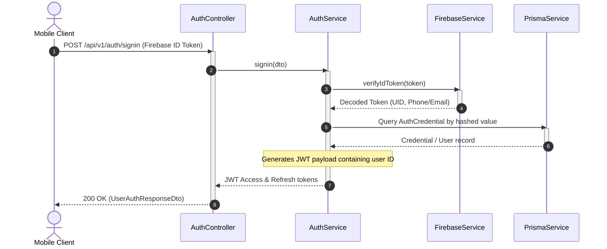

# Authentication Module

The `AuthModule` is the gateway for user onboarding, logins, session handling, and credential linking.

---

## 📋 Purpose & Responsibilities

- **User Signup (`/signup`)**: Validates Firebase credentials, checks for existing accounts, and registers new user records.
- **User Signin (`/signin`)**: Exchanges validated Firebase ID tokens for internal JWT sessions.
- **Social Integration (`/social-signin`)**: Authenticates users using external credentials (e.g. Instagram OAuth).
- **Secondary Credentials (`/add-secondary`)**: Allows users to attach a secondary email or phone number to their primary profile.
- **Developer Login (`/dev-login`)**: Simplifies local manual testing by bypassing full Firebase integrations if configured.

---

## 🛠 File & Class Definitions

### Module Entry Point
- **[AuthModule](file:///Users/mohitmalpani/Business/BreathAway/Backend/breathaway/src/modules/auth/auth.module.ts)**: Configures Passport strategies, JWT modules, and registers the Auth controller and service.

### Controller
- **[AuthController](file:///Users/mohitmalpani/Business/BreathAway/Backend/breathaway/src/modules/auth/auth.controller.ts)**: Exposes endpoints for user registration, authentication, social sign-ins, and logout actions.
  - Route Prefix: `/api/v1/auth`

### Services
- **[AuthService](file:///Users/mohitmalpani/Business/BreathAway/Backend/breathaway/src/modules/auth/auth.service.ts)**: Contains logic to verify Firebase tokens, find users by identity, and issue JWT tokens.
- **[JwtModule](file:///Users/mohitmalpani/Business/BreathAway/Backend/breathaway/src/modules/auth/jwt.module.ts)**: Dedicated JWT configuration provider.

### DTOs
- `AuthSignupRequestDto`
- `AuthSigninRequestDto`
- `SocialAuthRequestDto`
- `AddSecondaryAuthRequestDto`
- `DevLoginRequestDto`
- `UserAuthResponseDto`

---

## 🔄 Authentication Request Flow

