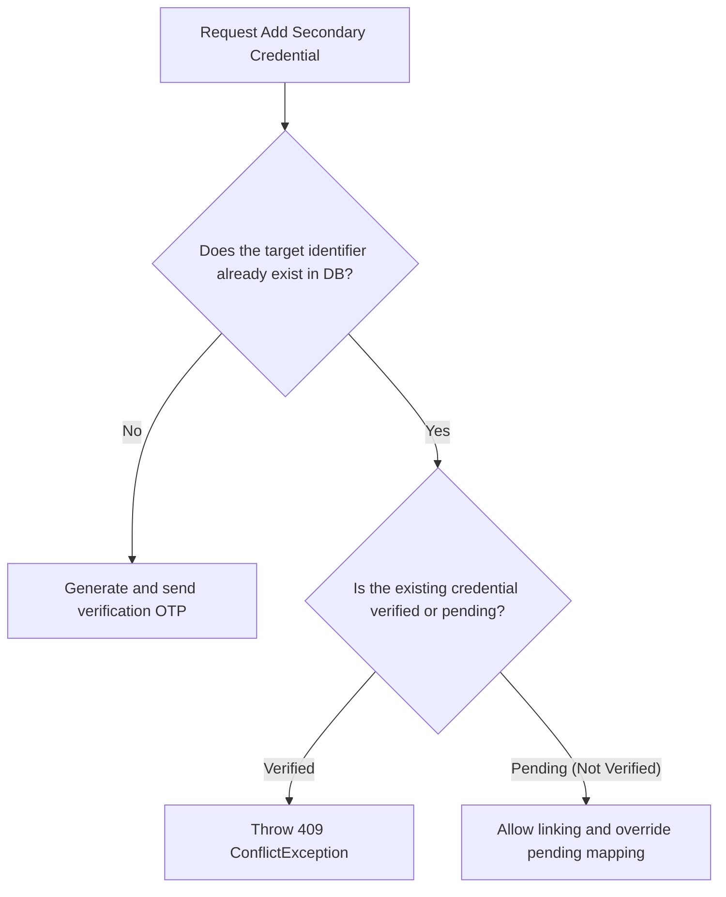
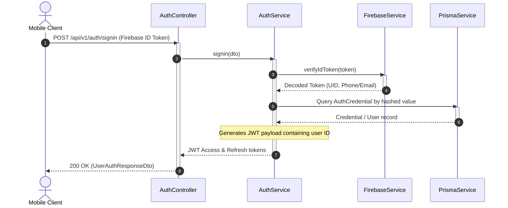

# Authentication Module

The `AuthModule` is the gateway for user onboarding, logins, session handling, and credential linking.

---

## 📋 Purpose & Responsibilities

- **User Signup (`/signup`)**: Validates Firebase credentials, checks for existing accounts, and registers new user records.
- **User Signin (`/signin`)**: Exchanges validated Firebase ID tokens for internal JWT sessions.
- **Social Integration (`/social-signin`)**: Authenticates users using external credentials (e.g. Instagram OAuth).
- **Secondary Credentials (`/add-secondary`)**: Allows users to attach a secondary email or phone number to their primary profile.
- **Developer Login (`/dev-login`)**: Simplifies local manual testing by bypassing full Firebase integrations if configured.

---

## 🔒 Secondary Credential Linking & Conflict Resolution

When an authenticated user wants to add a secondary authentication method (such as attaching a backup phone number or email to their profile via `/add-secondary`), the backend executes strict identity verification routines to prevent account hijacking or profile overlap.

### Conflict Scenarios & Policies

1. **New Unique Identifier**:
   - **Action**: User links a brand-new, unregistered identifier (email or phone).
   - **Resolution**: System creates the identity record under `isVerified = false` and sends a verification OTP code. Once verified, the credentials are saved.
2. **Identifier Already Verified by Another User**:
   - **Action**: User A tries to link an email that is already verified and linked to User B.
   - **Resolution**: The system throws a `409 ConflictException` ("Credential already linked to another active account"). Merges are prohibited to ensure account separation and security.
3. **Overriding Pending Registrations**:
   - **Action**: User A tries to link an email that was registered by User B but never verified (`isVerified = false`).
   - **Resolution**: The system allows User A to "claim" the pending identifier. It sends a new OTP code to User A. Once User A verifies, the pending identity's connection to User B is broken and remapped to User A.

---

## 🛠 File & Class Definitions

### Module Entry Point
- **[AuthModule](file:///Users/mohitmalpani/Business/BreathAway/Backend/breathaway/src/modules/auth/auth.module.ts)**: Configures Passport strategies, JWT modules, and registers the Auth controller and service.

### Controller
- **[AuthController](file:///Users/mohitmalpani/Business/BreathAway/Backend/breathaway/src/modules/auth/auth.controller.ts)**: Exposes endpoints for user registration, authentication, social sign-ins, and logout actions.
  - Route Prefix: `/api/v1/auth`

### Services
- **[AuthService](file:///Users/mohitmalpani/Business/BreathAway/Backend/breathaway/src/modules/auth/auth.service.ts)**: Contains logic to verify Firebase tokens, find users by identity, and issue JWT tokens.
- **[JwtModule](file:///Users/mohitmalpani/Business/BreathAway/Backend/breathaway/src/modules/auth/jwt.module.ts)**: Dedicated JWT configuration provider.

---

## 🔄 Authentication Request Flow

