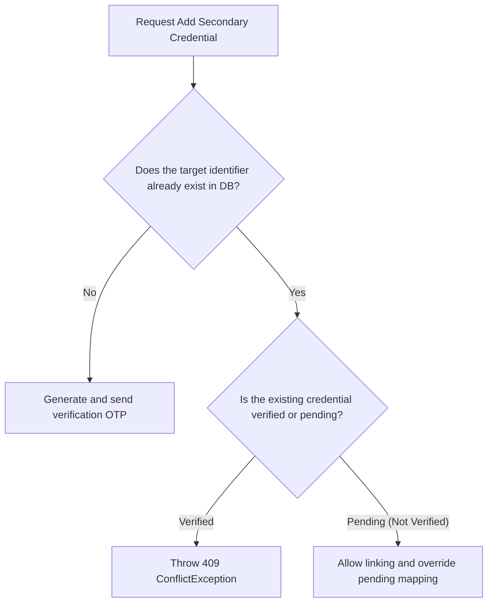
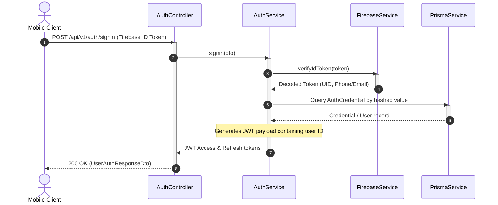
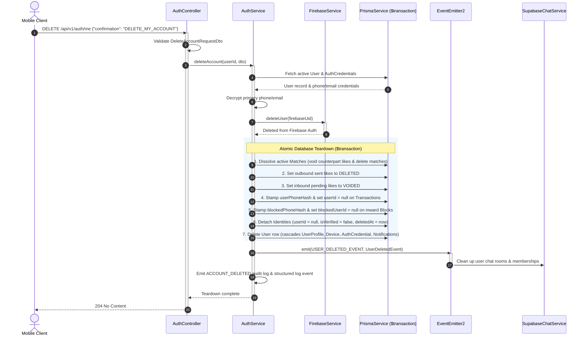
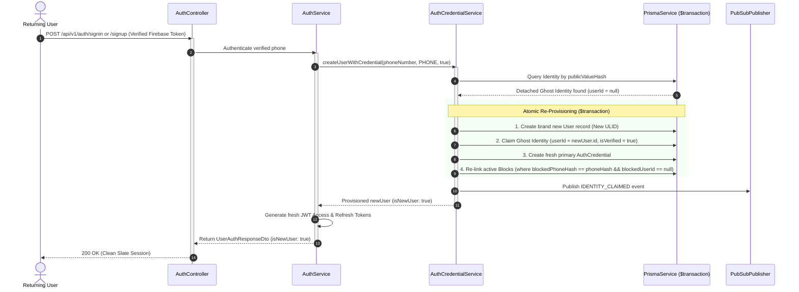

# Authentication Module

The `AuthModule` is the gateway for user onboarding, logins, session handling, and credential linking.

---

## 📋 Purpose & Responsibilities

- **User Signup (`/signup`)**: Validates Firebase credentials, checks for existing accounts, and registers new user records.
- **User Signin (`/signin`)**: Exchanges validated Firebase ID tokens for internal JWT sessions.
- **Social Integration (`/social-signin`)**: Authenticates users using external credentials (e.g. Instagram OAuth).
- **Secondary Credentials (`/add-secondary`)**: Allows users to attach a secondary email or phone number to their primary profile.
- **Developer Login (`/dev-login`)**: Simplifies local manual testing by bypassing full Firebase integrations if configured.

---

## 🧠 Business Logic & Core Concepts

### 1. Cryptographic PII Normalization & Hashing

To protect PII (Personally Identifiable Information) such as phone numbers and emails, the backend never stores them in plaintext.

- Identifiers are first **normalized** (e.g., lowercased, non-digits stripped) to create a canonical representation.
- They are then processed through the `IdentityCryptoService` to produce a `valueHash`.
- This ensures that duplicate account detection and cross-module lookups (like resolving likes) operate entirely on hashed values.

### 2. "Ghost" Identity Claiming (Social Auth)

When users interact with social profiles (e.g., liking someone's Instagram handle) before that person has registered on BreathAway, the system creates a "Ghost Identity" (an `Identity` record with `userId = null`).

- When the target person eventually registers using that social platform (e.g., Instagram OAuth), `AuthService` detects the existing ghost identity.
- The service **claims** the identity by assigning it to the new user.
- A `PubSubEvent.IDENTITY_CLAIMED` is published to the `IDENTITY_WORKFLOWS` topic, triggering asynchronous match resolution for any likes that were pending against that handle.

---

## 🔒 Secondary Credential Linking & Conflict Resolution

When an authenticated user wants to add a secondary authentication method (such as attaching a backup phone number or email to their profile via `/add-secondary`), the backend executes strict identity verification routines to prevent account hijacking or profile overlap.


```mermaid
flowchart TD
    A[Request Add Secondary Credential] --> B{Does the target identifier already exist in DB?}
    B -- No --> C[Generate and send verification OTP]
    B -- Yes --> D{Is the existing credential verified or pending?}
    D -- Verified --> E[Throw 409 ConflictException]
    D -- Pending (Not Verified) --> F[Allow linking and override pending mapping]
```

### Conflict Scenarios & Policies

1. **New Unique Identifier**:
   - **Action**: User links a brand-new, unregistered identifier (email or phone).
   - **Resolution**: System creates the identity record under `isVerified = false` and sends a verification OTP code. Once verified, the credentials are saved.
2. **Identifier Already Verified by Another User**:
   - **Action**: User A tries to link an email that is already verified and linked to User B.
   - **Resolution**: The system throws a `409 ConflictException` ("Credential already linked to another active account"). Merges are prohibited to ensure account separation and security.
3. **Overriding Pending Registrations**:
   - **Action**: User A tries to link an email that was registered by User B but never verified (`isVerified = false`).
   - **Resolution**: The system allows User A to "claim" the pending identifier. It sends a new OTP code to User A. Once User A verifies, the pending identity's connection to User B is broken and remapped to User A.

---

## 🛠 File & Class Definitions

### Module Entry Point

- **[AuthModule](file:///Users/mohitmalpani/Business/BreathAway/Backend/breathaway/src/modules/auth/auth.module.ts)**: Configures Passport strategies, JWT modules, and registers the Auth controller and service.

### Controller

- **[AuthController](file:///Users/mohitmalpani/Business/BreathAway/Backend/breathaway/src/modules/auth/auth.controller.ts)**: Exposes endpoints for user registration, authentication, social sign-ins, and logout actions.
  - Route Prefix: `/api/v1/auth`

### Services

- **[AuthService](file:///Users/mohitmalpani/Business/BreathAway/Backend/breathaway/src/modules/auth/auth.service.ts)**: Contains logic to verify Firebase tokens, find users by identity, and issue JWT tokens.
- **[JwtModule](file:///Users/mohitmalpani/Business/BreathAway/Backend/breathaway/src/modules/auth/jwt.module.ts)**: Dedicated JWT configuration provider.

---

## 🔄 Authentication Request Flow


```mermaid
sequenceDiagram
    autonumber
    actor Client as Mobile Client
    participant AuthC as AuthController
    participant AuthS as AuthService
    participant Firebase as FirebaseService
    participant Prisma as PrismaService

    Client ->> AuthC: POST /api/v1/auth/signin (Firebase ID Token)
    activate AuthC
    AuthC ->> AuthS: signin(dto)
    activate AuthS
    AuthS ->> Firebase: verifyIdToken(token)
    activate Firebase
    Firebase -->> AuthS: Decoded Token (UID, Phone/Email)
    deactivate Firebase

    AuthS ->> Prisma: Query AuthCredential by hashed value
    activate Prisma
    Prisma -->> AuthS: Credential / User record
    deactivate Prisma

    Note over AuthS: Generates JWT payload containing user ID
    AuthS -->> AuthC: JWT Access & Refresh tokens
    deactivate AuthS
    AuthC -->> Client: 200 OK (UserAuthResponseDto)
    deactivate AuthC
```

---

## 🗑️ Account Deletion ("Right to be Forgotten") & Returning User Lifecycle {#account-deletion}

To satisfy statutory privacy mandates (e.g., **GDPR Article 17 "Right to be Forgotten"**, CCPA, and Apple App Store Guideline 5.1.1(v)), BreathAway provides an automated, self-service account termination API under `AuthModule`:

- **Endpoint**: `DELETE /api/v1/auth/me`
- **HTTP Status**: `204 No Content`
- **Security Guard**: `JwtAuthGuard` (User must possess an active JWT session)
- **Confirmation Guard**: Requires a strict confirmation payload `{"confirmation": "DELETE_MY_ACCOUNT"}` via `DeleteAccountRequestDto` to prevent accidental or malicious one-click deletions.

> [!CAUTION]
> Account deletion is an **immediate, irreversible destructive operation**. All personal profile data, active authentication credentials, registered devices, and notifications are permanently wiped. Returning to the platform with the same phone number creates a completely new account with a clean slate.

---

### 1. Entity Impact & Teardown Lifecycle Matrix

Account deletion must balance the user's right to erasure against critical platform safety constraints (preventing harassment via account recreation) and statutory financial compliance (GDPR Art. 17(3)(b) ledger bookkeeping). The table below details how every database entity is handled, its risk classification, and its returning user state:

| Entity / Database Table    | Teardown Action                                      | Severity / Risk | Rationale & Architectural Rule                                                                                                                                                                                                                           | Returning User State               |
| :------------------------- | :--------------------------------------------------- | :-------------: | :------------------------------------------------------------------------------------------------------------------------------------------------------------------------------------------------------------------------------------------------------- | :--------------------------------- |
| **`User`**                 | Hard-Delete (`tx.user.delete`)                       |  **CRITICAL**   | Core identity record. Hard-deletion cascades to dependent child tables.                                                                                                                                                                                  | Clean slate (New ULID provisioned) |
| **`UserProfile`**          | Cascade Delete (`onDelete: Cascade`)                 |    **HIGH**     | PII boundary: photos, bio, preferences, DOB, and name are wiped.                                                                                                                                                                                         | Clean slate (Must re-onboard)      |
| **`AuthCredential`**       | Cascade Delete (`onDelete: Cascade`)                 |    **HIGH**     | Active authentication credentials and encryption keys are wiped.                                                                                                                                                                                         | Clean slate                        |
| **`Device`**               | Cascade Delete (`onDelete: Cascade`)                 |   **MEDIUM**    | Push notification tokens (FCM/APNS) and device IDs purged.                                                                                                                                                                                               | Re-registered on new app install   |
| **`Notification`**         | Cascade Delete (`onDelete: Cascade`)                 |     **LOW**     | In-app notification history purged.                                                                                                                                                                                                                      | Empty inbox                        |
| **`Identity`**             | Detach to Ghost (`userId: null`)                     |  **CRITICAL**   | **Unique Constraint Collision Rule**: Detaching `userId` to `null` and setting `isVerified: false`, `deletedAt: now` frees the `@@unique([type, publicValueHash])` constraint so returning users can claim the unowned ghost identity without collision. | Claimed by new user                |
| **`Firebase Auth User`**   | External Deletion (`deleteUser`)                     |  **CRITICAL**   | Purges the user from Firebase Identity Platform, revoking all existing refresh tokens.                                                                                                                                                                   | Newly created in Firebase          |
| **`Match`**                | Explicit Delete in Transaction                       |  **CRITICAL**   | **Postgres FK RESTRICT Trap**: `Match(likeOneId, likeTwoId)` references `Like(id)` without cascade. Deleting `Match` rows first prevents foreign key constraint violations when `User.sentLikes` are modified.                                           | Never restored                     |
| **`Like` (Outbound)**      | Status `DELETED`                                     |   **MEDIUM**    | Neutralizes interest sent to other users, preventing ghost matches.                                                                                                                                                                                      | Never restored                     |
| **`Like` (Inbound)**       | Status `VOIDED`                                      |   **MEDIUM**    | Clears pending likes sent by other users to this profile.                                                                                                                                                                                                | Never restored                     |
| **`Block` (Inward)**       | Retain `blockedPhoneHash`, set `blockedUserId: null` |    **HIGH**     | **Anti-Evasion Protocol**: Preserves the keyed HMAC-SHA-256 of the blocked user's phone. When the blocked actor re-registers, the block automatically re-attaches to their new user ID.                                                                  | Re-linked automatically            |
| **`Block` (Outward)**      | Cascade Delete (`onDelete: Cascade`)                 |     **LOW**     | The deleting user's own outward block list is discarded.                                                                                                                                                                                                 | Discarded                          |
| **`Transaction`**          | Retain `userPhoneHash`, set `userId: null`           |    **HIGH**     | **GDPR Art. 17(3)(b) Financial Compliance**: Preserves financial ledgers and purchase invoices for tax and chargeback reconciliation without retaining personal identity links.                                                                          | Retained anonymously               |
| **`Chat Room` (Supabase)** | Asynchronous Teardown                                |    **HIGH**     | Dispatched via `USER_DELETED_EVENT` (`UserDeletedEvent`). Supabase chat channels and participant memberships are erased.                                                                                                                                 | Never restored                     |

---

### 2. Key Engineering Decisions & Gotchas

#### A. Foreign Key RESTRICT on `Match` (PostgreSQL)

In PostgreSQL, `Match.likeOneId` and `Match.likeTwoId` reference `Like(id)` with default `RESTRICT` behavior (no automatic cascading). Attempting to delete the `User` record directly triggers a foreign key violation because deleting the user's sent likes fails while an active `Match` still points to them.

- **Solution**: `deleteAccount` explicitly queries and deletes all `Match` records involving the user _before_ updating likes and deleting the user record.

#### B. The Ghost Identity Re-Registration Solution

The `Identity` table enforces a composite unique constraint: `@@unique([type, publicValueHash])` without a `deletedAt` discriminator. If an account deletion merely soft-deleted the identity with `userId` intact, any future attempt by that user to sign up with the same phone number would fail with an `AccountAlreadyExistsException`.

- **Solution**: During deletion, the identity record is detached:
  ```typescript
  await tx.identity.updateMany({
    where: { userId },
    data: {
      userId: null,
      isVerified: false,
      deletedAt: now,
    },
  });
  ```
  When the user returns months later, `AuthCredentialService.createUserWithCredential` detects the unowned ghost identity (`userId === null`), claims it for the new user, and publishes `PubSubEvent.IDENTITY_CLAIMED`.

#### C. Preventing the Delete-and-Recreate Block Evasion Loop

Without counter-measures, a malicious user blocked by User A could delete their account, immediately recreate it with the same phone number, and acquire a new `userId`, thereby circumventing User A's block.

- **Solution**:
  1. At block creation time, `BlocksService.create` hashes the target user's phone credential using keyed HMAC-SHA-256 and stores `blockedPhoneHash`.
  2. On account deletion, inward blocks are preserved with `blockedUserId = null` and `blockedPhoneHash` intact.
  3. When a user registers with that phone number, `AuthCredentialService.createUserWithCredential` executes an anti-evasion query:
     ```typescript
     await blockClient.updateMany({
       where: {
         blockedPhoneHash: phoneHash,
         blockedUserId: null,
         deletedAt: null,
       },
       data: {
         blockedUserId: newUser.id,
       },
     });
     ```
  4. All prior blocks are seamlessly re-attached to the new user without revealing safety metadata to the returning user.

#### D. GDPR Article 17(3)(b) Financial Audit Exemption

GDPR explicitly permits retention of financial transaction data to comply with legal obligations (accounting, tax, and chargeback dispute resolution).

- **Solution**: `Transaction` records are anonymized by setting `userId: null`, while stamping `userPhoneHash` (keyed HMAC-SHA-256). This enables support agents to reconcile payment disputes using the user's phone hash without holding unanonymized personal data in the database.

---

### 3. Sequence Diagram: Account Teardown Execution Pipeline

The sequence diagram below illustrates the exact order of operations executed during `DELETE /api/v1/auth/me`:


```mermaid
sequenceDiagram
    autonumber
    actor Client as Mobile Client
    participant AuthC as AuthController
    participant AuthS as AuthService
    participant Firebase as FirebaseService
    participant Prisma as PrismaService ($transaction)
    participant Events as EventEmitter2
    participant Supabase as SupabaseChatService

    Client ->> AuthC: DELETE /api/v1/auth/me {"confirmation": "DELETE_MY_ACCOUNT"}
    activate AuthC
    AuthC ->> AuthC: Validate DeleteAccountRequestDto
    AuthC ->> AuthS: deleteAccount(userId, dto)
    activate AuthS

    AuthS ->> Prisma: Fetch active User & AuthCredentials
    Prisma -->> AuthS: User record & phone/email credentials

    AuthS ->> AuthS: Decrypt primary phone/email
    AuthS ->> Firebase: deleteUser(firebaseUid)
    activate Firebase
    Firebase -->> AuthS: Deleted from Firebase Auth
    deactivate Firebase

    rect rgb(240, 248, 255)
        Note over AuthS, Prisma: Atomic Database Teardown ($transaction)
        AuthS ->> Prisma: 1. Dissolve active Matches (void counterpart likes & delete matches)
        AuthS ->> Prisma: 2. Set outbound sent likes to DELETED
        AuthS ->> Prisma: 3. Set inbound pending likes to VOIDED
        AuthS ->> Prisma: 4. Stamp userPhoneHash & set userId = null on Transactions
        AuthS ->> Prisma: 5. Stamp blockedPhoneHash & set blockedUserId = null on inward Blocks
        AuthS ->> Prisma: 6. Detach Identities (userId = null, isVerified = false, deletedAt = now)
        AuthS ->> Prisma: 7. Delete User row (cascades UserProfile, Device, AuthCredential, Notifications)
    end

    AuthS ->> Events: emit(USER_DELETED_EVENT, UserDeletedEvent)
    activate Events
    Events ->> Supabase: Clean up user chat rooms & memberships
    deactivate Events

    AuthS ->> AuthS: Emit ACCOUNT_DELETED audit log & structured log event
    AuthS -->> AuthC: Teardown complete
    deactivate AuthS
    AuthC -->> Client: 204 No Content
    deactivate AuthC
```

---

### 4. Sequence Diagram: Returning User Lifecycle & Anti-Evasion Re-Linking

The sequence diagram below illustrates what occurs when a user re-registers months later with the same phone number:


```mermaid
sequenceDiagram
    autonumber
    actor ReturningUser as Returning User
    participant AuthC as AuthController
    participant AuthS as AuthService
    participant CredS as AuthCredentialService
    participant Prisma as PrismaService ($transaction)
    participant PubSub as PubSubPublisher

    ReturningUser ->> AuthC: POST /api/v1/auth/signin or /signup (Verified Firebase Token)
    activate AuthC
    AuthC ->> AuthS: Authenticate verified phone
    activate AuthS
    AuthS ->> CredS: createUserWithCredential(phoneNumber, PHONE, true)
    activate CredS

    CredS ->> Prisma: Query Identity by publicValueHash
    Prisma -->> CredS: Detached Ghost Identity found (userId = null)

    rect rgb(245, 255, 245)
        Note over CredS, Prisma: Atomic Re-Provisioning ($transaction)
        CredS ->> Prisma: 1. Create brand new User record (New ULID)
        CredS ->> Prisma: 2. Claim Ghost Identity (userId = newUser.id, isVerified = true)
        CredS ->> Prisma: 3. Create fresh primary AuthCredential
        CredS ->> Prisma: 4. Re-link active Blocks (where blockedPhoneHash == phoneHash && blockedUserId == null)
    end

    CredS ->> PubSub: Publish IDENTITY_CLAIMED event
    CredS -->> AuthS: Provisioned newUser (isNewUser: true)
    deactivate CredS

    AuthS ->> AuthS: Generate fresh JWT Access & Refresh Tokens
    AuthS -->> AuthC: Return UserAuthResponseDto (isNewUser: true)
    deactivate AuthS
    AuthC -->> ReturningUser: 200 OK (Clean Slate Session)
    deactivate AuthC
```

---

### 5. Verification & Test Coverage Matrix

Every code path and edge case in the account deletion pipeline is covered by automated unit tests across the test suites:

| Test Item / Verification Scenario       | Test Suite / Spec File                                        | Risk / Severity | Assertions & Verified Behavior                                                                                                                                     | Status  |
| :-------------------------------------- | :------------------------------------------------------------ | :-------------: | :----------------------------------------------------------------------------------------------------------------------------------------------------------------- | :-----: |
| **Complete Deletion Pipeline**          | `src/modules/auth/tests/auth.service.spec.ts`                 |  **CRITICAL**   | Verifies Firebase deletion, match dissolution, like voiding, transaction anonymization, block hash stamping, ghost identity detachment, and user cascade deletion. | ✅ PASS |
| **Missing User Guard**                  | `src/modules/auth/tests/auth.service.spec.ts`                 |    **HIGH**     | Throws `UserNotFoundException` if the authenticated user ID does not exist in the database.                                                                        | ✅ PASS |
| **Already-Deleted User Guard**          | `src/modules/auth/tests/auth.service.spec.ts`                 |    **HIGH**     | Throws `UserNotFoundException` if `existingUser.deletedAt` is already populated.                                                                                   | ✅ PASS |
| **Firebase Deletion Resilience**        | `src/modules/auth/tests/auth.service.spec.ts`                 |    **HIGH**     | Ensures database deletion proceeds cleanly even if the user record is missing in Firebase Auth or Firebase Admin throws a lookup error.                            | ✅ PASS |
| **Confirmation Token Guard**            | `src/modules/auth/tests/auth.controller.spec.ts`              |  **CRITICAL**   | Rejects payloads missing `{"confirmation": "DELETE_MY_ACCOUNT"}` with validation error.                                                                            | ✅ PASS |
| **HTTP 204 Route Contract**             | `src/modules/auth/tests/auth.controller.spec.ts`              |    **HIGH**     | Verifies `DELETE /api/v1/auth/me` returns `204 No Content` and requires `JwtAuthGuard`.                                                                            | ✅ PASS |
| **Inward Block Phone Hashing**          | `src/modules/blocks/tests/blocks.service.spec.ts`             |    **HIGH**     | Verifies `BlocksService.create` populates `blockedPhoneHash` from the target user's phone credential.                                                              | ✅ PASS |
| **Nullable Blocked User Serialization** | `src/modules/blocks/tests/blocks.service.spec.ts`             |    **HIGH**     | Verifies `BlocksService` serializes block responses cleanly when `blocked` user is null (account deleted).                                                         | ✅ PASS |
| **Returning User Block Re-Linking**     | `src/modules/auth/tests/auth-credential.service.spec.ts`      |  **CRITICAL**   | Verifies `createUserWithCredential` executes `block.updateMany` re-linking unattached blocks to the new user ULID upon phone registration.                         | ✅ PASS |
| **Transaction Phone Hash Stamping**     | `src/modules/transactions/tests/transactions.service.spec.ts` |    **HIGH**     | Verifies `TransactionsService.record` stamps `userPhoneHash` at transaction creation time when a phone credential exists.                                          | ✅ PASS |
| **Firebase User Deletion Methods**      | `src/modules/firebase/test/firebase.service.spec.ts`          |    **HIGH**     | Verifies `getUserByPhoneNumber`, `getUserByEmail`, and `deleteUser` call Firebase Auth Admin SDK with exact parameters.                                            | ✅ PASS |
| **Chats Null Blocked User Filter**      | `src/modules/chats/tests/chats.service.spec.ts`               |   **MEDIUM**    | Verifies chats query filters out null `blockedUserId`s without throwing runtime errors.                                                                            | ✅ PASS |
