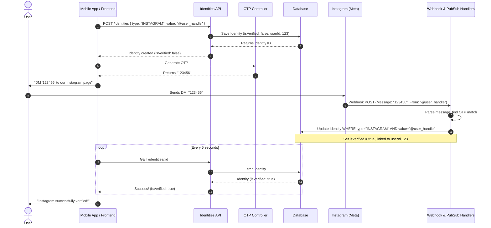

# Identity Workflows Module

The `IdentityWorkflowsModule` orchestrates progressive onboarding and identity validation workflows, coordinating verification steps across multiple features.

---

## 📋 Purpose & Responsibilities

- **Progressive Onboarding**: Guides users through account setup states (such as verifying a phone OTP, linking Instagram, and creating a profile).
- **Workflow State Management**: Directs validation checks and registers progress indicators in the database to prevent incomplete registrations.

---

## 🧠 Business Logic & Core Concepts

### 1. Retroactive Match Resolution (Ghost Identities)
When an `IDENTITY_CLAIMED` event fires, the `handleIdentityClaimed` listener scans for all `PENDING` likes that targeted the newly claimed identity. It iterates over these actionable likes and runs them through the `MatchResolverService`. This logic is what converts pending "ghost" interactions into mutual matches the moment a user finishes onboarding.

### 2. Cross-Channel OTP Verification
The Instagram verification flow (`handleInstagramOtpReceived`) bridges SMS/Email logic with Instagram DMs. It verifies the OTP, fetches the Meta social identity, claims the `Identity` record, and then fires a push notification to confirm the linkage to the user. All of this operates purely as an event consumer disconnected from the client's HTTP request lifecycle.

---

## 📸 Instagram Identity Verification Flow

This workflow verifies ownership of a user's Instagram handle using an out-of-band message check via Webhooks and OTPs.

### Step-by-Step Breakdown

#### 1. Identity Registration (Pending State)
- **Action**: The client app calls `POST /identities`.
- **Payload**: Sends `type` as `INSTAGRAM` and the `publicValue` as the customer's Instagram Handle/ID.
- **Backend Result**: The `IdentitiesController` saves this record in the database. Crucially, the `isVerified` flag defaults to `false`, and it is linked to the currently authenticated `userId`.
- **Client Action**: The client stores the returned identity `id` to check the status later.

#### 2. OTP Generation
- **Action**: The client requests a new One-Time Password via the OTP Controller.
- **Backend Result**: The backend generates a secure, short-lived OTP and links it to this specific user/session.

#### 3. User Action
- **Action**: The client displays the OTP to the user and asks them to DM that exact code to the platform's official Instagram account.
- **User Action**: The user opens Instagram and sends the OTP as a direct message.

#### 4. Webhook & Validation
- **Action**: Meta (Instagram) fires a webhook to the backend containing the incoming message.
- **Backend Result**:
  1. The Webhook Handler receives the payload and routes it to the OTP Handler.
  2. The OTP Handler checks the text of the message against active OTPs.
  3. Finding a match, it validates that the sender's Instagram ID matches the `publicValue` claimed by the user.

#### 5. Verification & Association
- **Action**: The backend uses Pub/Sub to trigger the identity claim completion.
- **Backend Result**: The system updates the identity record in the database. It sets `isVerified = true`, stamps `verifiedAt` with the current timestamp, and solidifies the association between the Instagram ID and your system's User ID.

#### 6. Client Polling (Completion)
- **Action**: Meanwhile, the client has been calling `GET /identities/:id` every few seconds.
- **Backend Result**: Once step 5 completes, the next polling request returns `isVerified: true`. The client sees this, stops polling, and updates the UI to show a successful Instagram link.

---

## 🔄 Sequence Diagram

