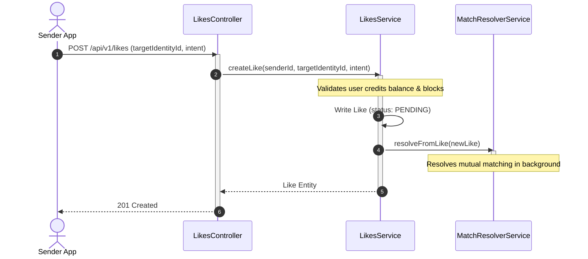

# Likes Module

The `LikesModule` manages user liking mechanics and intentions. It is the entry point for starting connections.

---

## 📋 Purpose & Responsibilities

- **Send Like (`POST /`)**: Creates a pending `Like` from the authenticated user to a target user's identity.
- **Intents**: Captures the sender's relational intent (`RELATIONSHIP`, `CASUAL`, `OPEN`) to evaluate compatibility during matching.
- **Withdraw Like (`DELETE /:id`)**: Allows users to void or remove a previously sent pending like.
- **Listing Received Likes**: Provides a paginated list of inbound pending likes for the current user.

---

## 🛠 File & Class Definitions

### Controller
- **[LikesController](file:///Users/mohitmalpani/Business/BreathAway/Backend/breathaway/src/modules/likes/likes.controller.ts)**: Handles HTTP requests for sending, withdrawing, and listing likes.
  - Route Prefix: `/api/v1/likes`

### Service
- **[LikesService](file:///Users/mohitmalpani/Business/BreathAway/Backend/breathaway/src/modules/likes/likes.service.ts)**: Validates credits balance before liking, ensures blocks do not exist, and writes the `Like` record to the database.

---

## 🔄 Interaction Flow

When a user likes another, a check is triggered to see if it results in a mutual connection:

