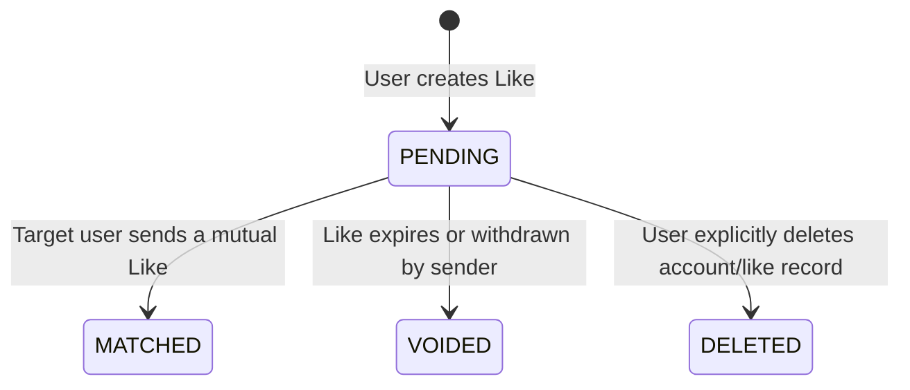

# Likes Module

The `LikesModule` manages liking mechanics, capturing user intents, and executing state transitions for outbound connection requests.

---

## 📋 Purpose & Responsibilities

- **Liking Mechanics**: Persists connection intents from one user to another's identity.
- **Relational Intent Capturing**: Tracks the specific dating/connection intents of the sender to ensure mutual compatibility checks.
- **Credit Deductions Integration**: Integrates with the `CreditsModule` to deduct credit balances for specific actions (such as sending a super-like).

---

## ⚙️ Managed Enums & States

The liking flow relies on two core enums:

### 1. IntentType
Defines the connection interest type selected by the sender:

* **`RELATIONSHIP`**: User is looking for long-term relationships.
* **`CASUAL`**: User is looking for casual dating or hangouts.
* **`OPEN`**: User is open to multiple connection models.

### 2. LikeStatus
Represents the state lifecycle of a liking record:

* **`PENDING`**: The like has been sent, and the target user has not yet liked back.
* **`MATCHED`**: A mutual like has been detected and resolved into a Match.
* **`VOIDED`**: The like expired without a response or was cancelled.
* **`DELETED`**: The sender explicitly removed the like.
