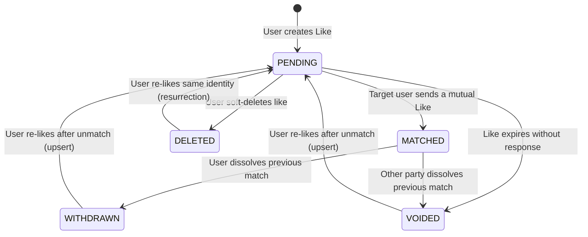

# Likes Module

The `LikesModule` manages liking mechanics, capturing user intents, and executing state transitions for outbound connection requests.

---

## 📋 Purpose & Responsibilities

- **Liking Mechanics**: Persists connection intents from one user to another's identity.
- **Pre-Flight Validation**: Provides `POST /likes/can-create` to evaluate match/like eligibility instantly without executing DB transactions or consuming credits.
- **Relational Intent Capturing**: Tracks the specific dating/connection intents of the sender to ensure mutual compatibility checks.
- **Credit Deductions Integration**: Integrates with the `CreditsModule` to deduct credit balances for specific actions (such as sending a super-like).
- **Idempotent Re-Liking & Soft-Delete Resurrection**: Seamlessly handles re-liking previously deleted, withdrawn, or voided likes by updating the existing record back to `PENDING` rather than inserting a duplicate row or throwing a unique constraint conflict.

---

## 🧠 Business Logic & Core Concepts

### 1. Atomic Credit Consumption

Sending a like is a premium action. The `LikesService` performs a pre-check for sufficient credits. When persisting the like, it uses a database transaction (`$transaction`) to atomically create the `Like` record and deduct the required credits via the `CreditsService`. If the user lacks credits, the system emits a `USAGE_DENIED` audit event.

### 2. "Ghost" Identity Target Resolution

In BreathAway, users do not just like other _users_; they like _target identities_ (e.g., an Instagram handle or a phone number).

- If the target identity is already registered to a user, the like targets them directly.
- If the target identity **does not exist**, the system creates an _unresolved_ "Ghost Identity" (`userId = null`). This allows users to express intent toward someone who hasn't joined the platform yet. When that person eventually registers, the Auth module claims this ghost identity and triggers retroactive matching.

### 3. Identity and Active Match Duplicate Prevention

When a user likes a target identity that resolves to an existing user profile (e.g., liking a user's phone number after already matching via their Instagram handle), the system verifies whether an `ACTIVE` match already exists between the two users.

- If an active match is found, the system explicitly aborts the transaction by throwing an `AlreadyMatchedException`.
- This early termination occurs **before** the credit consumption transaction begins, preventing unwarranted credit deductions and keeping the DB clean from duplicate likes tied to alternative identities.

**Pre-Flight API**: Clients can utilize the `POST /likes/can-create` endpoint with a target identity to verify eligibility beforehand. This avoids surprising the user with a failed transaction and enables smoother UI flows (like disabling the "Like" button in advance).

### 4. Re-Liking & Soft-Deleted Like Resurrection (Upsert Semantics)

The database schema enforces a unique constraint `@@unique([senderUserId, targetIdentityId])`, ensuring that only one like record can ever exist for a given sender-and-target-identity pair.

When a user deletes a pending like (`DELETE /api/v1/likes/:id`), the record is soft-deleted for auditability:

- Status transitions to `DELETED`.
- `deletedAt` is stamped with the current timestamp.

If the user subsequently attempts to like the same identity again:

- **No 409 Conflict**: Instead of attempting to insert a new row and failing with a database unique constraint violation (`409 Conflict: A record with this value already exists.`), the system identifies the existing inactive record (`DELETED`, `WITHDRAWN`, or `VOIDED`).
- **Resurrection back to `PENDING`**: Within the atomic `$transaction`, the service updates the existing record:
  - Resets `status` to `PENDING`.
  - Clears `deletedAt` back to `null`.
  - Refreshes `expiresAt` based on the current time and caller timezone.
  - Updates `intent` and optional personal `label`.
- **Full Operational Parity**: The resurrected like executes all standard liking operations:
  1. Verifies and deducts user credits atomically via `CreditsService.consumeCredits`.
  2. Emits a `LIKE_CREATED` audit log.
  3. Dispatches asynchronous mutual match resolution via `MatchResolverService.resolveFromLike`.
- **Pre-Flight Validation**: The `POST /api/v1/likes/can-create` endpoint recognizes soft-deleted records as re-likable, returning `{ canCreate: true }` as long as no active match exists and the user is not liking themselves.

### 5. Asynchronous Match Resolution

After a like is successfully persisted, the `LikesService` asynchronously delegates to the `MatchResolverService`. This design ensures that the critical path (deducting credits and saving the intent) is fast and isolated from the heavy logic of evaluating mutual connections. Failures in the resolver do not roll back the like creation.

### 6. Persistent Annotations (Labels)

Users can attach a personal string `label` to a like (e.g., "Sarah from the gym"). Business logic dictates that these labels can be updated at any time, even if the like transitions to a `MATCHED` or `VOIDED` state, allowing users to continually personalize their history.

---

## ⚙️ Managed Enums & States

The liking flow relies on two core enums:

### 1. IntentType

Defines the connection interest type selected by the sender:

- **`RELATIONSHIP`**: User is looking for long-term relationships.
- **`CASUAL`**: User is looking for casual dating or hangouts.
- **`OPEN`**: User is open to multiple connection models.

### 2. LikeStatus

Represents the state lifecycle of a liking record:

- **`PENDING`**: The like has been sent, and the target user has not yet liked back.
- **`MATCHED`**: A mutual like has been detected and resolved into an active Match.
- **`VOIDED`**: The like expired without a response, or was system-voided when the other party dissolved a previous match. Can transition back to `PENDING` on re-like.
- **`WITHDRAWN`**: The like was withdrawn when the user dissolved a previous match. Can transition back to `PENDING` on re-like.
- **`DELETED`**: The sender explicitly soft-deleted the pending like. If the user likes the same identity again, this row is resurrected back to `PENDING` rather than creating a duplicate or throwing a conflict.
