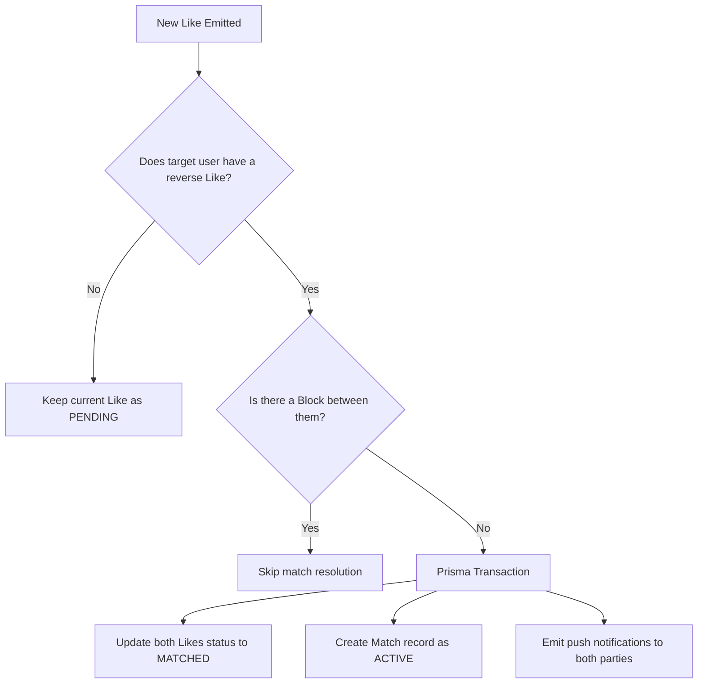

# Match Resolver Module

The `MatchResolverModule` is a background orchestrator responsible for identifying mutual interest and creating active matches.

---

## 📋 Purpose & Responsibilities

- **Synchronous Pipeline Trigger**: Invoked immediately after a new `Like` record is written to the database.
- **Mutual Interest Evaluation**: Searches for a reverse like (where the target user has liked the current sender).
- **Compatibility Verification**: Confirms that:
  1. Neither user has blocked the other.
  2. The target identity matches a valid user record.
- **Match Creation**: Executes the match creation and updates like statuses inside a database transaction.
- **Notification Triggers**: Emits push events to notify both users of their new connection.

---

## 🛠 File & Class Definitions

### Service
- **[MatchResolverService](file:///Users/mohitmalpani/Business/BreathAway/Backend/breathaway/src/modules/match-resolver/match-resolver.service.ts)**: Contains the core matching algorithm. It does not have an HTTP controller as it is run entirely as an in-app service component.

---

## 🔄 Match Resolution Flow

