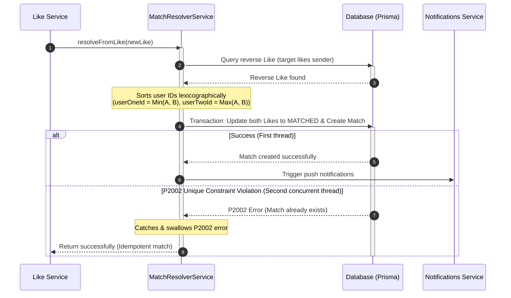

# Match Resolver Module

The `MatchResolverModule` is an internal background orchestrator responsible for identifying mutual interest, resolving active matches, and handling high-concurrency race conditions.

---

## 📋 Purpose & Responsibilities

- **Synchronous Pipeline Trigger**: Invoked immediately after a new `Like` record is written to the database.
- **Mutual Interest Evaluation**: Searches for a reverse like (where the target user has liked the current sender).
- **Concurrency & Scaling**: Employs unique safety checks to resolve simultaneous mutual likes without duplicate matches or database transaction failures.

---

## ⚙️ Concurrency & Race-Condition Design

When User A likes User B, and User B likes User A at the exact same millisecond, two parallel database queries will identify a mutual connection and attempt to create a `Match`. To prevent duplicate match records or transaction deadlocks, the module implements two architectural patterns:

### 1. Deterministic User ID Sorting
To guarantee that a match record between two users is unique, the database enforces a unique composite index on the columns `(userOneId, userTwoId)`. 

When creating or querying a match, the service dynamically sorts the user IDs lexicographically:
* **`userOneId`**: Assigned to the lexicographically smaller User UUID/ULID string.
* **`userTwoId`**: Assigned to the lexicographically larger User UUID/ULID string.

This ensures that regardless of which user liked whom first, the database query always targets the same canonical row configuration.

### 2. Prisma P2002 Swallowing (Idempotent Resolution)
If both users like each other simultaneously, the transactions will run concurrently:
1. Thread 1 updates User A's like to `MATCHED` and attempts to insert the `Match` record.
2. Thread 2 updates User B's like to `MATCHED` and attempts to insert the `Match` record.
3. Whichever thread finishes first successfully creates the `Match`.
4. The slower thread will fail with a Prisma unique constraint violation error (**`P2002`**).
5. The `MatchResolverService` explicitly catches the `P2002` error and swallows it, logging a warning but returning a success status. This ensures that the user's action completes successfully rather than rolling back because the match had already been established by the other user.

---

## 🔄 Match Resolution Flow

