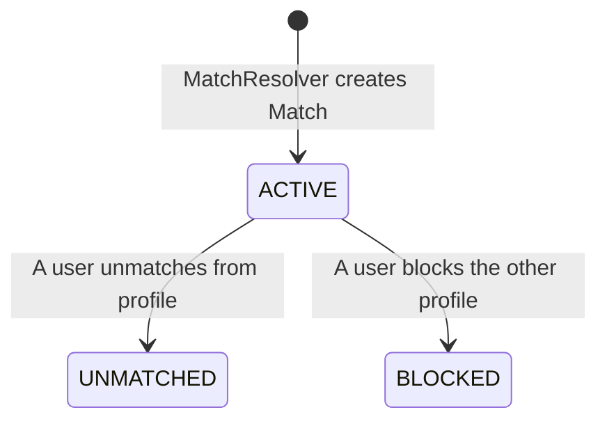

# Matches Module

The `MatchesModule` stores and tracks established, mutual connections between users, managing their state transitions and communication access rules.

---

## 📋 Purpose & Responsibilities

- **Match Tracking**: Persists mutual matches, recording the matching timestamp and both partners' initial intents.
- **Connection Lifecycle Management**: Updates match state parameters when users unmatch or block each other.
- **Access Authorization**: Acts as the gatekeeper for other communication systems (like Chats) to ensure a match is in an active state.

---

## ⚙️ Managed Enums & States

The matching system manages records via the **`MatchStatus`** enum:

### Match States Reference

* **`ACTIVE`**: 
  - **Description**: The connection is live and mutual.
  - **Permissions**: Both users can view each other's profiles and exchange messages in chat channels.
* **`UNMATCHED`**:
  - **Description**: One of the users explicitly broke the connection.
  - **Permissions**: Profile visibility is removed and messaging access is immediately revoked.
* **`BLOCKED`**:
  - **Description**: One of the users blocked the other.
  - **Permissions**: Restricts all interactions. The blocked profile cannot search for, view, or attempt to re-like the blocker.
