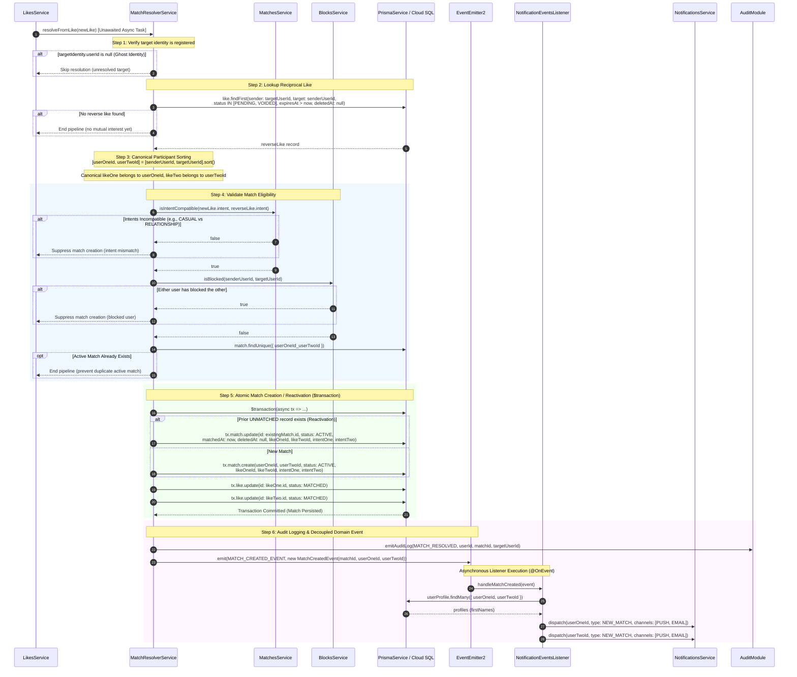
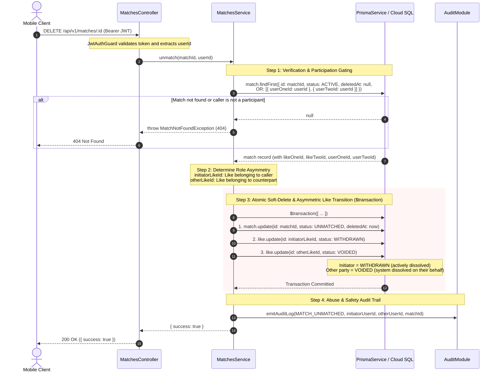
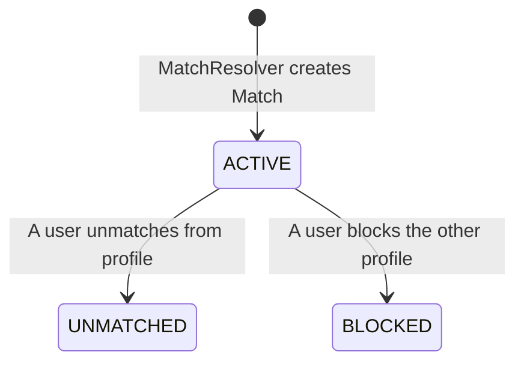

# Matches Module

The `MatchesModule` stores and tracks established, mutual connections between users, managing their state transitions and communication access rules.

---

## 📋 Purpose & Responsibilities

- **Match Tracking**: Persists mutual matches, recording the matching timestamp and both partners' initial intents.
- **Connection Lifecycle Management**: Updates match state parameters when users unmatch or block each other.
- **Access Authorization**: Acts as the gatekeeper for other communication systems (like Chats) to ensure a match is in an active state.

---

## 🔄 Core Workflows & Sequence Diagrams

The matching subsystem is orchestrated across two primary services:

1. **`MatchResolverService` (`src/modules/match-resolver`)**: The asynchronous engine triggered after a like is persisted, responsible for evaluating reciprocity, compatibility, and forging the `Match` record.
2. **`MatchesService` (`src/modules/matches`)**: Manages the lifecycle of active matches, queries, perspective normalisation, and connection dissolution (`unmatch`).

### 1. Match Resolution Pipeline (`MatchResolverService.resolveFromLike`)

This sequence executes asynchronously after a like is created in `LikesService.create()`. It runs outside the client's HTTP response path to keep swipe latency under 80ms.

---

### 2. Unmatch & Connection Dissolution (`MatchesService.unmatch`)

When an authenticated user dissolves a match (`DELETE /api/v1/matches/:id`), the operation executes as an asymmetric atomic transaction:

---

## 🧠 Business Logic & Core Concepts

### 1. Intent Compatibility Matrix

A match is only forged if both users' connection intents align. The `MatchesService` enforces this via a strict matrix:

- **`OPEN`**: Highly permissive; matches with any other intent (`OPEN`, `RELATIONSHIP`, `CASUAL`).
- **`RELATIONSHIP`**: Strict; matches only with `RELATIONSHIP` or `OPEN`.
- **`CASUAL`**: Strict; matches only with `CASUAL` or `OPEN`.

### 2. Perspective Normalisation

Internally, the database stores participants arbitrarily as `userOne` and `userTwo`. However, when returning data to the client, the `MatchesService` dynamically remaps the payload into `me` and `otherUser` based on the caller's ID. This guarantees that frontend clients always consume the API from the first-person perspective without needing to check which user slot they occupy.

### 3. Unmatching & Abuse Auditing

Dissolving a connection (Unmatching) acts as a soft-delete (stamping `deletedAt` and transitioning status to `UNMATCHED`). When this occurs, the service emits a `MATCH_UNMATCHED` audit event containing both user IDs. This allows backend moderators to detect abuse patterns, such as "rematch cycling" (matching, unmatching, and matching again rapidly).

---

## ⚙️ Managed Enums & States

The matching system manages records via the **`MatchStatus`** enum:

### Match States Reference

- **`ACTIVE`**:
  - **Description**: The connection is live and mutual.
  - **Permissions**: Both users can view each other's profiles and exchange messages in chat channels.
- **`UNMATCHED`**:
  - **Description**: One of the users explicitly broke the connection.
  - **Permissions**: Profile visibility is removed and messaging access is immediately revoked.
- **`BLOCKED`**:
  - **Description**: One of the users blocked the other.
  - **Permissions**: Restricts all interactions. The blocked profile cannot search for, view, or attempt to re-like the blocker.
