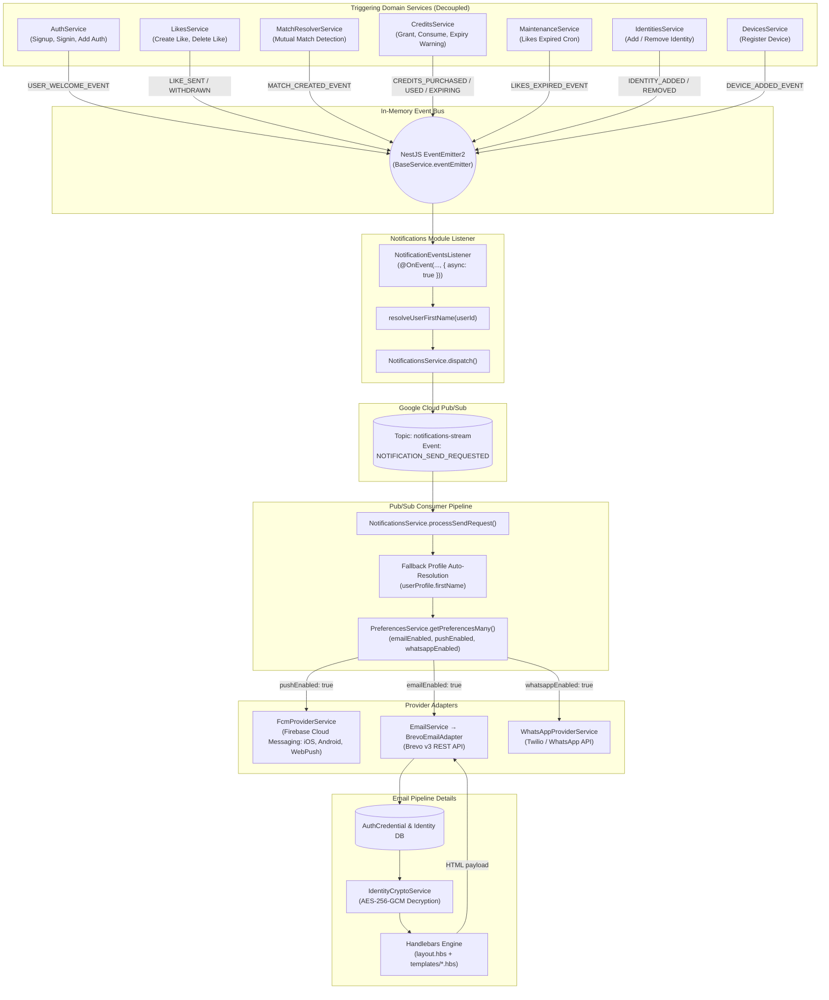

# Notifications Module

The `NotificationsModule` provides BreathAway's multi-channel notification infrastructure, orchestrating transactional emails (via Brevo), push notifications (via Firebase Cloud Messaging), and SMS/WhatsApp alerts. It features an event-driven Pub/Sub fan-out pipeline, dynamic Handlebars templating with layout inheritance, envelope-encrypted recipient email resolution, and strict user preference gatekeeping.

---

## 📋 Purpose & Responsibilities

- **Multi-Channel Dispatch**: Distributes notifications across **Email** (Brevo SMTP API), **Push** (Firebase Cloud Messaging), and **WhatsApp/SMS** without duplicating business logic.
- **Asynchronous Pub/Sub Fan-Out**: Decouples API endpoints from downstream notification providers using Google Cloud Pub/Sub, ensuring sub-80ms client response times.
- **Transactional Email Engine**: Pre-compiles and caches responsive HTML templates via Handlebars, applies brand styling and partials (`header.hbs`, `footer.hbs`), and executes personalized interpolations.
- **Envelope-Encrypted Email Resolution**: Transparently decrypts user email addresses stored across encrypted `Identity` records using `IdentityCryptoService` (AES-256-GCM + Google Cloud KMS).
- **Preference Gatekeeping**: Enforces granular user privacy settings (`pushEnabled`, `emailEnabled`, `whatsappEnabled`) via `PreferencesService` before dispatching to provider networks.
- **Double-Blind & PII Protection**: Guarantees zero leak of sensitive user identities during social notifications (e.g., likes remain secret until mutual matches are confirmed; security alerts mask identifiers).

---

## 🏗 Multi-Channel Architecture

The following diagram illustrates how user actions trigger notifications, how events fan out through Cloud Pub/Sub, and how the `EmailService` resolves credentials and dispatches via Brevo.



---

## ✉️ Brevo Transactional Email Engine

### 1. Template Compilation & Layout Inheritance

All email templates reside under `src/modules/notifications/templates/` and inherit from a centralized, mobile-responsive base layout:

```
src/modules/notifications/templates/
├── layout.hbs                   # Responsive container, CSS reset, typography, header & footer slots
├── partials/
│   ├── header.hbs               # Brand logo, top spacing, webview links
│   └── footer.hbs               # Legal address, unsubscribe link, copyright year
└── [template-name].hbs          # Individual body templates
```

- **Startup Pre-Compilation**: During `EmailService.onModuleInit()`, Handlebars registers partials (`header`, `footer`) and pre-compiles `layout.hbs` and all template files into an in-memory `Map<EmailType, Handlebars.TemplateDelegate>`. Any malformed Handlebars syntax is caught during application boot, preventing runtime failures.
- **Custom Comparison Helpers**: The engine registers logical comparison helpers (`gt`, `gte`, `lt`, `lte`, `eq`) enabling dynamic pluralization and conditional styling:
  ```handlebars
  {{#if (gt creditsUsed 1)}}credits{{else}}credit{{/if}}
  ```

### 2. Envelope-Encrypted Email Resolution

BreathAway enforces zero-plaintext storage of Personally Identifiable Information (PII). The `User` table contains no email column. Instead:

1. `EmailService.send()` queries `AuthCredential` records where `type = AuthCredentialType.EMAIL` and `deletedAt IS NULL`.
2. It fetches the attached `Identity` record containing `publicValueCiphertext`, `publicValueIv`, `publicValueTag`, and `publicValueWrappedKey`.
3. It passes these fields to `IdentityCryptoService.decryptPublicValue()`, decrypting the ciphertext via AES-256-GCM and GCP Cloud KMS.
4. Emails are de-duplicated and normalized to lowercase before dispatching.

### 3. Provider Adapter (`BrevoEmailAdapter`)

The `BrevoEmailAdapter` implements `IEmailAdapter` and communicates with the Brevo v3 Transactional SMTP API (`POST https://api.brevo.com/v3/smtp/email`):

```typescript
{
  "sender": { "name": "BreathAway", "email": "notifications@breathaway.app" },
  "to": [{ "email": "recipient@example.com" }],
  "subject": "Personalized Subject Line",
  "htmlContent": "<!DOCTYPE html>..."
}
```

---

## 📲 Push Notifications & Multi-Platform FCM Delivery

BreathAway leverages Firebase Cloud Messaging (`FcmProviderService`) to broadcast push notifications across **iOS**, **Android**, and **Web Browsers (Web Push)**.

### Token Grouping & Platform-Specific Configurations

Device tokens associated with the recipient user are fetched from the `Device` table and segregated by `DevicePlatform`:

1. **iOS (`DevicePlatform.IOS`)**:
   - Dispatches via Apple Push Notification service (`apns`).
   - Configures `aps: { sound: 'default', badge: 1 }` and `category` headers.
2. **Android (`DevicePlatform.ANDROID`)**:
   - Dispatches via FCM Android block (`android`).
   - Configures `priority: 'high'`, `notification: { channelId: 'default', sound: 'default' }`.
3. **Web (`DevicePlatform.WEB`)**:
   - Dispatches via WebPush protocol block (`webpush`).
   - Configures browser notification display metadata:
     - `icon`: Configured via `WEBPUSH_ICON_URL` (defaulting to `${APP_URL}/icon-192x192.png`).
     - `badge`: Configured via `WEBPUSH_BADGE_URL` (defaulting to `${APP_URL}/badge-72x72.png`).
     - `fcmOptions: { link: resolveWebLink(...) }`: The fully-qualified HTTPS deep link the browser focuses or navigates to when the user clicks the notification.

### Deep Linking & Payload Normalization

Every outgoing push notification includes unified navigation metadata in its top-level `data` payload:
- `link`: Normalized route (e.g., `/matches/01HM...`, `/credits`).
- `route`: Alias for `link` for cross-client compatibility.

Relative links are resolved against the `APP_URL` environment variable:
- Absolute URLs (`https://...`) pass through unmodified.
- Relative routes (e.g., `/matches/:id`) are appended to `${APP_URL}/app${link}`.

> [!TIP]
> For a full client-side implementation guide (service workers, VAPID key setup, token synchronization, and foreground toast handling), consult the [Web Push Integration Guide](../api/web-push.md).

---

## 📊 Lifecycle Email Notifications Catalog

BreathAway supports **14 distinct email notifications** covering onboarding, social matching, credits and monetization, account security, and system events.

### Master Email Reference Matrix

| Notification Type / Email Type | Category     | Trigger Origin / Method                    | Primary Recipient  | Subject Line Template                                            | Template File               | Preference Key |
| :----------------------------- | :----------- | :----------------------------------------- | :----------------- | :--------------------------------------------------------------- | :-------------------------- | :------------- |
| `WELCOME`                      | Onboarding   | `AuthService.signup` / `signInOrSignUp`    | New user           | `Welcome to BreathAway, {{name}}! 🌬️`                            | `welcome.hbs`               | `emailEnabled` |
| `LIKE_SENT`                    | Social       | `LikesService.create`                      | Like sender        | `Your like has been sent! 💌`                                    | `like-sent.hbs`             | `emailEnabled` |
| `NEW_MATCH`                    | Social       | `MatchResolverService.resolveFromLike`     | Both matched users | `It's a Match, {{name}}! 💫`                                     | `new-match.hbs`             | `emailEnabled` |
| `LIKE_WITHDRAWN`               | Social       | `LikesService.delete`                      | Like sender        | `Like Withdrawn — BreathAway`                                    | `like-withdrawn.hbs`        | `emailEnabled` |
| `LIKES_EXPIRED`                | Maintenance  | `MaintenanceService.voidPendingLikes`      | Like sender        | `Update on your pending likes ⏳`                                | `likes-expired.hbs`         | `emailEnabled` |
| `CREDITS_PURCHASED`            | Monetization | `CreditsService.grantCredits`              | Purchasing user    | `Credits Purchase Confirmed! 💳`                                 | `credits-purchased.hbs`     | `emailEnabled` |
| `CREDITS_USED`                 | Monetization | `CreditsService.consumeCredits`            | Spending user      | `You used {{creditsUsed}} credit(s) on BreathAway ✨`            | `credits-used.hbs`          | `emailEnabled` |
| `BUNDLE_EXPIRY_WARNING`        | Maintenance  | `CreditsService.handleExpiryWarningBatch`  | Bundle holder      | `Urgent / Reminder: {{count}} credits expiring... ⏳`            | `bundle-expiry-warning.hbs` | `emailEnabled` |
| `CREDIT_UPDATE`                | Monetization | `CreditsService` / Admin                   | User               | `Your BreathAway credits have been updated`                      | `credit-update.hbs`         | `emailEnabled` |
| `IDENTITY_ADDED`               | Security     | `IdentitiesService.create` / `AuthService` | Account owner      | `Security Alert: New {{identityType}} added to your account 🔒`  | `identity-added.hbs`        | `emailEnabled` |
| `IDENTITY_REMOVED`             | Security     | `IdentitiesService.delete`                 | Account owner      | `Security Alert: {{identityType}} removed from your account 🔒`  | `identity-removed.hbs`      | `emailEnabled` |
| `DEVICE_ADDED`                 | Security     | `DevicesService.createDevice`              | Account owner      | `Security Alert: New device added to your BreathAway account 📱` | `device-added.hbs`          | `emailEnabled` |
| `NEW_MESSAGE`                  | Social       | `ChatsService.sendMessage`                 | Chat recipient     | `{{senderName}} sent you a message 💬`                           | `new-message.hbs`           | `emailEnabled` |
| `SYSTEM_ALERT`                 | System       | System workflows / Admin                   | User               | `{{alertTitle}} — BreathAway`                                    | `system-alert.hbs`          | `emailEnabled` |

---

## 🔍 Detailed Notification Specifications

### 1. Welcome Email (`WELCOME`)

Sent immediately when a user creates their account or links their first verified email address.

- **Trigger Point**:
  - `AuthService.signup()`: when a user completes standard registration.
  - `AuthService.signInOrSignUp()`: when a new user record is created via federated authentication.
  - `AuthService.addSecondaryAuth()`: when an existing user attaches and verifies a new `EMAIL` identity.
- **Template**: `welcome.hbs`
- **Subject**: `Welcome to BreathAway, {{name}}! 🌬️`
- **Payload Variables**:
  | Key | Type | Description |
  | :--- | :--- | :--- |
  | `name` | `string` | User's preferred first name |
  | `appUrl` | `string` | Base deep-link or web app URL |
  | `ctaUrl` | `string` | Onboarding profile completion link |

> [!NOTE]
> When `addSecondaryAuth()` links an email address, both the `WELCOME` onboarding email and an `IDENTITY_ADDED` security alert are dispatched so the user verifies delivery and is notified of the account credential modification.

---

### 2. Like Sent Confirmation (`LIKE_SENT`)

Sent to the sender confirming that their like has been securely recorded and reassuring them of double-blind confidentiality.

- **Trigger Point**: `LikesService.create()`
- **Template**: `like-sent.hbs`
- **Subject**: `Your like has been sent! 💌`
- **Payload Variables**:
  | Key | Type | Description |
  | :--- | :--- | :--- |
  | `name` | `string` | Sender's first name |
  | `targetMaskedValue` | `string` | Masked phone number (e.g. `+1 ••• ••• 4589`) or handle |
  | `targetLabel` | `string` _(optional)_ | Contact nickname or label chosen by sender |
  | `intent` | `string` | Like intent (e.g., `CRUSH`, `DATING`, `NETWORKING`) |
  | `expiresAt` | `string` | Formatted expiration date string (e.g., 90 days out) |
  | `date` | `string` | ISO timestamp of the like creation (`DateUtil.now()`) |

> [!IMPORTANT]
> **Double-Blind Privacy**: The target recipient is **never** sent an email or told who liked them. Only the sender receives this confirmation.

---

### 3. Mutual Match Alert (`NEW_MATCH`)

Sent concurrently to both users when a mutual like is resolved, establishing a match.

- **Trigger Point**: `MatchResolverService.resolveFromLike()`
- **Template**: `new-match.hbs`
- **Subject**: `It's a Match, {{name}}! 💫`
- **Payload Variables**:
  | Key | Type | Description |
  | :--- | :--- | :--- |
  | `name` | `string` | Recipient user's first name |
  | `matchName` | `string` | Matched partner's first name |
  | `matchAvatarUrl` | `string` _(optional)_ | Public avatar image URL of the matched partner |
  | `matchId` | `string` | ULID identifier of the created `Match` |
  | `chatUrl` | `string` | Deep link directly into the newly created chat room |
  | `date` | `string` | ISO timestamp of match creation |

---

### 4. Like Withdrawn (`LIKE_WITHDRAWN`)

Sent to the user when they delete or cancel a pending, unreciprocated like.

- **Trigger Point**: `LikesService.delete()`
- **Template**: `like-withdrawn.hbs`
- **Subject**: `Like Withdrawn — BreathAway`
- **Payload Variables**:
  | Key | Type | Description |
  | :--- | :--- | :--- |
  | `name` | `string` | User's first name |
  | `targetMaskedValue` | `string` | Masked phone number or identifier of the target |
  | `targetLabel` | `string` _(optional)_ | Custom nickname originally given to the target |
  | `withdrawnAt` | `string` | Formatted timestamp of withdrawal (`DateUtil.now()`) |

---

### 5. Likes Expired Clean-Up (`LIKES_EXPIRED`)

Sent by the nightly maintenance worker when unreciprocated pending likes surpass the 90-day retention window and are transitioned to `EXPIRED`.

- **Trigger Point**: `MaintenanceService.voidPendingLikes()`
- **Template**: `likes-expired.hbs`
- **Subject**: `Update on your pending likes ⏳`
- **Payload Variables**:
  | Key | Type | Description |
  | :--- | :--- | :--- |
  | `name` | `string` | User's first name |
  | `count` | `number` | Number of likes that expired in the batch |
  | `expiryDate` | `string` | Date on which the batch was voided |
  | `date` | `string` | ISO timestamp of the cron execution |

---

### 6. Credits Purchased Receipt (`CREDITS_PURCHASED`)

Sent to the user upon a successful credit bundle purchase, subscription renewal, or promo credit grant.

- **Trigger Point**: `CreditsService.grantCredits()`
- **Template**: `credits-purchased.hbs`
- **Subject**: `Credits Purchase Confirmed! 💳`
- **Payload Variables**:
  | Key | Type | Description |
  | :--- | :--- | :--- |
  | `name` | `string` | User's first name |
  | `creditsAdded` | `number` | Quantity of credits granted |
  | `creditBalance` | `number` | Real-time derived total balance after addition |
  | `transactionId` | `string` | Ledger entry reference ID or invoice identifier |
  | `expiresAt` | `string` _(optional)_ | Formatted expiration date for time-limited bundles |
  | `bundleType` | `string` | Source label (`PURCHASE`, `SUBSCRIPTION`, `BONUS`) |

---

### 7. Credits Used Notification (`CREDITS_USED`)

Sent to the user whenever credits are debited from their ledger (e.g. sending a paid like or unlocking a connection).

- **Trigger Point**: `CreditsService.consumeCredits()`
- **Template**: `credits-used.hbs`
- **Subject**: `You used {{creditsUsed}} {{#if (gt creditsUsed 1)}}credits{{else}}credit{{/if}} on BreathAway ✨`
- **Payload Variables**:
  | Key | Type | Description |
  | :--- | :--- | :--- |
  | `name` | `string` | User's first name |
  | `creditsUsed` | `number` | Number of credits debited in this transaction |
  | `creditBalance` | `number` | Remaining real-time credit balance |
  | `usedAt` | `string` | Formatted timestamp of consumption |
  | `reason` | `string` | Credit source reason (`LIKE_USAGE`, `ADMIN`) |

---

### 8. Credit Bundle Expiry Warning (`BUNDLE_EXPIRY_WARNING`)

Sent proactively to users who have expiring credit bundles within the warning threshold (7 days for info, 2 days for urgent notice).

- **Trigger Point**: `CreditsService.handleExpiryWarningBatch()` (via maintenance cron)
- **Template**: `bundle-expiry-warning.hbs`
- **Subject**: `{{#if isUrgent}}Urgent: {{count}} credits expiring soon! ⏳{{else}}Reminder: {{count}} credits expiring on {{expiryDate}} ⏳{{/if}}`
- **Payload Variables**:
  | Key | Type | Description |
  | :--- | :--- | :--- |
  | `name` | `string` | User's first name |
  | `count` | `number` | Total quantity of credits expiring across the affected bundles |
  | `expiryDate` | `string` | Earliest expiration date string |
  | `daysRemaining` | `number` | Days remaining until expiration |
  | `urgency` | `'warning' \| 'info'` | Urgency classification |
  | `isUrgent` | `boolean` | `true` if `daysRemaining <= 2` |

---

### 9. Identity Added Security Alert (`IDENTITY_ADDED`)

Sent whenever a new contact method (email, phone, Instagram handle) is attached to a user's account.

- **Trigger Point**: `IdentitiesService.create()`, `AuthService.addSecondaryAuth()`
- **Template**: `identity-added.hbs`
- **Subject**: `Security Alert: New {{identityType}} added to your account 🔒`
- **Payload Variables**:
  | Key | Type | Description |
  | :--- | :--- | :--- |
  | `name` | `string` | Account holder's first name |
  | `identityType` | `string` | Human-readable identity type (`Email`, `Phone`, `Instagram`) |
  | `maskedValue` | `string` | Masked contact identifier (e.g. `j•••••@example.com`, `+1 ••• ••• 1234`) |
  | `addedAt` | `string` | Formatted timestamp of identity attachment |
  | `isVerified` | `boolean` | Whether identity was pre-verified |

> [!WARNING]
> Security notifications include direct action buttons linking to `/settings/security` so users can immediately lock compromised accounts if they did not initiate the action.

---

### 10. Identity Removed Security Alert (`IDENTITY_REMOVED`)

Sent when an existing identity method is unlinked or deleted from an account.

- **Trigger Point**: `IdentitiesService.delete()`
- **Template**: `identity-removed.hbs`
- **Subject**: `Security Alert: {{identityType}} removed from your account 🔒`
- **Payload Variables**:
  | Key | Type | Description |
  | :--- | :--- | :--- |
  | `name` | `string` | Account holder's first name |
  | `identityType` | `string` | Type of identity removed |
  | `maskedValue` | `string` | Masked identifier that was deleted |
  | `removedAt` | `string` | Formatted timestamp of deletion |

---

### 11. New Device Added Alert (`DEVICE_ADDED`)

Sent when a new physical or web device registers an active push notification token for the account.

- **Trigger Point**: `DevicesService.createDevice()`
- **Template**: `device-added.hbs`
- **Subject**: `Security Alert: New device added to your BreathAway account 📱`
- **Payload Variables**:
  | Key | Type | Description |
  | :--- | :--- | :--- |
  | `name` | `string` | Account holder's first name |
  | `platform` | `string` | Platform identifier (`IOS`, `ANDROID`, `WEB`) |
  | `deviceId` | `string` | Masked or truncated device ID/model |
  | `appVersion` | `string` | Client app build version (e.g., `1.4.2`) |
  | `addedAt` | `string` | Formatted timestamp of device registration |

---

## ⚡ Reliability & Decoupled Event Pattern

### Decoupled Domain Events via `@nestjs/event-emitter`

To maintain sub-100ms API response times, decouple feature domains, and prevent transactional bloat, domain services **never directly call `NotificationsService.dispatch`** or import `NotificationsModule`.

Instead, domain services extend `BaseService` and emit strongly typed domain events synchronously. All notification orchestration, channel selection, priority mapping, and recipient profile resolution are isolated within `NotificationEventsListener`.

```typescript
// 1. Domain Service (e.g. LikesService) — Only emits domain events
async create(userId: string, dto: CreateLikeRequestDto): Promise<LikeResponseDto> {
  const targetIdentity = await this.identitiesService.findOne(...);
  const like = await this.prisma.like.create(...);

  // Synchronous domain event emission (runs listeners asynchronously)
  this.eventEmitter.emit(
    LIKE_SENT_EVENT,
    new LikeSentEvent(
      userId,
      targetIdentity.publicValueMasked ?? '',
      dto.targetLabel ?? null,
      like.intent,
      like.expiresAt,
    ),
  );

  return this.mapToResponse(like);
}
```

```typescript
// 2. NotificationEventsListener (src/modules/notifications/listeners/)
@OnEvent(LIKE_SENT_EVENT, { async: true })
async handleLikeSent(event: LikeSentEvent): Promise<void> {
  try {
    const firstName = await this.resolveUserFirstName(event.userId);

    await this.notificationsService.dispatch({
      type: NotificationType.LIKE_SENT,
      category: NotificationCategory.SOCIAL,
      priority: NotificationPriority.NORMAL,
      channels: [NotificationChannel.EMAIL, NotificationChannel.PUSH],
      userIds: [event.userId],
      payload: {
        name: firstName ?? 'there',
        targetMaskedValue: event.targetMaskedValue,
        targetLabel: event.targetLabel,
        intent: event.intent,
        expiresAt: event.expiresAt ? DateUtil.formatDate(event.expiresAt) : '',
        date: DateUtil.now().toISOString(),
      },
    });
  } catch (error) {
    this.logger.error('Failed to dispatch like sent notification', {
      userId: event.userId,
      err: serializeError(error),
    });
  }
}
```

### Key Engineering Rules

1. **Zero Direct Coupling**: Domain services (`Auth`, `Likes`, `Matches`, `Credits`, etc.) must **never** import `NotificationsModule` or inject `NotificationsService`.
2. **Zero Profile Pre-fetching**: Domain services do not query `userProfile` solely to extract `firstName` for notifications. `NotificationEventsListener` resolves profile data as needed.
3. **Fallback Name Auto-Resolution**: If a notification request omits `payload.name` for a single recipient, `NotificationsService.processSendRequest` automatically fetches `userProfile.firstName` before dispatching to provider networks.
4. **Asynchronous Execution**: Handlers in `NotificationEventsListener` configure `@OnEvent(EVENT_NAME, { async: true })`, ensuring notification formatting runs completely outside the client's HTTP request lifecycle.
5. **Resilient Provider Failure**: In `NotificationsService.processSendRequest()`, downstream provider dispatches run in `Promise.allSettled()`. A failure in Brevo email delivery never prevents FCM push or WhatsApp delivery.
6. **Detailed Architecture Guide**: See [Decoupled Domain Events Architecture](../architecture/domain-events.md) for full event catalog and scaffolding blueprints.

---

## ⚙️ Configuration & Environment Variables

| Variable                     | Type   | Description                                         | Example                      |
| :--------------------------- | :----- | :-------------------------------------------------- | :--------------------------- |
| `BREVO_API_KEY`              | String | Secret API key for Brevo transactional email v3 API | `xkeysib-••••••••••••`       |
| `EMAIL_FROM_ADDRESS`         | String | Verified sender address configured in Brevo         | `no-reply@breathaway.app`    |
| `EMAIL_FROM_NAME`            | String | Display name for outgoing system emails             | `BreathAway`                 |
| `APP_URL`                    | String | Base frontend or universal deep-link URL            | `https://app.breathaway.com` |
| `WEBPUSH_ICON_URL`           | String | Web push notification icon asset URL                | `https://app.breathaway.com/icon-192x192.png` |
| `WEBPUSH_BADGE_URL`          | String | Web push monochrome badge asset URL                 | `https://app.breathaway.com/badge-72x72.png` |
| `PUBSUB_NOTIFICATIONS_TOPIC` | String | GCP Pub/Sub topic for async notification queue      | `notifications-stream`       |

> [!CAUTION]
> In production environments (Cloud Run), `BREVO_API_KEY` must be mounted from **Google Cloud Secret Manager**. Never hardcode API keys or commit them to source control.

---

## 🧪 Testing & Verification

### Unit Testing Providers & Templates

- **`BrevoEmailAdapter`**: Tested with mocked `axios.post` calls to verify payload serialization, authentication headers (`api-key`), timeout configurations, and error handling.
  - File: `src/modules/notifications/tests/brevo.email.adapter.spec.ts`
- **`EmailService`**: Tested with mocked `PrismaService`, `IdentityCryptoService`, and `IEmailAdapter` to verify envelope decryption, Handlebars caching, and preference filtering.
  - File: `src/modules/notifications/tests/email.service.spec.ts`
- **Full Test Suite Execution**:
  ```bash
  pnpm test src/modules/notifications
  ```

### Manual Verification via Postman / Swagger

To trigger test notifications in staging:

1. Ensure the user has an `EMAIL` auth credential linked and verified.
2. Ensure `emailEnabled: true` in user preferences (`GET /api/v1/preferences`).
3. Trigger an action (e.g. `POST /api/v1/likes`, `POST /api/v1/identities`, `POST /api/v1/devices`).
4. Check application logs in Google Cloud Logging for `LOG_EVENT.NOTIFICATION_SENT` and `step: "provider_dispatch"`.
5. Verify email delivery in the Brevo Transactional Email dashboard.
