# Modules Overview & Architecture

The BreathAway backend is built upon a highly modular, decoupled **NestJS architecture**. The system is organized into **25 specialized feature and infrastructure modules**, each encapsulating a specific bounded domain context with strict DTO boundaries and dependency injection.

---

## 🗺 Module Taxonomy & Domain Boundaries

```mermaid
graph TB
    subgraph "Core & Infrastructure"
        Firebase[FirebaseModule]
        Notifications[NotificationsModule]
        Health[HealthModule]
        PubSub[PubSubModule]
        Maintenance[MaintenanceModule]
        Audit[AuditModule]
    end

    subgraph "Authentication & Identities"
        Auth[AuthModule]
        OTP[OneTimePasswordsModule]
        Identities[IdentitiesModule]
        SocialIdentities[SocialIdentitiesModule]
        Instagram[InstagramModule]
        IdentityWorkflows[IdentityWorkflowsModule]
        Devices[DevicesModule]
    end

    subgraph "Users & Relationships"
        Profiles[ProfilesModule]
        Preferences[PreferencesModule]
        Blocks[BlocksModule]
        Likes[LikesModule]
        Matches[MatchesModule]
        MatchResolver[MatchResolverModule]
        Chats[ChatsModule]
        Reports[ReportsModule]
    end

    subgraph "Credits & Monetization"
        Credits[CreditsModule]
        Subscriptions[SubscriptionsModule]
        Webhooks[WebhooksModule]
        Admin[AdminModule]
    end

    Auth --> Identities
    Auth --> OTP
    Auth --> Firebase
    Identities --> IdentityWorkflows
    Likes --> Matches
    Matches --> MatchResolver
    Matches --> Chats
    Credits --> Subscriptions
    Webhooks --> Subscriptions
    Likes --> Credits
```

---

## 📦 Domain Module Catalog

### 1. Core & Infrastructure Modules

Foundational services providing cloud platform integrations, observability, asynchronous messaging, and system health.

- **[Firebase Module](./firebase.md)**: Manages Firebase Admin SDK credentials, token verification, and FCM push messaging initialization.
- **[Notifications Module](./notifications.md)**: Dispatches multi-channel alerts (Transactional Email via Brevo, Push notifications via FCM, and WhatsApp) with Handlebars template hydration and envelope-encrypted PII resolution.
- **[Health Module](./health.md)**: Cloud Run liveness and readiness probes (`/health/live`, `/health/ready`), validating PostgreSQL, Redis, and KMS connectivity.
- **[PubSub Module](./pubsub.md)**: Asynchronous event ingestion and publishing using GCP Cloud Pub/Sub topics and subscription worker handlers.
- **[Maintenance Module](./maintenance.md)**: Provides scheduled tasks, cleanup cron jobs, soft-deleted record pruning, and system maintenance guards.
- **[Audit Module](./audit.md)**: Structured compliance audit logging recording critical state changes, authorization failures, and administrative actions.

### 2. Authentication & Identities

Secure onboarding, multi-factor verification, OAuth social graph linking, and encrypted credential storage.

- **[Auth Module](./auth.md)**: Core authentication gateway handling session generation, JWT issuance/refresh, and Firebase ID token exchange.
- **[One-Time Passwords Module](./one-time-passwords.md)**: Generates, hashes, delivers, and verifies cryptographic SMS and email OTP tokens with rate limiting.
- **[Identities Module](./identities.md)**: Encrypted user identifiers (AES-256-GCM envelope encryption wrapped with GCP KMS) protecting PII.
- **[Social Identities Module](./social-identities.md)**: Multi-platform OAuth identity linking (Google, Apple, Twitter, LinkedIn).
- **[Instagram Module](./instagram.md)**: Instagram Graph API integration for profile verification and media showcase synchronization.
- **[Identity Workflows Module](./identity-workflows.md)**: Multi-step identity verification state machines and onboarding lifecycle orchestrators.
- **[Devices Module](./devices.md)**: Device session management, fingerprinting, active token revocation, and FCM device registration.

### 3. Users & Relationships

User profile management, discovery, mutual matching logic, and realtime messaging.

- **[Profiles Module](./profiles.md)**: Comprehensive user profile CRUD, photos, prompts, bio, height, and location indexing.
- **[Preferences Module](./preferences.md)**: Discovery preference filters (age range, distance radius, relationship goals, lifestyle criteria).
- **[Blocks Module](./blocks.md)**: Two-way blocking mechanisms ensuring blocked users are excluded from discovery feeds and messaging.
- **[Likes Module](./likes.md)**: Real-time like, pass, and super-like actions with rate limiting and quota verification.
- **[Matches Module](./matches.md)**: Mutual match detection, match lifecycle states (`PENDING`, `ACTIVE`, `UNMATCHED`), and match notifications.
- **[Match Resolver Module](./match-resolver.md)**: Background worker resolving asynchronous match workflows and affinity computations.
- **[Chats Module](./chats.md)**: One-to-one conversation channels, Supabase realtime synchronization, message history, and read receipts.
- **[Reports Module](./reports.md)**: User reporting workflows, abuse categorization, moderation queue routing, and automated safety flags.

### 4. Credits & Monetization

In-app economy, double-entry financial ledger, subscription tiers, and payment webhooks.

- **[Credits Module](./credits.md)**: Double-entry ledger managing credit accounts, balance transactions, and credit spending.
- **[Subscriptions Module](./subscriptions.md)**: In-app purchase (IAP) entitlement management for iOS StoreKit and Google Play Billing.
- **[Webhooks Module](./webhooks.md)**: Cryptographically verified webhook receivers for App Store Server Notifications and Google Cloud Pub/Sub.
- **[Admin Module](./admin.md)**: Role-Based Access Control (RBAC) administrative operations, account reviews, and financial reconciliations.

---

## 📐 Modular Design Standards

Every module in BreathAway strictly complies with the following engineering standards:

1. **DTO Separation**: Payloads strictly isolated into `dto/request/` and `dto/response/` with Swagger decorators and `class-validator` rules.
2. **Service Delegation**: Controllers only handle HTTP routing and parameter deserialization; all business operations execute within `@Injectable()` services.
3. **No Direct Prisma in Controllers**: Database interactions remain strictly encapsulated in services.
4. **Circular Dependency Avoidance**: Cross-module communication uses `forwardRef()` only where strictly necessary; shared domain logic is extracted into shared providers or decoupled via Pub/Sub events.
