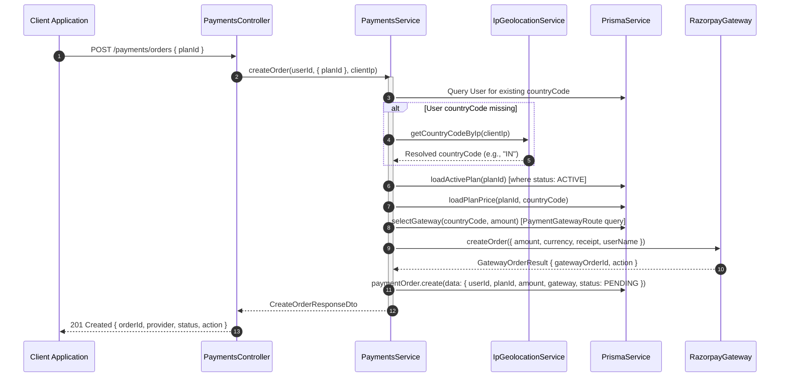

# Payments Module

The `PaymentsModule` orchestrates provider-agnostic payment processing for the web application, managing order creation, client checkout dispatch, server-side signature verification, idempotency tracking, and autonomous reconciliation.

---

## 📋 Purpose & Responsibilities

- **Checkout Initialization**: Resolves localized pricing and dynamic provider routes, initiating payment orders at external gateways.
- **Provider Action Dispatch**: Emits a discriminated `action` object (`sdk`, `redirect`, `form_post`) instructing dumb client applications how to render checkout UI without hardcoded gateway logic.
- **Cryptographic Signature Verification**: Validates gateway callbacks using HMAC-SHA256 and constant-time string comparisons.
- **Atomic Credit Fulfillment**: Coordinates with `TransactionsModule` and `CreditsModule` in a unified database transaction to grant credit balances on successful purchases.
- **Autonomous Reconciliation**: Background cron sweeper that inspects stale `PENDING` orders, settling captured transactions and expiring abandoned ones.
- **Decoupled Domain Communication**: Emits `PAYMENT_COMPLETED_EVENT` upon fulfillment to drive asynchronous receipt delivery and audit logging.

---

## 🏗 Directory & Component Structure

```
src/modules/payments/
├── application/
│   └── exceptions/
│       ├── gateway-not-available.exception.ts     # 503: No active route for country
│       ├── gateway-order-creation.exception.ts    # 502: Upstream provider rejected order
│       ├── invalid-amount-range.exception.ts      # 400: minAmount > maxAmount
│       ├── invalid-priority-step.exception.ts     # 400: Priority step out of bounds (no 900/1000)
│       ├── invalid-reorder-payload.exception.ts   # 400: Route IDs mismatch for country
│       ├── order-already-paid.exception.ts        # 409: Duplicate fulfillment attempt
│       ├── order-not-found.exception.ts           # 404: Order not found or user mismatch
│       ├── route-already-exists.exception.ts      # 409: Route exists for [country, gateway]
│       ├── route-not-found.exception.ts           # 404: Route ID not found
│       └── index.ts                               # Barrel export
├── dto/
│   ├── request/
│   │   ├── create-order.request.dto.ts            # Body: { planId }
│   │   ├── create-payment-route.request.dto.ts    # Body: { countryCode, gateway, priority, ... }
│   │   ├── list-payment-routes-query.request.dto.ts # Query: { countryCode, enabled, gateway }
│   │   ├── reorder-payment-routes.request.dto.ts  # Body: { countryCode, routeIds: [...] }
│   │   ├── update-payment-route.request.dto.ts    # Body: { priority, enabled, minAmount, ... }
│   │   └── verify-order.request.dto.ts            # Body: { razorpay_order_id, ... }
│   ├── response/
│   │   ├── create-order.response.dto.ts           # Response: { orderId, provider, action }
│   │   ├── order-status.response.dto.ts           # Response: { status, creditsGranted }
│   │   └── payment-route.response.dto.ts          # Response: { id, countryCode, gateway, priority, ... }
│   └── index.ts                                   # Barrel export
├── events/
│   ├── payment-completed.event.ts                 # Strongly typed domain event
│   └── index.ts
├── gateways/
│   ├── payment-gateway.interface.ts               # Core PaymentGatewayAdapter contract
│   ├── razorpay/
│   │   └── razorpay.gateway.ts                    # Razorpay Node SDK implementation
│   └── index.ts
├── tests/
│   ├── payment-routes-admin.controller.spec.ts    # Route management controller tests
│   ├── payment-routes.service.spec.ts             # Route CRUD, re-ranking & validation tests
│   ├── payments.controller.spec.ts                # HTTP endpoint & controller unit tests
│   ├── payments.service.spec.ts                   # Core business logic & transaction tests
│   ├── payments.reconciliation.spec.ts            # Cron polling & stale order sweep tests
│   └── razorpay.gateway.spec.ts                   # Gateway adapter & signature tests
├── payment-routes-admin.controller.ts             # REST controller for route administration
├── payment-routes.service.ts                      # Route management & atomic priority engine
├── payments.controller.ts                         # REST controller exposing public endpoints
├── payments.service.ts                            # Core fulfillment & order orchestration
├── payments.reconciliation.ts                     # Background @Cron reconciliation engine
└── payments.module.ts                             # NestJS feature module configuration
```

---

## ⚙️ Managed Enums

The payments engine uses standard Prisma schema enums to ensure strict type safety across database operations, DTOs, and controllers:

### 1. PaymentOrderStatus

Tracks the lifecycle state of a payment order:

- **`PENDING`**: Initial order created at the gateway, waiting for customer payment.
- **`PAID`**: Payment captured and verified; credits granted to user account.
- **`FAILED`**: Payment failed, declined, or cancelled by the user.
- **`EXPIRED`**: Order was not completed within the 30-minute validity window.
- **`REFUNDED`**: Payment was refunded after capture.

### 2. PaymentGateway

Supported gateway providers:

- **`RAZORPAY`**: Primary web checkout adapter for Indian and international cards/UPI.
- **`CASHFREE`**: Secondary Indian checkout provider (planned).
- **`DECENTRO`**: Direct bank UPI collection gateway (planned).
- **`EASEBUZZ`**: Alternate Indian merchant aggregator (planned).
- **`REVENUECAT`**: Mobile in-app purchase aggregator (iOS App Store / Google Play).

---

## 🔌 REST API Specification

### 1. Create Payment Order

Initializes a payment order for the requested subscription plan. The backend determines the country, pricing, and gateway provider.

- **Endpoint**: `POST /api/v1/payments/orders`
- **Authentication**: Bearer JWT (Authenticated User)
- **Headers**:
  - `X-Forwarded-For`: _(Optional)_ Client IP used for geographic fallback lookup if user country is missing.

#### Request Body (`CreateOrderRequestDto`)

```json
{
  "planId": "01J8VXYZ1234ABCDEFGHJKMNPQ"
}
```

> **Security Note**: The request body deliberately excludes currency and amount. The backend queries `SubscriptionPlanPrice` by country code to calculate the payable amount server-side.

#### Response Body (`CreateOrderResponseDto`)

```json
{
  "orderId": "01J90ABC1234DEF5678GHI90JK",
  "provider": "RAZORPAY",
  "status": "PENDING",
  "amount": 49900,
  "currency": "INR",
  "action": {
    "type": "sdk",
    "keyId": "rzp_test_1234567890",
    "gatewayOrderId": "order_PZzFNjKiHwPLnZ",
    "prefill": {
      "name": "Jane",
      "contact": "+919876543210"
    }
  }
}
```

---

### 2. Get Order Status (Polling)

Returns the current status of an order. The web app polls this endpoint after the gateway modal closes and proceeds only when `status === "PAID"`.

- **Endpoint**: `GET /api/v1/payments/orders/:orderId`
- **Authentication**: Bearer JWT (Owner verification: returns 404 if order does not belong to user)

#### Response Body (`OrderStatusResponseDto`)

```json
{
  "status": "PAID",
  "creditsGranted": 10
}
```

---

### 3. Verify Payment (Client-Side Callback)

Submits the signature payload returned by the gateway checkout SDK to trigger immediate verification and fulfillment.

- **Endpoint**: `POST /api/v1/payments/orders/:orderId/verify`
- **Authentication**: Bearer JWT

#### Request Body (`VerifyOrderRequestDto`)

```json
{
  "razorpay_order_id": "order_PZzFNjKiHwPLnZ",
  "razorpay_payment_id": "pay_PZzFNjKiHwPLnZ",
  "razorpay_signature": "a1b2c3d4e5f67890abcdef1234567890abcdef12"
}
```

#### Response Body (`VerifyOrderResponseDto`)

```json
{
  "status": "PAID",
  "creditsGranted": 10
}
```

---

## 🛡️ Administrative & Dynamic Routing API

The administrative surface (`/api/v1/admin/payments/routes`) allows human administrators and autonomous health-monitoring systems to manage gateway configurations, amount limits, kill-switches, and step-based priorities in real time.

All administrative endpoints are protected by **HTTP Basic Authentication** (`AdminBasicAuthGuard`).

### 1. Priority Step Architecture (Strict Ordinal Ranking)

Rather than assigning arbitrary numbers (such as `900` or `1000`), gateway preference within a country is defined strictly by **contiguous ordinal step numbers**: `1, 2, 3, ... N`.

- **Step 1** is the primary preferred gateway tried first by `PaymentsService.selectGateway()`.
- **Step 2** is the immediate fallback if Step 1 is disabled or outside transaction amount limits.
- When creating or modifying a route, assigning it to Step `K` automatically shifts adjacent routes in an atomic database transaction.
- Out-of-bounds priority numbers (e.g. passing `900` when only 3 routes exist) are rejected with `400 Bad Request` (`InvalidPriorityStepException`).

### 2. Dual-Caller Operational Models

1. **Human Administrators**:
   - Create and configure new routes for expansion countries.
   - Adjust `minAmount` / `maxAmount` bounds (e.g., reserving UPI gateways for microtransactions).
   - Reorder priority ranks via admin drag-and-drop interfaces.
2. **Autonomous Health & Success-Rate Balancers**:
   - Internal background workers monitoring gateway error rates can invoke `PATCH /toggle` to immediately isolate failing gateways.
   - Workers periodically compute country-level conversion rates and submit a ranked array to `PUT /reorder` to optimize traffic dynamically.

### 3. Administrative Endpoints

#### A. Create Route (`POST /api/v1/admin/payments/routes`)

Provisions a new gateway for a country. If `priority` is omitted, it defaults to the next step (`N + 1`).

```http
POST /api/v1/admin/payments/routes
Authorization: Basic <admin_credentials>
Content-Type: application/json

{
  "countryCode": "IN",
  "gateway": "CASHFREE",
  "priority": 2,
  "enabled": true,
  "minAmount": 100,
  "maxAmount": 500000
}
```

#### B. List Routes (`GET /api/v1/admin/payments/routes`)

Lists all configured routes ordered by `countryCode ASC, priority ASC`. Supports query filters: `?countryCode=IN&enabled=true&gateway=RAZORPAY`.

```json
[
  {
    "id": "01J8VXYZ1234ABCDEFGHJKMNPQ",
    "countryCode": "IN",
    "gateway": "RAZORPAY",
    "priority": 1,
    "enabled": true,
    "minAmount": null,
    "maxAmount": null,
    "createdAt": "2026-09-27T00:00:00.000Z",
    "updatedAt": "2026-09-27T00:00:00.000Z"
  },
  {
    "id": "01J8VXYZ5678ABCDEFGHJKMNPR",
    "countryCode": "IN",
    "gateway": "CASHFREE",
    "priority": 2,
    "enabled": true,
    "minAmount": 100,
    "maxAmount": 500000,
    "createdAt": "2026-09-27T00:00:00.000Z",
    "updatedAt": "2026-09-27T00:00:00.000Z"
  }
]
```

#### C. Batch Reorder Steps (`PUT /api/v1/admin/payments/routes/reorder`)

Atomically re-ranks priority steps for all routes of a country. Index 0 becomes Step 1, Index 1 becomes Step 2, etc.

```http
PUT /api/v1/admin/payments/routes/reorder
Authorization: Basic <admin_credentials>
Content-Type: application/json

{
  "countryCode": "IN",
  "routeIds": [
    "01J8VXYZ5678ABCDEFGHJKMNPR",
    "01J8VXYZ1234ABCDEFGHJKMNPQ"
  ]
}
```

#### D. Update Route (`PATCH /api/v1/admin/payments/routes/:id`)

Updates amount limits, enabled status, or shifts priority step.

```http
PATCH /api/v1/admin/payments/routes/01J8VXYZ1234ABCDEFGHJKMNPQ
Authorization: Basic <admin_credentials>
Content-Type: application/json

{
  "priority": 1,
  "minAmount": 500,
  "maxAmount": 200000
}
```

#### E. Toggle Enabled (Circuit Breaker) (`PATCH /api/v1/admin/payments/routes/:id/toggle`)

Single-click or automated toggle of gateway availability.

#### F. Delete Route (`DELETE /api/v1/admin/payments/routes/:id`)

Removes a route and automatically compacts remaining priority steps for that country.

---

## 🔄 Internal Module Flow

The following sequence illustrates the internal method invocations within `PaymentsModule` during order creation:



---

## 🔌 The Gateway Adapter Pattern

The `PaymentsModule` interacts with external payment gateways exclusively through the **`PaymentGatewayAdapter`** interface. This prevents vendor lock-in and makes adding new gateways straightforward.

### Adapter Interface Contract

```typescript
export interface PaymentGatewayAdapter {
  /** Gateway identifier corresponding to Prisma PaymentGateway enum. */
  readonly gateway: PaymentGateway;

  /** Initializes an order with the external provider. */
  createOrder(params: GatewayCreateOrderParams): Promise<GatewayOrderResult>;

  /** Polls current order status (used by reconciliation cron). */
  fetchOrderStatus(gatewayOrderId: string): Promise<GatewayOrderStatus>;

  /** Verifies checkout signature returned to browser. */
  verifySignature(params: GatewayVerifyParams): boolean;

  /** Fetches captured payment ID for reconciliation deduplication. */
  fetchCapturedPaymentId?(gatewayOrderId: string): Promise<string | null>;
}
```

### Checkout Action Shapes (`PaymentActionDto`)

The frontend branches solely on `action.type`, keeping checkout UI decoupled:

| Action Type     | Typical Gateways         | Frontend Handling                           | Action Payload Fields                   |
| :-------------- | :----------------------- | :------------------------------------------ | :-------------------------------------- |
| **`sdk`**       | Razorpay, Cashfree       | Opens client SDK modal with publishable key | `keyId`, `gatewayOrderId`, `prefill`    |
| **`redirect`**  | Decentro, UPI Intent     | Redirects browser window to hosted checkout | `url`                                   |
| **`form_post`** | NetBanking / Legacy Bank | Injects and submits a hidden HTML form      | `url`, `fields: Record<string, string>` |

---

## 📡 Decoupled Domain Events

In accordance with system-wide architectural rules, `PaymentsService` **never** imports `NotificationsModule` directly.

Upon committing fulfillment in the database, `PaymentsService` emits a `PAYMENT_COMPLETED_EVENT`:

```typescript
this.eventEmitter.emit(
  PAYMENT_COMPLETED_EVENT,
  new PaymentCompletedEvent(
    order.userId,
    order.id,
    creditsGranted,
    order.amount,
    order.currency,
  ),
);
```

The centralized `NotificationEventsListener` (`src/modules/notifications/listeners/notification-events.listener.ts`) listens asynchronously:

```typescript
@OnEvent(PAYMENT_COMPLETED_EVENT, { async: true })
async handlePaymentCompleted(event: PaymentCompletedEvent): Promise<void> {
  // Dispatches payment confirmation email and in-app notification
}
```

---

## ⚠️ Exception Hierarchy & HTTP Mapping

Domain exceptions in `application/exceptions/` are automatically mapped to standard HTTP response codes via the project's exception filters:

| Domain Exception                             | HTTP Status Code          | Description / Cause                                                        |
| :------------------------------------------- | :------------------------ | :------------------------------------------------------------------------- |
| **`SubscriptionPlanNotFoundException`**      | `404 Not Found`           | The specified `planId` does not exist or has `status: INACTIVE`.           |
| **`SubscriptionPlanPriceNotFoundException`** | `404 Not Found`           | No localized price is defined for the resolved `countryCode`.              |
| **`OrderNotFoundException`**                 | `404 Not Found`           | The `orderId` was not found or does not belong to the authenticated user.  |
| **`OrderAlreadyPaidException`**              | `409 Conflict`            | Attempted manual verification on an order that has already been fulfilled. |
| **`GatewayNotAvailableException`**           | `503 Service Unavailable` | No active `PaymentGatewayRoute` is configured for the country and amount.  |
| **`GatewayOrderCreationException`**          | `502 Bad Gateway`         | The upstream gateway (e.g. Razorpay) rejected order creation.              |
| **`UnauthorizedException`**                  | `401 Unauthorized`        | Invalid HMAC-SHA256 signature in `POST /verify`.                           |
| **`RouteNotFoundException`**                 | `404 Not Found`           | The requested payment route ID does not exist.                             |
| **`RouteAlreadyExistsException`**            | `409 Conflict`            | A route already exists for the given [countryCode, gateway] pair.          |
| **`InvalidPriorityStepException`**           | `400 Bad Request`         | Priority step is out of bounds (arbitrary values like 900 or 1000).        |
| **`InvalidAmountRangeException`**            | `400 Bad Request`         | minAmount exceeds maxAmount.                                               |
| **`InvalidReorderPayloadException`**         | `400 Bad Request`         | routeIds does not match the exact set of routes for the country.           |

---

## 🔑 Environment Configuration

All runtime secrets and parameters are retrieved via NestJS `ConfigService`:

| Variable Name             | Environment    | Description                                                        | Example Value                             |
| :------------------------ | :------------- | :----------------------------------------------------------------- | :---------------------------------------- |
| `RAZORPAY_KEY_ID`         | Sandbox / Prod | Publishable key surfaced to client SDK.                            | `rzp_test_...` / `rzp_live_...`           |
| `RAZORPAY_KEY_SECRET`     | Sandbox / Prod | Secret key for order creation & signature verification.            | `SecretManager(projects/.../secrets/...)` |
| `RAZORPAY_WEBHOOK_SECRET` | Sandbox / Prod | Shared secret for validating inbound webhook HMAC.                 | `SecretManager(projects/.../secrets/...)` |
| `DEFAULT_COUNTRY_CODE`    | All            | Fallback ISO-3166-1 alpha-2 code when geolocation fails.           | `IN`                                      |
| `CREDIT_EXPIRY_DAYS`      | All            | Default validity duration for granted credits if plan specifies 0. | `90`                                      |

---

## 🧪 Testing & Quality Assurance

The module ships with comprehensive unit tests for all components:

- **`payments.controller.spec.ts`**: Tests controller delegation, parameter mapping, `@ClientIp()` extraction, and response DTO formatting.
- **`payments.service.spec.ts`**: Tests server-side price derivation, IP geolocation resolution, atomic Prisma `$transaction` execution, duplicate event idempotency (P2002/P2025), and domain event emissions.
- **`payments.reconciliation.spec.ts`**: Tests stale order polling (>15 min), auto-expiration of orders (>30 min), gateway status synchronization, and concurrent race-condition absorption.
- **`razorpay.gateway.spec.ts`**: Tests Razorpay SDK parameter construction, order translation, HMAC-SHA256 signature verification, and gateway status normalization.
