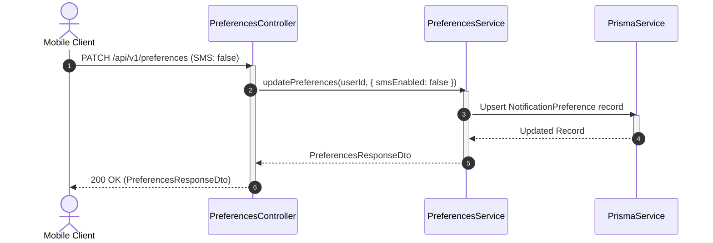

# Preferences Module

The `PreferencesModule` manages user-specific notification preferences, allowing users to opt in or out of communication channels.

---

## 📋 Purpose & Responsibilities

- **Channel Opt-In/Opt-Out (`GET /` and `PATCH /`)**: Exposes API endpoints for users to manage their communication preferences across multiple channels.
- **Auditing Updates**: Emits a `PREFERENCES_UPDATED` audit log event containing metadata on the categories modified.
- **Fail-Safe Retrieval**: If no preferences record is found in the database for a user, the service returns all-channels-enabled system defaults to prevent a broken user experience.

---

## ⚙️ Managed Preferences & Channels

The module manages flags in the `NotificationPreference` table mapping the following channels:

| Parameter | Type | Default | Description |
| :--- | :--- | :--- | :--- |
| `pushEnabled` | Boolean | `true` | Allows FCM push notifications to registered device tokens |
| `whatsappEnabled`| Boolean | `true` | Permits WhatsApp messaging for alerts or updates |
| `smsEnabled` | Boolean | `true` | Enables fallback SMS notification alerts |
| `emailEnabled` | Boolean | `true` | Allows sending transaction details or system emails |

---

## 🛠 File & Class Definitions

### Controller
- **[PreferencesController](file:///Users/mohitmalpani/Business/BreathAway/Backend/breathaway/src/modules/preferences/preferences.controller.ts)**: Exposes endpoints to retrieve and partially update user notification settings.
  - Route Prefix: `/api/v1/preferences`

### Service
- **[PreferencesService](file:///Users/mohitmalpani/Business/BreathAway/Backend/breathaway/src/modules/preferences/preferences.service.ts)**: Handles database reads, upsert updates to ensure a preference record is initialized if missing, and audit event logging.

---

## 🔄 Read & Update Flow

