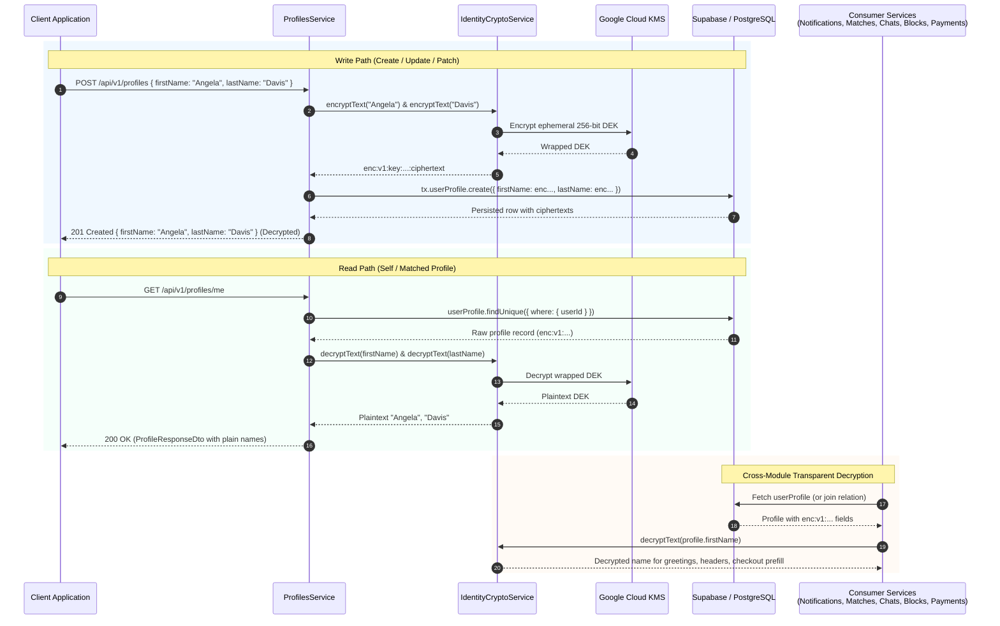

# Profiles Module

The `ProfilesModule` manages user profile identities, personal attributes, and privacy-focused visibility rules.

---

## 📋 Purpose & System Role

This module acts as the source of truth for user profile details (such as names, dates of birth, and gender representations). It enforces data format standards during onboarding and implements strict visibility boundaries to protect user privacy.

---

## ⚙️ Managed Profiles Data

The database records for `UserProfile` track the following parameters:

- **First Name**: The user's primary name (enforced length: 1 to 100 characters). Encrypted at rest using AES-256-GCM envelope encryption (`enc:v1:...`).
- **Last Name**: Optional family name. Encrypted at rest using AES-256-GCM envelope encryption (`enc:v1:...`).
- **Date of Birth**: Captured as a timestamp to compute user ages for matching algorithms.
- **Gender**: Classified using the `GenderType` enum (`MALE`, `FEMALE`, `NONBINARY`, `OTHER`).

---

## 🔐 Field-Level Envelope Encryption (FLE) for Names

### 🛡 Security Threat Model & Zero-Plaintext Storage

In compliance with global data privacy frameworks (such as GDPR Articles 5, 25, 32, and 34) and zero-trust data protection principles, **`UserProfile.firstName`** and **`UserProfile.lastName`** are never stored in plaintext within the PostgreSQL / Supabase database.

Even though database-level encryption at rest protects physical disk volumes, raw database snapshots, read-only analytics replicas, connection pool telemetry, and inadvertent query logging could otherwise expose customer real names. By applying application-layer envelope encryption before the data ever leaves the NestJS runtime, BreathAway ensures:

1. **Zero-Knowledge Database Invariant**: The database engine, DB administrators, hosting providers (Supabase), and raw SQL dumps only ever see high-entropy cryptographic strings.
2. **KMS Key Separation**: Data Encryption Keys (DEKs) are wrapped and protected by **Google Cloud KMS**. Without explicit IAM access to the KMS key ring, database contents are mathematically impossible to decipher.
3. **Defense in Depth**: Even in the event of an SQL injection or database credential compromise, attacker exfiltration yields only unreadable ciphertext envelopes.

---

### 📦 Compact Envelope Serialization Format

Like annotations in `LikesModule`, profile names are serialized directly into standard PostgreSQL `TEXT` columns using a self-describing compact envelope representation:

```text
enc:v1:<keyId>:<ivBase64>:<tagBase64>:<wrappedKeyBase64>:<ciphertextBase64>
```

| Segment              | Purpose               | Description                                                             |
| :------------------- | :-------------------- | :---------------------------------------------------------------------- |
| `enc`                | Schema Indicator      | Identifies the string as an application-layer encrypted envelope.       |
| `v1`                 | Format Version        | Enables future cryptographic algorithm and format evolution.            |
| `<keyId>`            | GCP KMS Key ID        | Identifier of the Key Management Service key that wrapped the data key. |
| `<ivBase64>`         | Initialization Vector | 12-byte cryptographically random IV (Base64-encoded) for AES-256-GCM.   |
| `<tagBase64>`        | Authentication Tag    | 16-byte GCM authentication tag (Base64-encoded) guaranteeing integrity. |
| `<wrappedKeyBase64>` | Wrapped DEK           | 256-bit ephemeral Data Encryption Key encrypted via GCP Cloud KMS.      |
| `<ciphertextBase64>` | Ciphertext Payload    | AES-256-GCM encrypted UTF-8 bytes of the name (Base64-encoded).         |

---

### 🔄 End-to-End Encryption & Decryption Lifecycle



---

### 🌐 Cross-Module Transparent Decryption

Multiple backend modules consume user profile names for push notifications, messaging headers, match cards, and checkout experiences. Every consumer leverages `IdentityCryptoService` to hydrate plaintext names seamlessly:

| Consuming Module          | Service / Handler                      | Usage & Decryption Context                                                                                                               |
| :------------------------ | :------------------------------------- | :--------------------------------------------------------------------------------------------------------------------------------------- |
| **`ProfilesModule`**      | `ProfilesService`                      | Decrypts profile records upon retrieval (`getProfileByUserId`, `getProfileById`). Encrypts on writes (`create`, `update`, `patch`).      |
| **`NotificationsModule`** | `NotificationEventsListener`           | Decrypts recipient first name across 9 domain event listeners (device registered, like sent, auth codes, credit top-ups, chat messages). |
| **`NotificationsModule`** | `NotificationsService`                 | Decrypts profile name during single-recipient dispatch (`enrichRecipientProfile`).                                                       |
| **`NotificationsModule`** | `NotificationRecipientResolverService` | Decrypts profile recipient names when looking up email and SMS contact endpoints.                                                        |
| **`MatchesModule`**       | `MatchesService`                       | Concurrently decrypts `firstName` and `lastName` for both current user (`me`) and matched peer (`otherUser`) in DTO mapping.             |
| **`ChatsModule`**         | `ChatsService`                         | Decrypts participant `firstName` and `lastName` when returning conversation room summaries (`getRooms`).                                 |
| **`BlocksModule`**        | `BlocksService`                        | Decrypts `blockedUser` profile names in block listing and single lookup responses (`createBlock`, `getBlocks`).                          |
| **`PaymentsModule`**      | `PaymentsService`                      | Decrypts `profile.firstName` to pre-populate customer contact details on payment gateway order creation (`getUserContact`).              |

---

### 🛡 Backward Compatibility & Fallback Policy

To ensure zero-downtime deployments and resilience across environments:

- If a profile name does not start with the canonical `enc:` prefix (e.g. existing records in staging prior to migration or test fixtures), `IdentityCryptoService.decryptText()` gracefully returns the string as-is without throwing errors.
- Any new write or update through `ProfilesService` automatically encrypts the payload, ensuring progressive self-healing migration of legacy records upon their next modification.

---

## 🧠 Business Logic & Core Concepts

### 1. Cascading Account Soft-Deletion (Deprecated)

> [!NOTE]
> **Deprecated Endpoint**: `ProfilesService.deleteProfile` (`DELETE /api/v1/profiles`) performs a partial soft-deletion. For statutory GDPR "Right to be Forgotten" account teardown, all clients should use the comprehensive `DELETE /api/v1/auth/me` endpoint documented in the [Authentication Module](auth.md#account-deletion).

The legacy `ProfilesService.deleteProfile` method executes a single, atomic Prisma transaction that:

- Soft-deletes the core `User` record (`deletedAt` stamped).
- Soft-deletes all associated `Identity` and `AuthCredential` rows.
- Deactivates all `Device` records (`isActive = false`).
  The profile row itself is intentionally left intact (associated with the soft-deleted user) to allow for future audit trails or account recovery.

### 2. Guarded Existence Checks

Because profiles are highly related to matching, many guards and services need to know if a user has finished onboarding. The `profileExists` method uses a hyper-optimized `select: { userId: true }` projection to provide a fast boolean guard without fetching full row data.

---

## 🛠️ Core Module Capabilities

### 1. Onboarding Profile Initialization

During user onboarding (orchestrated by the workflows module), a profile record is created and linked to the new user ID. The module ensures that a user cannot progress in the app without completing their basic profile attributes.

### 2. Privacy-Scoped Visibility Gatekeeper

To prevent scraping and ensure privacy, profile details are not publicly accessible. The module enforces a strict access boundary:

- A user can always view their own profile.
- A user can only view another user's profile if they are an Administrator OR if there is an **`ACTIVE` Match relationship** between them.
- Attempting to load the profile of a non-matched user results in access denial, preventing data exposure.

### 3. De-normalization & Search Synchronization

To optimize search queries and recommendations, the module coordinates with caching layers and indexes, ensuring profile details are available for match-matching lookups while maintaining PostgreSQL database normalization.
