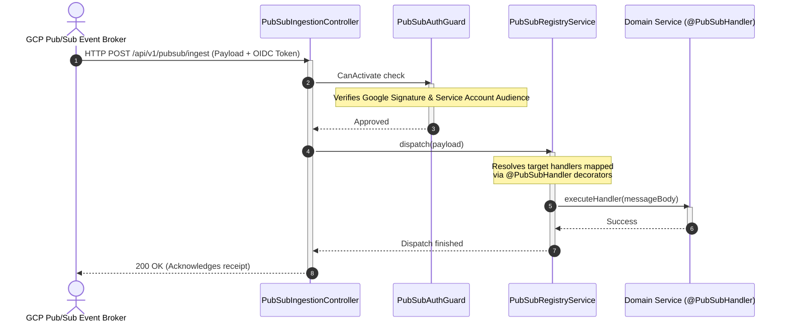

# Pub/Sub Module

The `PubSubModule` manages asynchronous communications with **Google Cloud Pub/Sub**, supporting decoupled, event-driven workflows.

---

## 📋 Purpose & Responsibilities

- **Event Publishing**: Exposes a uniform interface to publish system events to configured GCP Pub/Sub topics.
- **Webhook Ingestion**: Receives GCP Pub/Sub push messages via an HTTP ingestion endpoint.
- **Message Dispatch**: Decouples incoming payloads and routes them to target modules.

---

## ⚙️ Architectural Choice: Push vs. Pull Model

Standard queue systems (like Kafka, RabbitMQ, or Pub/Sub pull configurations) typically run persistent background worker threads that poll the broker in a continuous loop to fetch messages. However, BreathAway utilizes a **Push Webhook Model** due to Cloud Run container scaling constraints:

> [!IMPORTANT]
> **Why We Use Push Subscriptions in Cloud Run**
> 1. **Stateless Scale-to-Zero**: GCP Cloud Run is designed to scale down to `0` instances when there is no active traffic to save costs. A polling loop require a container to run continuously (`24/7`), preventing scale-down.
> 2. **Lifecycle Termination**: Cloud Run containers that are idle have their CPU throttled, which would starve a long-polling thread.
> 3. **On-Demand Wakeup**: With Pub/Sub Push Subscriptions, GCP sends message payloads as HTTP POST requests to our `/api/v1/pubsub/ingest` endpoint. If no container is running, the incoming HTTP request triggers Cloud Run to provision a container instantly (cold start), process the message, and scale back down when finished.

---

## 🛡️ Webhook Security & Ingestion Pipeline

To prevent unauthorized users from trigger action webhooks, the ingestion route is protected by a signature checker:

1. **GCP Token Verification**: The `PubSubIngestionController` endpoint checks for the presence of an OIDC ID token in the `Authorization` header.
2. **Auditing**: Validates that the token was issued by Google and is configured for the matching Pub/Sub target service account.
3. **Payload Dispatch**: If authenticated, the body is forwarded to the `PubSubRegistryService` to resolve the dispatcher mapping.

---

## 🔄 Dispatch Routing Flow

Messages are routed using TypeScript decorator handlers:

