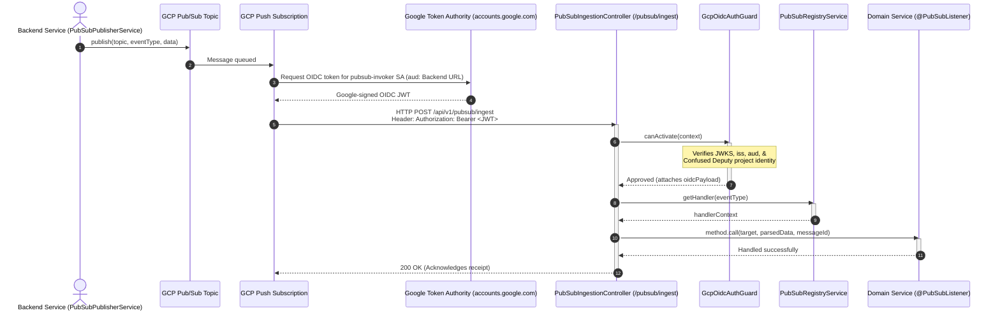
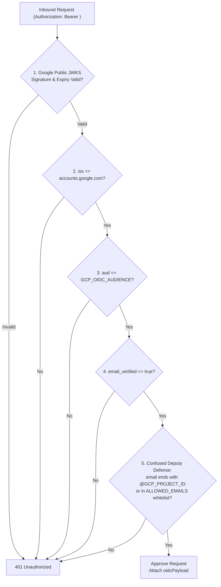

# Pub/Sub Module

The `PubSubModule` manages asynchronous communications with **Google Cloud Pub/Sub**, supporting decoupled, event-driven workflows.

---

## 📋 Purpose & Responsibilities

- **Event Publishing**: Exposes a uniform interface via `PubSubPublisherService` to publish system events to configured GCP Pub/Sub topics.
- **Webhook Ingestion**: Receives GCP Pub/Sub push messages via an authenticated HTTP ingestion endpoint (`/api/v1/pubsub/ingest`).
- **Message Dispatch**: Decodes Base64 payloads and dynamically dispatches events to registered `@PubSubListener` handlers.
- **Enterprise Security**: Enforces cryptographic OpenID Connect (OIDC) authentication with defense against "Confused Deputy" attacks.

---

## ⚙️ Architectural Choice: Push vs. Pull Model

Standard queue systems (like Kafka, RabbitMQ, or Pub/Sub pull configurations) typically run persistent background worker threads that poll the broker in a continuous loop to fetch messages. However, BreathAway utilizes a **Push Webhook Model** due to Cloud Run container scaling constraints:

> [!IMPORTANT]
> **Why We Use Push Subscriptions in Cloud Run**
>
> 1. **Stateless Scale-to-Zero**: GCP Cloud Run is designed to scale down to `0` instances when there is no active traffic to save costs. A polling loop requires a container to run continuously (`24/7`), preventing scale-down.
> 2. **Lifecycle CPU Throttling**: Cloud Run instances that are not actively processing an inbound HTTP request have their CPU throttled, starving background long-polling threads.
> 3. **On-Demand Wakeup**: With Pub/Sub Push Subscriptions, GCP sends message payloads as HTTP POST requests to our `/api/v1/pubsub/ingest` endpoint. If no container is running, the incoming HTTP request triggers Cloud Run to provision an instance instantly (cold start), process the message, and scale back down when finished.

---

## 🛡️ Webhook Security & OIDC Authentication

### The Vulnerability with Shared Query Secrets
Previously, push endpoints relied on a shared static token passed as a query parameter (e.g. `POST /api/v1/pubsub/ingest?token=SECRET`). 

Cloud Run front-end access logging automatically records the full requested URL (`httpRequest.requestUrl`) in plaintext into GCP Cloud Logging. This caused the shared secret to leak into log streams, BigQuery sinks, and trace dashboards.

### The Solution: Service Account OIDC ID Tokens
GCP Pub/Sub natively supports signing short-lived Google OpenID Connect (OIDC) ID tokens on behalf of a designated IAM Service Account (`pubsub-invoker`). These tokens are delivered via the `Authorization: Bearer <JWT>` HTTP header:

1. **Clean URLs**: The endpoint URL is clean (`/api/v1/pubsub/ingest`). Request headers are suppressed from Cloud Run access logs by default.
2. **Automatic Key Rotation**: Tokens are signed by Google (`accounts.google.com`) and automatically rotated with short lifespans (~1 hour).
3. **Cryptographic Identity**: The token carries cryptographic proof of caller identity (`iss`, `aud`, `email`, `email_verified`).

---

## 🔄 End-to-End Push & Ingestion Flow



---

## 🔒 Confused Deputy Defense in `GcpOidcAuthGuard`

### What is a Confused Deputy Attack in GCP?
In Google Cloud, **any GCP user or project can request a Google-signed OIDC token with any arbitrary audience string**.

If an attacker in an unrelated GCP project creates a Pub/Sub push subscription targeting our Cloud Run URL (`aud: https://backend-service-...run.app`), Google will happily sign that JWT:
- `iss`: `https://accounts.google.com` (valid!)
- `aud`: `https://backend-service-...run.app` (valid!)
- `email`: `attacker-sa@foreign-project.iam.gserviceaccount.com`

If a guard only validates the Google signature, `iss`, and `aud`, **it would accept malicious requests from foreign GCP projects**.

### The 5-Point Validation Strategy
[`GcpOidcAuthGuard`](file:///Users/mohitmalpani/Business/BreathAway/Backend/breathaway/src/common/guards/gcp-oidc-auth.guard.ts) executes a 5-step verification process to prevent this vulnerability:



1. **Cryptographic Validation**: Uses `OAuth2Client.verifyIdToken` to fetch Google's public JWKS certificates and verify the signature and token expiration.
2. **Strict Issuer Check**: Verifies `iss` is `https://accounts.google.com` or `accounts.google.com`.
3. **Audience Matching**: Verifies `payload.aud === GCP_OIDC_AUDIENCE` to prevent cross-service token replay.
4. **Email Verification**: Verifies `payload.email_verified === true` and `payload.email` is present.
5. **Caller Origin & Whitelist**: Verifies `payload.email` ends with `@${GCP_PROJECT_ID}.iam.gserviceaccount.com` (or matches an explicit whitelist `GCP_OIDC_ALLOWED_EMAILS`).

---

## 🏗️ Terraform Infrastructure Setup

Push subscriptions are managed via Terraform in `terraform/pubsub.tf`:

```hcl
# 1. Dedicated Service Account for Pub/Sub push delivery
resource "google_service_account" "pubsub_invoker" {
  account_id   = "pubsub-invoker"
  display_name = "PubSub Push Subscription Invoker"
  project      = var.project_id
}

# 2. Allow GCP Pub/Sub service agent to mint OIDC tokens for the service account
resource "google_service_account_iam_member" "pubsub_token_creator" {
  service_account_id = google_service_account.pubsub_invoker.name
  role               = "roles/iam.serviceAccountTokenCreator"
  member             = "serviceAccount:service-${data.google_project.project.number}@gcp-sa-pubsub.iam.gserviceaccount.com"
}

# 3. Grant the service account permissions to invoke Cloud Run
resource "google_cloud_run_v2_service_iam_member" "pubsub_invoker_run_binding" {
  name     = data.google_cloud_run_v2_service.backend_service.name
  location = data.google_cloud_run_v2_service.backend_service.location
  project  = var.project_id
  role     = "roles/run.invoker"
  member   = "serviceAccount:${google_service_account.pubsub_invoker.email}"
}

# 4. Push Subscription with native OIDC token configuration
resource "google_pubsub_subscription" "push_subscriptions" {
  for_each = local.pubsub_push_subscriptions

  name    = each.value.subscription_name
  topic   = each.value.topic_name
  project = var.project_id

  ack_deadline_seconds = each.value.ack_deadline

  push_config {
    push_endpoint = "${data.google_cloud_run_v2_service.backend_service.uri}/api/v1/pubsub/ingest"

    oidc_token {
      service_account_email = google_service_account.pubsub_invoker.email
      audience              = data.google_cloud_run_v2_service.backend_service.uri
    }
  }
}
```

---

## 🧠 Business Logic & Core Concepts

### 1. Inbound/Outbound Asymmetry
Pub/Sub crosses the network boundary in two different ways:
- **Outbound (Publishing)**: `PubSubPublisherService` pushes directly to GCP topics using the standard `@google-cloud/pubsub` SDK via Application Default Credentials.
- **Inbound (Ingestion)**: Handled via standard HTTP push controller (`PubSubIngestionController`), enabling Cloud Run scale-to-zero.

### 2. Silent Failure for Unroutable Events
The ingestion controller intentionally swallows unroutable messages (missing event type, no registered handler, bad base64 payload) with a warning log and returns `200 OK`. 

If it returned `4xx` or `5xx`, GCP Pub/Sub would assume delivery failed and retry the unroutable payload indefinitely, clogging the queue. Real handler errors throw exceptions, which correctly trigger Pub/Sub's retry backoff policy.
