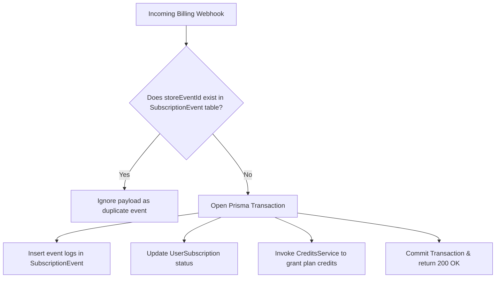
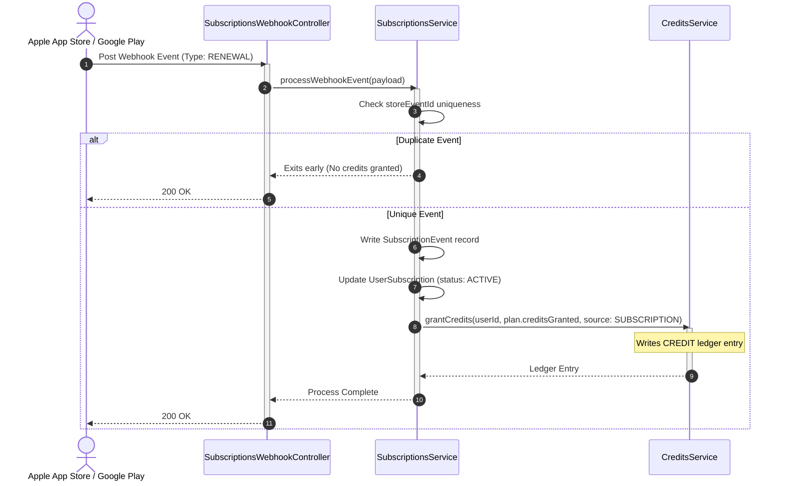

# Subscriptions Module

The `SubscriptionsModule` manages plan configurations, user subscriptions, and billing transactions, enforcing idempotency checks on external store events.

---

## 📋 Purpose & Responsibilities

- **Plan Configuration**: Serves plan definitions (validity, pricing, trial periods, and granted credits).
- **Billing State Tracking**: Stores user subscriptions and parses updates from store platforms.
- **Auto-Renewal Execution**: Grants credit balances to users automatically upon subscription renewal logs.

---

## ⚙️ Managed Enums

The subscription system uses the following enums to represent billing and transaction states:

### 1. SubscriptionPlanStatus
Defines the availability of a subscription plan:
* **`ACTIVE`**: Plan is active and can be purchased by users.
* **`INACTIVE`**: Plan is archived or deprecated; no new signups allowed.

### 2. SubscriptionStatus
Tracks the lifecycle state of a user's subscription:
* **`ACTIVE`**: Subscription is currently paid and active.
* **`EXPIRED`**: Period ended and was not renewed.
* **`CANCELLED`**: Auto-renew disabled, active until the current period ends.
* **`GRACE_PERIOD`**: Billing failure occurred; attempting recovery with temporary access.
* **`PAUSED`**: The user paused the subscription (Google Play).
* **`REVOKED`**: Terminated by store support (e.g. following a chargeback or refund).

### 3. StorePlatform & CurrencyCode
* **`StorePlatform`**: Billing engine (`APPLE`, `GOOGLE`).
* **`CurrencyCode`**: Mapped currencies (`INR`, `USD`, `SGD`, `AED`, `GBP`, `EUR`, `AUD`).

### 4. SubscriptionEventType
Defines the categories of log events captured in `SubscriptionEvent`:
* **`INITIAL_PURCHASE`**, `RENEWAL`, `CANCELLATION`, `GRACE_PERIOD_ENTERED`, `BILLING_RECOVERY`, `REFUND`, `EXPIRY`, `REVOCATION`.

---

## 🧠 Business Logic & Core Concepts

### 1. Client-Initiated Verification vs Webhooks
Apple and Google send server-to-server webhooks for purchases, but these can be delayed. To ensure immediate access for the user, `verifyAndCreateSubscription` allows the client SDK to trigger subscription provisioning directly. This acts as the primary entry point, effectively overriding the latency of the asynchronous webhooks.

### 2. Maintenance Sweep (Orphaned Expirations)
Sometimes a renewal or cancellation webhook is dropped or delayed permanently. The `expireSubscriptions()` method runs as a background cron to sweep the database for any active subscriptions whose `expiresAt` is in the past, transitioning them safely to `EXPIRED` and generating the necessary event logs.

---

## 🔒 Billing Idempotency & Duplicate Prevention

Apple App Store and Google Play Store webhooks (often routed via aggregators like RevenueCat) operate on an **at-least-once delivery guarantee**. This means the payment platform may send the same transaction webhook multiple times if network delays occur during acknowledgment. 

If processed repeatedly without safety checks, the server would grant duplicate credit balances to the user, creating a severe business risk.

To enforce idempotency, the system handles event ingestion as follows:

1. **Unique Event Key**: Every transaction webhook contains a unique event identifier from the store (`storeEventId`).
2. **Pre-Flight Lookup**: Before initiating database write operations or calling the ledger services, the system queries the `SubscriptionEvent` table for the matching `storeEventId`.
3. **Early Exit**: If a match is found, the backend logs a duplicate warning and immediately responds with a `200 OK` (acknowledging receipt without executing changes), skipping credit grants.
4. **Atomic Updates**: If the event is unique, updates are executed inside a Prisma transaction, ensuring the subscription state and credit ledger logs commit together.

---

## 🔄 Subscription Log Event Pipeline

