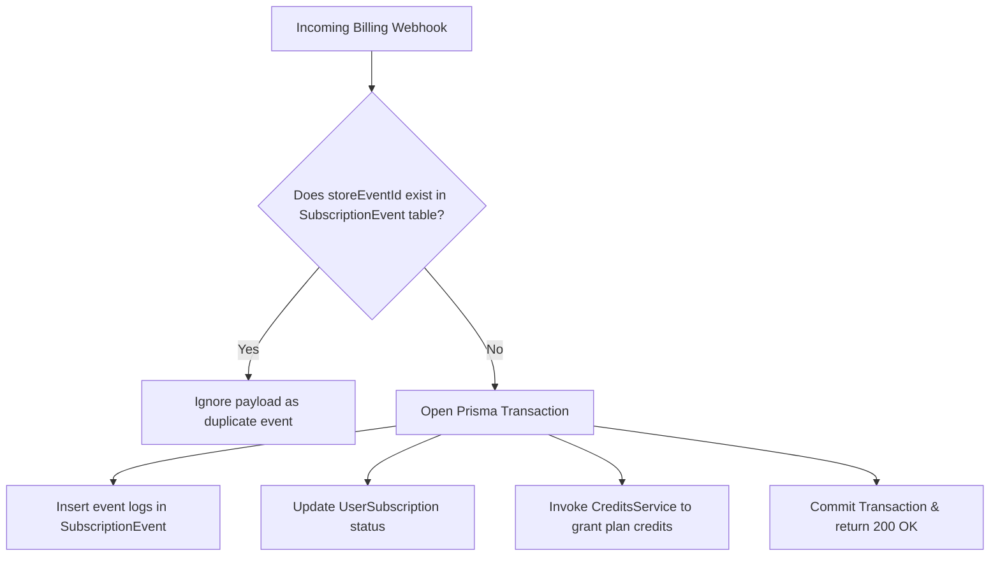
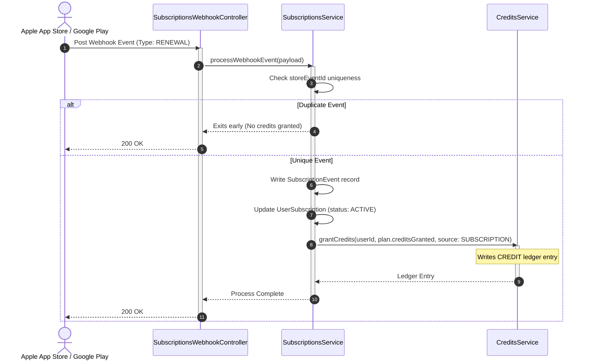
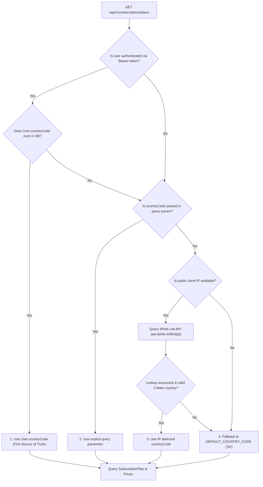

# Subscriptions Module

The `SubscriptionsModule` manages plan configurations, user subscriptions, and billing transactions, enforcing idempotency checks on external store events.

---

## 📋 Purpose & Responsibilities

- **Plan Configuration**: Serves plan definitions (validity, pricing, trial periods, and granted credits).
- **Billing State Tracking**: Stores user subscriptions and parses updates from store platforms.
- **Auto-Renewal Execution**: Grants credit balances to users automatically upon subscription renewal logs.

---

## ⚙️ Managed Enums

The subscription system uses the following enums to represent billing and transaction states:

### 1. SubscriptionPlanStatus

Defines the availability of a subscription plan:

- **`ACTIVE`**: Plan is active and can be purchased by users.
- **`INACTIVE`**: Plan is archived or deprecated; no new signups allowed.

### 2. SubscriptionStatus

Tracks the lifecycle state of a user's subscription:

- **`ACTIVE`**: Subscription is currently paid and active.
- **`EXPIRED`**: Period ended and was not renewed.
- **`CANCELLED`**: Auto-renew disabled, active until the current period ends.
- **`GRACE_PERIOD`**: Billing failure occurred; attempting recovery with temporary access.
- **`PAUSED`**: The user paused the subscription (Google Play).
- **`REVOKED`**: Terminated by store support (e.g. following a chargeback or refund).

### 3. StorePlatform & CurrencyCode

- **`StorePlatform`**: Billing engine (`APPLE`, `GOOGLE`).
- **`CurrencyCode`**: Mapped currencies (`INR`, `USD`, `SGD`, `AED`, `GBP`, `EUR`, `AUD`).

### 4. SubscriptionEventType

Defines the categories of log events captured in `SubscriptionEvent`:

- **`INITIAL_PURCHASE`**, `RENEWAL`, `CANCELLATION`, `GRACE_PERIOD_ENTERED`, `BILLING_RECOVERY`, `REFUND`, `EXPIRY`, `REVOCATION`.

---

## 🧠 Business Logic & Core Concepts

### 1. Client-Initiated Verification vs Webhooks

Apple and Google send server-to-server webhooks for purchases, but these can be delayed. To ensure immediate access for the user, `verifyAndCreateSubscription` allows the client SDK to trigger subscription provisioning directly. This acts as the primary entry point, effectively overriding the latency of the asynchronous webhooks.

### 2. Maintenance Sweep (Orphaned Expirations)

Sometimes a renewal or cancellation webhook is dropped or delayed permanently. The `expireSubscriptions()` method runs as a background cron to sweep the database for any active subscriptions whose `expiresAt` is in the past, transitioning them safely to `EXPIRED` and generating the necessary event logs.

### 3. Dynamic Regional Pricing & Geolocation

When clients query active plans (`GET /api/v1/subscriptions/plans`), prices are dynamically resolved and localized to the user's geographic region. The backend serves as the authoritative pricing authority, determining country from authenticated profile data or public client IP via IPinfo Lite, preventing frontend price manipulation.

---

## 🔒 Billing Idempotency & Duplicate Prevention

Apple App Store and Google Play Store webhooks (often routed via aggregators like RevenueCat) operate on an **at-least-once delivery guarantee**. This means the payment platform may send the same transaction webhook multiple times if network delays occur during acknowledgment.

If processed repeatedly without safety checks, the server would grant duplicate credit balances to the user, creating a severe business risk.

To enforce idempotency, the system handles event ingestion as follows:

1. **Unique Event Key**: Every transaction webhook contains a unique event identifier from the store (`storeEventId`).
2. **Pre-Flight Lookup**: Before initiating database write operations or calling the ledger services, the system queries the `SubscriptionEvent` table for the matching `storeEventId`.
3. **Early Exit**: If a match is found, the backend logs a duplicate warning and immediately responds with a `200 OK` (acknowledging receipt without executing changes), skipping credit grants.
4. **Atomic Updates**: If the event is unique, updates are executed inside a Prisma transaction, ensuring the subscription state and credit ledger logs commit together.

---

## 🔄 Subscription Log Event Pipeline

---

## 🌍 Regional Pricing & IP Geolocation (IPinfo Lite)

To show appropriate regional pricing and currency without relying on client-side location reports, the backend acts as the authoritative source of truth for the caller's country when fetching active subscription plans.

### Country Resolution Hierarchy

The country code is resolved using a strict four-tier hierarchy:

1. **User Profile (`User.countryCode`)**: If the request contains an authenticated JWT Bearer token and the user's account has a `countryCode` in the database, it is taken as the **first source of truth**, bypassing external lookups.
2. **Explicit Query Parameter (`countryCode`)**: If the user has no set profile country or is unauthenticated, an explicit query parameter `?countryCode=XX` is respected (useful for currency switchers or testing).
3. **Public Client IP (`@ClientIp()` via IPinfo Lite)**: For unauthenticated or profile-empty users, the public client IP is extracted from reverse proxy headers and resolved via `IpGeolocationService`.
4. **Server Default Fallback**: If the IP lookup fails, times out, or the IP is private/loopback, it gracefully falls back to `DEFAULT_COUNTRY_CODE` (configured in env, defaulting to `'IN'`).

### Graceful Price Fallback

To ensure plans never render with missing prices when a plan lacks custom regional pricing for a newly detected country:

- The database queries prices for both `[resolvedCountryCode, defaultCountryCode]`.
- If the plan has prices for `resolvedCountryCode`, those prices are returned.
- If the plan lacks prices for `resolvedCountryCode`, it automatically falls back to the `defaultCountryCode` price row for that plan.
- The returned response explicitly contains `countryCode` and `currencyCode` in `prices[]` so client applications know the exact currency being charged.

### Component Architecture

- **`@ClientIp()` Parameter Decorator** (`src/common/decorators/client-ip.decorator.ts`):
  Extracts the public client IP from the `X-Forwarded-For` header set by Google Front End (GFE) / Cloud Load Balancer in GCP Cloud Run, with fallbacks to `req.ip` and `req.socket.remoteAddress`.
- **`IpGeolocationService`** (`src/infrastructure/ip-geolocation/ip-geolocation.service.ts`):
  Lightweight, standalone service calling `https://api.ipinfo.io/lite/{ip}?token={token}`. Automatically filters private, link-local, and loopback IP ranges (`127.0.0.0/8`, `::1`, `10.0.0.0/8`, `172.16.0.0/12`, `192.168.0.0/16`, `169.254.0.0/16`) without hitting the external API.
- **`SubscriptionPlansService.listActivePlans()`** (`src/modules/subscriptions/services/subscription-plans.service.ts`):
  Coordinates the 4-tier resolution hierarchy and localized price filtering with default country fallback.

### Environment Configuration

| Variable               | Type             | Default     | Description                                                                               |
| :--------------------- | :--------------- | :---------- | :---------------------------------------------------------------------------------------- |
| `IPINFO_TOKEN`         | string           | `undefined` | IPinfo Lite API token. If omitted, lookups log a warning and fallback to default country. |
| `IPINFO_TIMEOUT_MS`    | number           | `1500`      | Abort timeout in milliseconds for IPinfo HTTP calls.                                      |
| `DEFAULT_COUNTRY_CODE` | string (2 chars) | `'IN'`      | System-wide fallback country code when geolocation fails.                                 |

### Local Testing & Mocking with Postman

You can test regional pricing locally by mocking the client IP address using the `X-Forwarded-For` header:

1. **Endpoint**: `GET http://localhost:3000/api/v1/subscriptions/plans`
2. **Add Header**: `X-Forwarded-For: <target_ip>`
3. **Testing Tips**:
   - **Do not send `Authorization: Bearer <token>`** when testing raw IP geolocation, because `User.countryCode` is priority #1.
   - Use public ISP IP addresses for accurate regional testing:
     - India (`IN`): `122.160.0.1` (Airtel) or `49.40.8.179` (Jio)
     - United States (`US`): `8.8.8.8` (Google DNS)
     - United Kingdom (`GB`): `81.2.69.142`
   - _Note on Anycast IPs_: Global CDN addresses like Cloudflare (`103.21.244.2`) or Twitter (`104.244.42.1`) are geolocated to `US` in IPinfo because their organization headquarters are in the United States.
