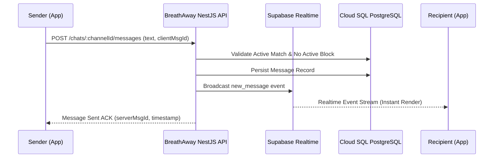

# [PRD]: Realtime Chat & Safety Moderation

- **Status**: `APPROVED`
- **Module Owners**: `ChatsModule`, `ReportsModule`, `BlocksModule`
- **Tech Lead**: Backend Engineering Team
- **Last Updated**: 2026-09-12

---

## 1. Executive Summary

BreathAway's chat system facilitates direct, secure, and respectful communication between matched users. The system leverages **Supabase Realtime Broadcast & Presence Channels** for ephemeral events (typing indicators, presence, instant delivery) backed by persistent storage in Cloud SQL PostgreSQL.

---

## 2. Realtime Messaging Topology

---

## 3. Safety & Moderation Controls

1. **Active Match Prerequisite**: Users can only transmit messages within a channel if their mutual `Match` status is strictly `ACTIVE`.
2. **Instant Block Termination**:
   - If User A blocks User B, the channel is immediately disabled.
   - The Supabase channel topic is terminated, preventing further websocket subscriptions.
3. **Automated Content Screening**: Messages containing flagged harassment patterns or unapproved media links are held for asynchronous review or rejected before broadcast.
4. **User Reporting**: One-tap reporting with evidence snapshots (last 20 messages packaged into an immutable audit snapshot for moderation review).
