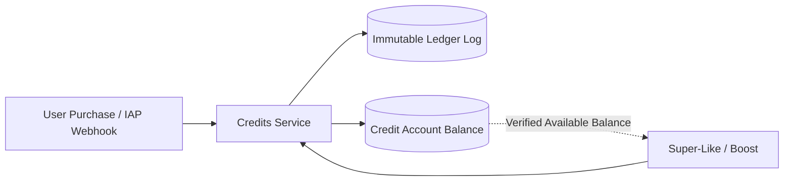

# [PRD]: Credit Ledger & Monetization System

- **Status**: `APPROVED`
- **Module Owners**: `CreditsModule`, `SubscriptionsModule`, `WebhooksModule`
- **Tech Lead**: Backend Engineering Team
- **Last Updated**: 2026-09-12

---

## 1. Executive Summary

BreathAway operates an in-app economy where users can purchase credit packs to unlock high-intent actions, such as `SUPER_LIKE`, `BOOST`, and `UNDO_SWIPE`. To guarantee absolute financial auditability, zero balance drift, and compliance, all credit movements are recorded via a **double-entry ledger model**.

---

## 2. Invariants & Ledger Principles



1. **Immutable Records**: Ledger entries are insert-only. No updates or deletions are ever performed on `CreditLedgerEntry`.
2. **Double-Entry Balance Verification**: The user's current available balance is always mathematically identical to the sum of all historical credits minus all historical debits:
   ```text
   Available Balance = Total Credits - Total Debits
   ```
3. **Pessimistic / Transactional Isolation**: Deducting credits must run inside a database transaction (`Prisma.$transaction`) using row-level locking or optimistic version checks to prevent concurrent double-spend race conditions.

---

## 3. Credit Consumption Matrix

| Action | Cost (Credits) | Description | Refund Policy |
| :--- | :--- | :--- | :--- |
| **`SUPER_LIKE`** | 5 credits | Instantly highlights profile at top of recipient's deck | Non-refundable once sent |
| **`BOOST`** | 20 credits | 30-minute 10x visibility multiplier in active geo-region | Refunded if system outage occurs |
| **`UNDO_SWIPE`** | 3 credits | Reverts the last recorded `PASS` interaction | Non-refundable |
| **`READ_RECEIPT`** | 2 credits | Unlocks delivery and read checkmarks on conversation | Persistent per chat |

---

## 4. API Endpoints

- `GET /api/v1/credits/balance`: Retrieves real-time available and escrowed balances.
- `GET /api/v1/credits/history`: Returns paginated, tamper-evident transaction logs.
- `POST /api/v1/credits/spend`: Debits credits for a designated platform action with an idempotency key.
