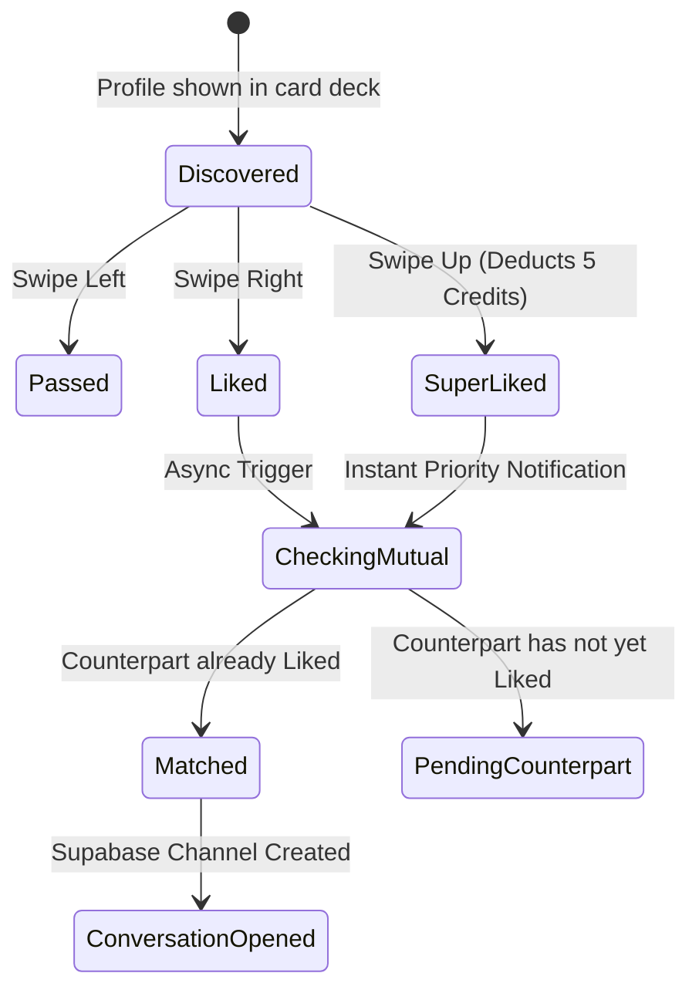

# [PRD]: Matching & Discovery Engine

- **Status**: `APPROVED`
- **Module Owners**: `LikesModule`, `MatchesModule`, `MatchResolverModule`
- **Tech Lead**: Backend Engineering Team
- **Last Updated**: 2026-09-12

---

## 1. Executive Summary

The **Matching & Discovery Engine** is the core engagement loop of BreathAway. It manages how potential connections are ranked, delivered to clients as discovery cards, and how swiping interactions (`LIKE`, `PASS`, `SUPER_LIKE`) convert into mutual matches.

---

## 2. Business Logic & Invariants



1. **Idempotency**: Swipes must include an `idempotencyKey` (UUIDv4) generated by the mobile client to prevent duplicate likes or double charges on flaky connections.
2. **Quota Enforcement**:
   - Free users receive 50 standard likes per rolling 24-hour period.
   - Subscribers have unlimited standard likes.
   - `SUPER_LIKE` consumes 5 credits from the user's `CreditAccount`.
3. **Mutual Matching Invariant**:
   - When User A likes User B, the backend checks for an existing `LIKE` from User B towards User A.
   - If present, a new `Match` record is created atomically within a database transaction, triggering match notifications to both users and creating a Supabase chat channel.
   - If not yet mutual, the like is stored in the database, and User A's profile is elevated in User B's discovery feed.

---

## 3. API Contract Specifications

### 3.1 Record a Like / Action
- **Endpoint**: `POST /api/v1/likes`
- **Guard**: `JwtAuthGuard`
- **Request Body**:
  ```json
  {
    "targetUserId": "c4b8b6e2-2ef8-4903-b09e-716b5399583c",
    "type": "LIKE",
    "idempotencyKey": "a9d9c8c1-1e9a-41f2-875f-554477889900"
  }
  ```
- **Response**: `201 Created`
  ```json
  {
    "success": true,
    "isMatch": true,
    "matchId": "f7a1b2c3-d4e5-6789-0123-abcdef456789",
    "remainingLikes": 42
  }
  ```

---

## 4. Non-Functional & Scaling Considerations

- **Response Latency**: The initial `POST /api/v1/likes` response must return in under 80ms. Heavy background resolution tasks (push notifications, BigQuery sync) are offloaded to GCP Pub/Sub workers.
- **Cache Invalidation**: Redis discovery deck caches for `targetUserId` are refreshed asynchronously upon match resolution.
