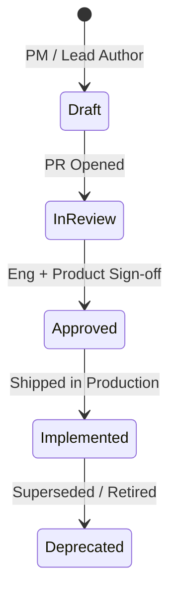

# Product Specifications & PRDs Hub

Welcome to the **BreathAway Product Specifications & PRD Hub**. This section serves as the formal bridge between Product Management, Design, and Backend Engineering.

Maintaining clear, structured specifications ensures that backend domain models, API contracts, business invariants, and non-functional requirements (security, latency, scalability) are collaboratively agreed upon before code is written.

---

## 🎯 Purpose & Principles

1. **Single Source of Truth**: PRDs define the expected user journey, business rules, edge cases, and success metrics for every major platform feature.
2. **Contract-First Engineering**: APIs and database schemas directly map back to requirements articulated in approved specifications.
3. **Living Documentation**: As features evolve through user feedback and operational telemetry, specifications are updated via pull requests rather than lingering in stale wikis.

---

## 🚦 Specification Lifecycle

| State | Definition | Actions Required |
| :--- | :--- | :--- |
| **`DRAFT`** | Initial proposal undergoing formulation | Author collecting requirements and problem definitions |
| **`IN_REVIEW`** | Ready for cross-functional review | Engineering, QA, and Security review API shapes & edge cases |
| **`APPROVED`** | Finalized and ready for development | Engineering breaks down tickets into modular sprint milestones |
| **`IMPLEMENTED`**| Shipped to staging/production | Telemetry and metrics actively monitored against baseline targets |
| **`DEPRECATED`** | Feature retired or superseded | Archived for historical context and audit trail |

---

## 📚 Spec Directory Structure

- **[Standard PRD Template](./prd-template.md)**: The standard boilerplate for authoring new feature specifications.
- **Feature PRDs**:
  - **[Matching & Discovery Workflow](./features/matching-workflow.md)**: Discovery card algorithm, swiping mechanics, asynchronous mutual match resolution, and match timeouts.
  - **[Credit Ledger & In-App Economy](./features/credit-system.md)**: Double-entry credit ledger, action costs, package purchases, and balance reconciliation.
  - **[Realtime Chat & Safety Moderation](./features/chat-messaging.md)**: Real-time messaging architecture, Supabase channel presence, image encryption, and abuse prevention.
