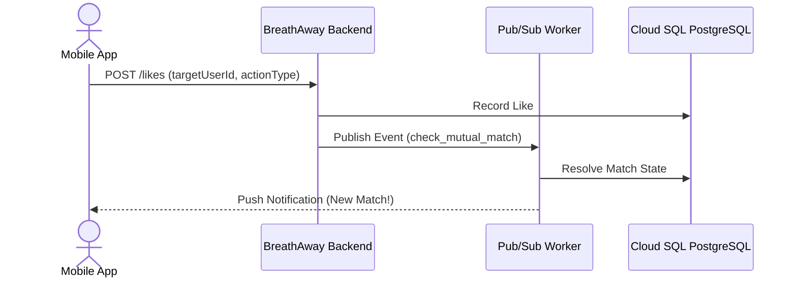

# Product Requirements Document (PRD) Template

Use this standardized template when creating or proposing new features for BreathAway. Copy this file into `docs/spec/features/[feature-name].md` and open a PR for review.

---

```markdown
# [PRD]: Feature Name

- **Status**: [DRAFT | IN_REVIEW | APPROVED | IMPLEMENTED | DEPRECATED]
- **Author(s)**: [Product Manager / Tech Lead Name]
- **Tech Lead**: [Senior Engineer Name]
- **Target Release**: [v1.X / Sprint Date]
- **Last Updated**: [YYYY-MM-DD]

---

## 1. Executive Summary & Problem Statement
Briefly summarize the feature and the core customer/business problem it addresses. Why are we building this now?

### Target Audience & Personas
- Persona 1 (e.g. Free Verified User seeking meaningful matches)
- Persona 2 (e.g. Premium Subscriber with boosted visibility)

---

## 2. Goals & Success Metrics (KPIs)
Define quantitative indicators to measure success post-launch:

| Metric | Baseline | Target | Measurement Method |
| :--- | :--- | :--- | :--- |
| Match Conversion Rate | 4.2% | > 6.5% | BigQuery Analytics Event `match.created` |
| First Message Response Rate | 28% | > 40% | Supabase Chat Telemetry |
| Latency (p95) | 220ms | < 150ms | GCP Cloud Trace |

---

## 3. User Experience & User Stories
Describe the chronological user flow and user stories:
- **US-01**: As a user, I want to swipe right on a profile so that I can express romantic interest.
- **US-02**: As a user, I want immediate feedback if a match is mutual so that I can initiate a conversation immediately.



---

## 4. Functional Specifications & Requirements

### 4.1 Core Invariants & Business Logic
- **Rate Limits**: Maximum 50 free likes per rolling 24-hour window per user.
- **Cooldowns**: Passes must not reappear in feed for at least 30 calendar days.
- **Mutual Match Resolution**: A match is created if and only if both `userA -> userB` and `userB -> userA` have recorded an active `LIKE`.

### 4.2 API Contract & Endpoints
| HTTP Method | Route | Auth Required | Description |
| :--- | :--- | :--- | :--- |
| `POST` | `/api/v1/likes` | Yes (JWT) | Submit like or pass action |
| `GET` | `/api/v1/matches` | Yes (JWT) | Fetch paginated active matches |
| `DELETE` | `/api/v1/matches/:id` | Yes (JWT) | Unmatch and archive conversation |

### 4.3 Data Model & Schema Modifications
Describe tables, fields, indexes, or enums added or altered in `prisma/schema.prisma`.

---

## 5. Non-Functional Requirements (NFRs)
- **Security & Privacy**: PII encryption, authorization checks (preventing IDOR).
- **Performance & Latency**: API response times must remain under 150ms at 99th percentile.
- **Auditability**: All transactional balance changes must emit immutable audit ledger records.
- **Stateless Cloud Run Compliance**: No local memory or file system dependencies.

---

## 6. Edge Cases & Failure Modes
- What happens if the user's internet disconnects mid-swipe? (Idempotency keys on write endpoints)
- What happens if one user blocks the other while an asynchronous match resolution job is queued?
- What occurs during database maintenance failover?

---

## 7. Rollout Plan & Milestones
1. **Milestone 1**: Database schema migration and repository implementations.
2. **Milestone 2**: Core NestJS service logic and unit test coverage (above 85%).
3. **Milestone 3**: Controller routing, DTO validation, and Swagger OpenAPI specs.
4. **Milestone 4**: Staging integration testing with mobile QA.
5. **Milestone 5**: Production rollout behind feature flags.
```
