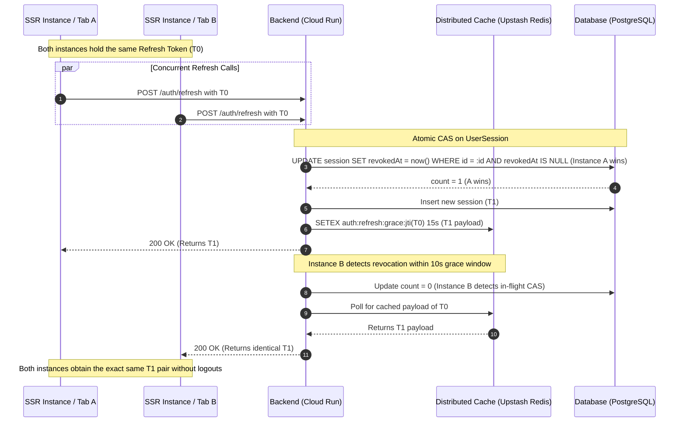

# Refresh Token Rotation (RTR) Grace Window & Concurrency Specification

**Target Audience:** Web / Frontend Engineering Teams, SSR Proxy Maintainers  
**Status:** Implemented & Active on Backend  
**Endpoints Affected:** `POST /api/v1/auth/refresh`

---

## 1. Executive Summary

To eliminate session logouts caused by concurrent requests across multi-instance serverless SSR proxies, browser tabs, service workers, and mobile network retries, the backend has implemented a **10-second idempotent grace window** on Refresh Token Rotation (RTR), backed by distributed caching (Upstash Redis) and atomic database Compare-And-Swap (CAS) concurrency resolution.

### The Key Takeaway for Frontend / SSR Engineers

- **Zero False-Positive Logouts from Concurrent Serverless Requests**: If two or more parallel requests present the exact same refresh token within a 10-second window, the backend will **not** treat this as a token replay attack and will **not** revoke the session family.
- **Idempotent Return of the Same Token Pair**: All requests arriving within the grace period receive the **exact same newly rotated token pair** (`accessToken`, `refreshToken`, and expiry metadata). No branching token trees are created.
- **Sub-Second Race Safety**: Even if two serverless SSR proxy instances invoke `/refresh` at the exact same millisecond, database-level CAS and internal polling ensure that both instances safely resolve with `200 OK` and identical credentials.

---

## 2. Background & Problem Analysis

In modern web applications, short-lived access tokens (15-minute lifespan) expire simultaneously across all pending API calls. When a user navigates to a view that triggers parallel HTTP requests (e.g. fetching user profile, matches, unread counts, and notifications concurrently):

1. **Multiple 401 Responses**: Several requests receive `401 Unauthorized` at the exact same moment.
2. **Serverless SSR Proxy Concurrency**: In serverless hosting environments (e.g., Vercel, Cloud Run, AWS Lambda, Node SSR clusters), these requests frequently land on **different serverless container instances**.
3. **The Mutex Limitation**: A client-side in-memory JavaScript mutex or the browser Web Locks API can only coordinate execution within a single browser process or tab. They cannot serialize calls across isolated serverless container instances or across decoupled client processes (such as background service workers or mobile apps).
4. **The Old Failure Mode**: Under strict zero-tolerance one-time-use RTR, the first request to hit the database successfully rotated the token, while any subsequent request presenting the same cookie/token was flagged as an unauthorized token replay. This immediately terminated the user's entire session family (`familyId`) and logged them out of all devices.

---

## 3. Backend Solution Architecture

To address this without compromising the threat model defined in RFC 6819 §5.2.2.3, the backend implements a three-tier defense:



### 3.1. Distributed 10-Second Grace Window (`ROTATION_GRACE_PERIOD_MS = 10_000`)

- When a refresh token ($T_0$) is consumed and rotated into a new token pair ($T_1$), the server caches the resulting authentication payload (`accessToken`, `refreshToken`, `expiresIn`, `refreshTokenExpiresAt`) in distributed Redis under the consumed token's unique identifier (`auth:refresh:grace:<jti>`) with a 15-second TTL.
- Any request presenting the consumed token ($T_0$) within **10 seconds** of its initial rotation is recognized as a legitimate concurrent client request.
- The backend immediately returns the **cached $T_1$ token pair**.
- **No new database sessions are created**, and **no token branches** are spawned.

### 3.2. Sub-Second Atomic CAS & Concurrency Collision Resolution

- If two requests reach the database at the exact same millisecond:
  - The rotation uses an atomic Compare-And-Swap query:
    ```sql
    UPDATE "UserSession"
    SET "revokedAt" = NOW()
    WHERE "id" = :sessionId AND "revokedAt" IS NULL;
    ```
  - Exactly one request wins the CAS (`count === 1`) and completes the rotation.
  - The colliding request (`count === 0`) detects that the token was revoked moments earlier by a concurrent instance.
  - Instead of throwing an error or terminating the session lineage, it polls the distributed cache (50ms interval, up to 5 attempts) to retrieve the winning request's response.
  - Furthermore, if an incoming token was revoked within $\le 1500\text{ms}$ and the cache write has not yet finished propagating, the backend automatically polls Redis before making any decision.

### 3.3. Replay Breach Containment (> 10 Seconds)

- If a revoked refresh token is presented **after** the 10-second grace period has elapsed:
  - The backend treats this as genuine token theft/replay in strict accordance with **RFC 6819 §5.2.2.3**.
  - The entire session family (`familyId`) for that user is terminated immediately across all devices.
  - The backend returns `401 Unauthorized` with error code `SESSION_TERMINATED_BREACH_DETECTED`.

### 3.4. Multi-Tiered Rate Limiting (`AUTH_REFRESH_THROTTLE`)

- The endpoint is protected against brute-force attacks via `@nestjs/throttler`, but specifically accommodates concurrent bursts:
  - **Short Tier (1s)**: Up to 2 requests per second (accommodating immediate parallel bursts).
  - **Medium Tier (10s)**: Up to 5 requests per 10 seconds.
  - **Long Tier (60s)**: Up to 10 requests per minute.
- Standard client IP resolution accounts for reverse proxies (`x-forwarded-for`), ensuring that different users do not share rate-limiting buckets.

---

## 4. How This Affects Frontend & SSR Proxy Implementation

### What You No Longer Need to Worry About

1. **Serverless Multi-Instance Races**: Parallel calls hitting different serverless containers or Edge SSR nodes will no longer trip token replay detection or log out the user.
2. **`bfcache` & Service Worker Sync**: Resuming pages from browser back/forward cache (`bfcache`) or background service workers that fire refresh requests simultaneously with active tabs are safely absorbed by the 10-second window.
3. **Flaky Network Retries**: Rapid client or proxy retries over spotty connections carrying the previously submitted refresh token will safely receive the rotated credentials.

### Recommended Client-Side Best Practices

While the backend is completely race-condition safe and idempotent, the following architectural principles remain recommended for optimal frontend performance:

1. **Client-Side Refresh Queuing (Best-Effort Optimization)**:
   - Within a single browser tab or client process, continuing to use an in-flight promise queue or mutex when a 401 is encountered is good practice. It reduces unnecessary network traffic and reduces latency for pending UI queries.
   - However, you no longer need complex, fragile cross-tab or cross-serverless coordination mechanisms. If a race condition slips past the client, the backend safely handles it.

2. **Credential Updates**:
   - When a refresh call succeeds (`200 OK`), update your local storage or session cookie with the returned `accessToken` and `refreshToken`.
   - Because all concurrent calls within 10 seconds receive the exact same token pair, whichever response your proxy or client stores last will be identical to the others.

3. **Handling 401 Unauthorized**:
   - If `POST /auth/refresh` returns `401 Unauthorized`, it indicates that the token is genuinely invalid, expired past its 14-day lifetime, or presented after the 10-second grace window (breach detection).
   - In this scenario, immediately purge stored credentials and redirect the user to login.

---

## 5. API Reference

### `POST /api/v1/auth/refresh`

#### Headers

| Header         | Value                                     | Description                  |
| :------------- | :---------------------------------------- | :--------------------------- |
| `Content-Type` | `application/json`                        | Required                     |
| `x-client-id`  | `ba_web_client` (or configured client ID) | Client platform identifier   |
| `x-device-id`  | `uuid-v4`                                 | Consistent device identifier |

#### Request Body

```json
{
  "refreshToken": "eyJhbGciOiJIUzI1NiIsInR5cCI6IkpXVCJ9..."
}
```

#### Successful Response (`200 OK`)

_(Returned on initial rotation and all subsequent calls presenting the same token within 10 seconds)_

```json
{
  "userId": "01KY9DY8M1GARMFEHXFJBZ08RM",
  "tokenType": "Bearer",
  "accessToken": "eyJhbGciOiJIUzI1NiIsInR5cCI6IkpXVCJ9...",
  "expiresIn": 900,
  "refreshToken": "eyJhbGciOiJIUzI1NiIsInR5cCI6IkpXVCJ9...",
  "refreshTokenExpiresAt": "2026-10-20T00:55:00.000Z"
}
```

#### Error Responses

- **`401 Unauthorized`**: Token expired, malformed, revoked outside grace window, or account deactivated.
- **`429 Too Many Requests`**: Rate limit exceeded (more than 10 refresh calls per minute from the same IP).
